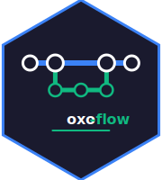

<div align="center">



<h1>oxo-flow</h1>

<p><strong>A Rust-native bioinformatics pipeline engine — built from first principles for performance, reproducibility, and clinical-grade rigor.</strong></p>

[](https://github.com/Traitome/oxo-flow/actions/workflows/ci.yml)
[](https://crates.io/crates/oxo-flow-core)
[](#license)
[](https://doc.rust-lang.org/edition-guide/)
[](#quick-start)
[](https://traitome.github.io/oxo-flow/documentation/)
[](https://github.com/Traitome/oxo-flow/releases)
[](https://crates.io/crates/oxo-flow-core)
[](https://crates.io/crates/oxo-flow-cli)
[](http://bioconda.github.io/recipes/oxo-flow-cli/README.html)
[](https://anaconda.org/bioconda/oxo-flow-cli/files)
[](https://crates.io/crates/oxo-flow-web)
[](https://deepwiki.com/Traitome/oxo-flow)

[Documentation](https://traitome.github.io/oxo-flow/documentation/) · [Workflow Gallery](https://traitome.github.io/oxo-flow/documentation/gallery/) · [Roadmap](ROADMAP.md) · [Contributing](CONTRIBUTING.md) · [Security](SECURITY.md)

</div>

---

## What is oxo-flow?

oxo-flow is a high-performance, modular bioinformatics pipeline engine built from first principles in Rust. It compiles workflows into Directed Acyclic Graphs and orchestrates execution with native concurrency, environment isolation, and clinical-grade reproducibility — all from a single, fast binary.

- 🔀 **DAG-based execution** — Automatic dependency resolution, topological ordering, and parallel execution
- 📦 **Environment management** — First-class support for conda, pixi, docker, singularity, and venv
- 🧬 **Bioinformatics-first** — Purpose-built for genomics workflows and clinical-grade pipelines
- 📊 **Clinical-grade reporting** — Modular HTML/PDF/JSON report generation with ACMG/AMP variant classification, biomarker tracking, and compliance audit trails
- 🌐 **Command Center** — Multi-tenant Web UI with real-time resource sensing, physical workspace isolation, and live log streaming
- 🗄️ **Persistent State** — SQLite-backed execution history and audit logs; automatic recovery of orphaned runs after server restart
- 🔒 **OS Identity Binding** — Secure task execution via Sudo or SSH, leveraging host POSIX permissions for data isolation
- 🐳 **Container packaging** — Multi-stage Docker builds, rootless containers, and HEALTHCHECK support
- ⚡ **Rust performance** — Fearless concurrency, zero-cost abstractions, `#![forbid(unsafe_code)]` across all crates
- 🔧 **Resource-aware scheduling** — Jobs declare CPU, memory, GPU, and disk; the scheduler respects constraints across local and cluster backends (SLURM, PBS, SGE, LSF)
- 🔒 **Security hardened** — Shell injection prevention, path traversal protection, secret scanning, and per-IP rate limiting

## Why oxo-flow?

| Feature | **oxo-flow** | Snakemake | Nextflow |
|---------|------------|-----------|----------|
| **Language** | Rust — compiled, type-safe, `#![forbid(unsafe_code)]` | Python | Groovy/JVM |
| **Performance** | Native binary, zero interpreter overhead | Python startup overhead | JVM startup overhead |
| **Workflow format** | TOML (`.oxoflow`) — declarative, composable | Snakefile / `.smk` (Python DSL) | Nextflow DSL (`.nf`) (Groovy DSL) |
| **Environment support** | conda, pixi, docker, singularity, venv — per-rule | conda, singularity, docker | conda, docker, singularity, modules |
| **Web interface** | Built-in REST API with RBAC and rate limiting | External Snakemake-UI | Nextflow Tower (commercial) |
| **Clinical reporting** | ACMG/AMP variant classification, compliance events | Not built-in | Not built-in |
| **Container packaging** | Multi-stage builds, rootless containers | Singularity/Docker | Docker/Singularity |
| **Cluster backends** | SLURM, PBS, SGE, LSF | SLURM, PBS, SGE, LSF | SLURM, PBS, SGE, LSF, k8s |
| **Type safety** | Type-state lifecycle, `RuleBuilder`, newtypes | Dynamic Python | Dynamic Groovy |
| **Security** | Shell sanitization, path traversal prevention, rate limiting | Limited | Limited |
| **Startup time** | Instant — native binary | Seconds (Python import) | Seconds (JVM boot) |
| **Reproducibility** | Config checksums, execution provenance, deterministic DAG | Checksums, provenance | Checksums, provenance |
| **Testing** | Comprehensive unit and integration test suite | pytest-based | Varied |

## Design Principles

oxo-flow is built on six engineering and scientific principles:

1. **DAG is the fundamental abstraction** — Every bioinformatics workflow is a directed acyclic graph of tasks. The engine natively constructs, validates, optimizes, and executes DAGs with maximum parallelism.

2. **Environment isolation is non-negotiable** — Bioinformatics tools have conflicting dependencies. Each task runs in its own isolated environment (conda, pixi, docker, singularity, venv).

3. **Reproducibility through determinism** — Given the same inputs, configuration, and environment specifications, the pipeline produces identical outputs. Config checksums, execution provenance, and container pinning guarantee this.

4. **Performance through Rust** — Zero-cost abstractions, fearless concurrency, and efficient memory management make Rust the ideal foundation for orchestrating thousands of concurrent bioinformatics tasks.

5. **Clinical-grade quality** — Reports are accurate, traceable, and auditable. Every step logs its provenance, inputs, outputs, software versions, and execution environment.

6. **Inverse design** — Start from what the user needs (clinical report, publication figure) and work backward to determine the data, tools, and steps required.

## Workflow Gallery

Learn oxo-flow incrementally with curated, validated example workflows — from a one-rule hello-world to production-grade multi-omics pipelines:

| # | Workflow | Complexity | Domain |
|---|----------|-----------|--------|
| 01 | [Hello World](examples/gallery/01_hello_world.oxoflow) | ⭐ | General |
| 02 | [File Pipeline](examples/gallery/02_file_pipeline.oxoflow) | ⭐⭐ | Data processing |
| 03 | [Parallel Samples](examples/gallery/03_parallel_samples.oxoflow) | ⭐⭐ | Batch processing |
| 04 | [Scatter-Gather](examples/gallery/04_scatter_gather.oxoflow) | ⭐⭐⭐ | Parallel computing |
| 05 | [Environment Management](examples/gallery/05_conda_environments.oxoflow) | ⭐⭐⭐ | DevOps |
| 06 | [RNA-seq Quantification](examples/gallery/06_rnaseq_quantification.oxoflow) | ⭐⭐⭐⭐ | Transcriptomics |
| 07 | [WGS Germline Calling](examples/gallery/07_wgs_germline.oxoflow) | ⭐⭐⭐⭐⭐ | Genomics |
| 08 | [Multi-Omics Integration](examples/gallery/08_multiomics_integration.oxoflow) | ⭐⭐⭐⭐⭐ | Multi-omics |
| 09 | [Single-Cell RNA-seq](examples/gallery/09_single_cell_rnaseq.oxoflow) | ⭐⭐⭐⭐ | Single-cell |
| 10 | [Transform Operator](examples/gallery/10_transform_operator.oxoflow) | ⭐⭐⭐ | Parallel computing |

Every workflow passes `oxo-flow validate` and is tested in CI. See the full [Workflow Gallery documentation](https://traitome.github.io/oxo-flow/documentation/gallery/) for detailed explanations, DAG visualizations, and CLI output.

## Quick Start

### Install from pre-built binaries

Download the latest release for your platform from [GitHub Releases](https://github.com/Traitome/oxo-flow/releases):

```bash
# Linux (x86_64)
curl -LO https://github.com/Traitome/oxo-flow/releases/latest/download/oxo-flow-x86_64-unknown-linux-gnu.tar.gz
tar xzf oxo-flow-x86_64-unknown-linux-gnu.tar.gz
sudo mv oxo-flow /usr/local/bin/

# macOS (Apple Silicon)
curl -LO https://github.com/Traitome/oxo-flow/releases/latest/download/oxo-flow-aarch64-apple-darwin.tar.gz
tar xzf oxo-flow-aarch64-apple-darwin.tar.gz
sudo mv oxo-flow /usr/local/bin/
```

### Install with cargo

```bash
cargo install oxo-flow-cli
```

### Install with Conda

```bash
conda install -c bioconda oxo-flow-cli
```

### Build from source

```bash
git clone https://github.com/Traitome/oxo-flow.git
cd oxo-flow
cargo build --release --workspace

# Binaries are in target/release/
# - oxo-flow        (CLI)
# - oxo-flow-web    (Web server)
```

### First workflow

```bash
# Create a new pipeline project (creates my-pipeline/ directory and my-pipeline.oxoflow)
oxo-flow init my-pipeline
cd my-pipeline

# Validate the workflow
oxo-flow validate my-pipeline.oxoflow

# Preview execution plan
oxo-flow dry-run my-pipeline.oxoflow

# Execute with 8 parallel jobs
oxo-flow run my-pipeline.oxoflow -j 8

# Visualize the DAG
oxo-flow graph my-pipeline.oxoflow > dag.dot
dot -Tpng dag.dot -o dag.png

# Generate an HTML report
oxo-flow report my-pipeline.oxoflow -f html -o report.html
```

## Cluster / HPC

oxo-flow supports job submission to HPC cluster schedulers including SLURM, PBS/PBS Pro, SGE/UGE, and LSF. The `oxo-flow cluster` subcommand manages the full submission lifecycle.

```bash
# Submit a workflow to a SLURM cluster
oxo-flow cluster submit workflow.oxoflow --backend slurm --queue short -o jobs/

# Check submission status
oxo-flow cluster status --id <job-id>

# Cancel a submitted job
oxo-flow cluster cancel --id <job-id>
```

**Supported backends:** `slurm`, `pbs`, `sge`, `lsf`. Configure cluster profiles with `oxo-flow profile` for reusable queue, walltime, and resource defaults.

Workflows can also be executed directly on a cluster without the submit subcommand by using a profile:

```bash
# List available profiles
oxo-flow profile list

# Run a workflow using a SLURM profile
oxo-flow run workflow.oxoflow --profile slurm
```

## Workflow Format (`.oxoflow`)

oxo-flow uses a TOML-based workflow format that is human-readable, composable, and declarative:

```toml
[workflow]
name = "variant-calling"
version = "1.0.0"

[config]
reference = "/data/ref/GRCh38.fa"

[[rules]]
name = "fastp"
input = ["raw/{sample}_R1.fastq.gz", "raw/{sample}_R2.fastq.gz"]
output = ["trimmed/{sample}_R1.fastq.gz", "trimmed/{sample}_R2.fastq.gz"]
threads = 8
shell = "fastp -i {input[0]} -I {input[1]} -o {output[0]} -O {output[1]}"

[rules.environment]
conda = "envs/fastp.yaml"

[[rules]]
name = "bwa_align"
input = ["trimmed/{sample}_R1.fastq.gz", "trimmed/{sample}_R2.fastq.gz"]
output = ["aligned/{sample}.bam"]
threads = 16
memory = "32G"
shell = "bwa-mem2 mem -t {threads} {config.reference} {input[0]} {input[1]} | samtools sort -o {output[0]}"

[rules.environment]
docker = "biocontainers/bwa-mem2:2.2.1"
```

Wildcards like `{sample}` are expanded automatically based on input file discovery or explicit configuration, enabling concise and powerful pattern-based pipeline definitions.

### Reference Directory Convention

Set a base directory and let oxo-flow derive standard paths:

```toml
reference_dir = "/data/references/GRCh38"

# Auto-derived:
# - reference_fasta → /data/references/GRCh38/genome.fa
# - gene_annotation → /data/references/GRCh38/genes.gtf
# - bwa_index → /data/references/GRCh38/bwa/genome.fa
# ... etc.

# Override specific paths:
reference_fasta = "/custom/path/genome.fa"
```

### Environment Groups

Share environments across multiple rules:

```toml
[env_groups.qc]
conda = "envs/qc.yaml"

[[rules]]
name = "fastqc"
env_group = "qc"

[[rules]]
name = "multiqc"
env_group = "qc"  # Reuses same environment
```

### Optional Rules

Rules can be marked as optional to skip execution when inputs are missing:

```toml
[[rules]]
name = "optional_qc"
input = ["{sample}_extra.fastq"]  # May not exist for all samples
output = ["{sample}_extra_qc.html"]
shell = "fastqc {input}"
optional = true  # Skip gracefully if input missing
```

### Directory Input

Track all files in a directory for modification detection:

```toml
[[rules]]
name = "process_dir"
input = { dir = "data/raw/", pattern = "*.fastq" }  # Optional glob pattern
output = ["results/processed/"]
shell = "process-dir {input} -o {output}"
```

## CLI Commands

The `oxo-flow` binary provides 22 subcommands for the complete workflow lifecycle:

| Command | Description |
|---------|-------------|
| `oxo-flow run` | Execute a workflow (`-j` parallel jobs, `-k` keep-going, `--timeout` per-job) |
| `oxo-flow dry-run` | Simulate execution — show what would run without executing |
| `oxo-flow validate` | Validate an `.oxoflow` file for syntax and semantic correctness (`--as-include` for sub-workflows) |
| `oxo-flow graph` | Export the workflow DAG in DOT format for visualization |
| `oxo-flow report` | Generate execution reports (`-f html\|json`, `-o` output path) |
| `oxo-flow batch` | Execute command templates in parallel across multiple items (lightweight alternative to full workflows) |
| `oxo-flow env` | Manage software environments (list, check) |
| `oxo-flow package` | Package workflow into a container image (`-f docker\|singularity`) |
| `oxo-flow serve` | Start the web interface (`--host`, `-p` port, default: `127.0.0.1:8080`) |
| `oxo-flow init` | Scaffold a new pipeline project (`-d` output directory) |
| `oxo-flow status` | Show execution status from the checkpoint file |
| `oxo-flow clean` | Clean workflow outputs and temporary files (`-n` dry-run, `--force`) |
| `oxo-flow config` | Inspect and manage workflow configuration (show, stats) |
| `oxo-flow completions` | Generate shell completions (bash, zsh, fish, elvish, PowerShell) |
| `oxo-flow format` | Reformat a `.oxoflow` file into canonical TOML form |
| `oxo-flow lint` | Run best-practice linting checks on a `.oxoflow` file |
| `oxo-flow profile` | Manage execution profiles (local, SLURM, PBS, SGE, LSF) |
| `oxo-flow export` | Export a workflow to a container definition or standalone TOML |
| `oxo-flow cluster` | Manage cluster job submission and monitoring (submit, status, cancel) |
| `oxo-flow diff` | Compare two `.oxoflow` workflow files and show differences |
| `oxo-flow debug` | Show expanded commands after variable substitution |
| `oxo-flow touch` | Mark workflow outputs as up-to-date without re-executing |
| `oxo-flow template` | Generate a workflow from a gallery template (`oxo-flow template` lists all) |
| `oxo-flow watch` | Watch a workflow file for changes and re-validate automatically |
| `oxo-flow resume` | Resume an interrupted workflow from a checkpoint file |
| `oxo-flow provenance` | Verify output file integrity against stored checksums |
| `oxo-flow schema` | Output the JSON Schema for the `.oxoflow` format |
| `oxo-flow test` | Run a workflow in test mode: validate + lint + dry-run |
| `oxo-flow publish` | Bundle a workflow with its environment files for sharing |

### Validate Sub-Workflows

When validating a sub-workflow that will be included via `[[include]]`:

```bash
oxo-flow validate rules/qc.oxoflow --as-include
```

This skips DAG validation since fragments don't have complete dependency graphs.

## Web API Endpoints

The `oxo-flow-web` server exposes a REST API (powered by [axum](https://github.com/tokio-rs/axum)):

```bash
# Start the server
oxo-flow serve --host 0.0.0.0 -p 8080
```

| Method | Endpoint | Description |
|--------|----------|-------------|
| `GET` | `/api/health` | Health check |
| `GET` | `/api/version` | Server and engine version info |
| `GET` | `/api/system` | System information (CPU, memory, OS) |
| `GET` | `/api/metrics` | Runtime metrics (requests, active workflows) |
| `GET` | `/api/workflows` | List available workflows |
| `GET` | `/api/environments` | List available environment backends |
| `POST` | `/api/workflows/validate` | Validate workflow TOML |
| `POST` | `/api/workflows/parse` | Parse workflow and return structured detail |
| `POST` | `/api/workflows/dag` | Build the DAG and return DOT representation |
| `POST` | `/api/workflows/dry-run` | Simulate execution and return the plan |
| `POST` | `/api/workflows/run` | Start workflow execution |
| `POST` | `/api/workflows/clean` | List output files that would be cleaned |
| `POST` | `/api/workflows/export` | Export workflow for sharing or archival |
| `POST` | `/api/workflows/format` | Reformat workflow into canonical TOML |
| `POST` | `/api/workflows/lint` | Run linting checks on a workflow |
| `POST` | `/api/workflows/stats` | Show workflow statistics |
| `POST` | `/api/workflows/diff` | Compare two workflow files |
| `POST` | `/api/reports/generate` | Generate a report (HTML or JSON) |
| `GET` | `/api/events` | Server-sent events for real-time updates |
| `GET` | `/api/runs` | List execution runs |
| `DELETE` | `/api/runs/{id}` | Cancel a running workflow |
| `GET` | `/api/runs/{id}/logs` | Get logs for a specific run |
| `POST` | `/api/auth/login` | Authenticate and create session |
| `GET` | `/api/auth/me` | Get current authenticated user |
| `GET` | `/api/license` | Check license status |

oxo-flow is organized as a Cargo workspace with three crates:

```
oxo-flow/
├── crates/
│   ├── oxo-flow-core/     # Core library: DAG engine, executor, environment mgmt,
│   │                      # config parsing, scheduler, wildcard expansion, reporting
│   ├── oxo-flow-cli/      # CLI binary ("oxo-flow") — Clap-based, 22 subcommands
│   └── oxo-flow-web/      # Web server ("oxo-flow-web") — axum REST API + frontend
├── examples/              # Example .oxoflow workflows
├── tests/                 # Integration tests
└── docs/                  # Documentation (MkDocs)
```

| Crate | Type | Binary | License |
|-------|------|--------|---------|
| `oxo-flow-core` | Library | — | Apache-2.0 |
| `oxo-flow-cli` | Binary | `oxo-flow` | Apache-2.0 |
| `oxo-flow-web` | Binary | `oxo-flow-web` | Dual Academic / Commercial |

### Core modules

| Module | Responsibility |
|--------|----------------|
| `dag.rs` | DAG construction, validation, topological sort |
| `executor.rs` | Task execution (local, cluster, cloud) |
| `environment.rs` | Environment management (conda, pixi, docker, singularity, venv) |
| `config.rs` | Workflow configuration and `.oxoflow` file parsing |
| `rule.rs` | Rule/step definitions with inputs, outputs, shell, resources |
| `scheduler.rs` | Job scheduling with resource constraints |
| `wildcard.rs` | Wildcard pattern expansion (`{sample}`, `{chr}`, etc.) |
| `report.rs` | Modular report generation (HTML/PDF/JSON from Tera templates) |
| `container.rs` | Container build and packaging utilities |
| `error.rs` | Unified error types (`thiserror`) |

## Documentation

Comprehensive documentation is available at **[traitome.github.io/oxo-flow/documentation/](https://traitome.github.io/oxo-flow/documentation/)**.

### 📖 Documentation Quick Links

| If you are... | Recommended Start |
|---|---|
| **New to oxo-flow** | [Quick Start](https://traitome.github.io/oxo-flow/documentation/tutorials/quickstart/) · [First Workflow](https://traitome.github.io/oxo-flow/documentation/tutorials/first-workflow/) |
| **A Bioinformatician** | [Workflow Gallery](https://traitome.github.io/oxo-flow/documentation/gallery/) |
| **A Pipeline Engineer** | [Workflow Format Specification](https://traitome.github.io/oxo-flow/documentation/reference/workflow-format/) · [CLI Reference](https://traitome.github.io/oxo-flow/documentation/commands/run/) |
| **A DevOps/Cloud Admin** | [Environment Management](https://traitome.github.io/oxo-flow/documentation/tutorials/environment-management/) · [Running on Cluster](https://traitome.github.io/oxo-flow/documentation/how-to/run-on-cluster/) |
| **A Clinical Lab Lead** | [Reporting System](https://traitome.github.io/oxo-flow/documentation/reference/reporting-system/) · [Validation Protocol](docs/VALIDATION_PROTOCOL.md) |

MkDocs source lives under [`docs/guide/src/`](docs/guide/src/).

## Development

```bash
# Build all workspace crates
cargo build

# Run all tests (unit + integration)
cargo test

# Run the full CI suite (format + clippy + build + test)
make ci

# Individual CI steps
cargo fmt -- --check          # Check formatting
cargo clippy -- -D warnings   # Lint (zero warnings)
cargo build                   # Compile
cargo test                    # Test

# Format code
cargo fmt
```

### Tech stack

| Component | Technology |
|-----------|------------|
| Language | Rust (2024 edition) |
| Async runtime | [tokio](https://tokio.rs/) |
| CLI framework | [clap](https://github.com/clap-rs/clap) (derive) |
| Web framework | [axum](https://github.com/tokio-rs/axum) |
| Serialization | [serde](https://serde.rs/) + TOML |
| Graph library | [petgraph](https://github.com/petgraph/petgraph) |
| Templating | [tera](https://github.com/Keats/tera) |
| Error handling | [thiserror](https://github.com/dtolnay/thiserror) (lib) / [anyhow](https://github.com/dtolnay/anyhow) (bin) |
| Logging | [tracing](https://github.com/tokio-rs/tracing) |

## License

This project uses a **split licensing model**:

| Crate | License | Details |
|-------|---------|---------|
| `oxo-flow-core` | [Apache-2.0](LICENSE) | Free and open-source |
| `oxo-flow-cli` | [Apache-2.0](LICENSE) | Free and open-source |
| `oxo-flow-web` | [Academic](LICENSE-ACADEMIC) / [Commercial](LICENSE-COMMERCIAL) | Free for academic and non-commercial use; commercial use requires a separate license |

The core library and CLI are licensed under the **Apache License 2.0** — you are free to use, modify, and distribute them without restriction.

The **web interface** (`oxo-flow-web`) is available under a **dual license**: free for academic and non-commercial use under the Academic License, and requiring a commercial license for commercial deployments. See [LICENSE-ACADEMIC](LICENSE-ACADEMIC) and [LICENSE-COMMERCIAL](LICENSE-COMMERCIAL) for details.

## Contributing

Contributions are welcome! Please see:

- [CONTRIBUTING.md](CONTRIBUTING.md) — Contribution guidelines
- [ROADMAP.md](ROADMAP.md) — Project roadmap and areas where help is needed
- [CODE_OF_CONDUCT.md](CODE_OF_CONDUCT.md) — Community standards
- [GOVERNANCE.md](GOVERNANCE.md) — Project governance and decision-making
- [SECURITY.md](SECURITY.md) — Security vulnerability reporting

Before submitting a PR, ensure all checks pass:

```bash
make ci
```

## Community

- 🐛 **Bug reports** — [GitHub Issues](https://github.com/Traitome/oxo-flow/issues) (use [bug report template](.github/ISSUE_TEMPLATE/bug_report.md))
- 💡 **Feature requests** — [GitHub Issues](https://github.com/Traitome/oxo-flow/issues) (use [feature request template](.github/ISSUE_TEMPLATE/feature_request.md))
- 📖 **Documentation** — [traitome.github.io/oxo-flow/documentation/](https://traitome.github.io/oxo-flow/documentation/)
- ❓ **Questions** — [Ask DeepWiki](https://deepwiki.com/Traitome/oxo-flow)

## Additional Resources

- [LIMITATIONS.md](LIMITATIONS.md) — Known limitations and constraints
- [REPRODUCIBILITY.md](REPRODUCIBILITY.md) — Reproducibility guarantees and methodology
- [RELEASING.md](RELEASING.md) — Release process and versioning policy
- [TRADEMARK.md](TRADEMARK.md) — Trademark usage guidelines
- [docs/CHANGE_CONTROL.md](docs/CHANGE_CONTROL.md) — Change control for regulated environments
- [docs/VALIDATION_PROTOCOL.md](docs/VALIDATION_PROTOCOL.md) — IQ/OQ/PQ validation protocol

---

<div align="center">

**Built with 🧬 by [Traitome](https://github.com/Traitome)**

</div>
