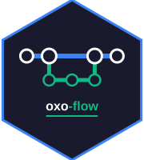

<div align="center">



<h1>oxo-flow</h1>

<p><strong>A Rust-native bioinformatics pipeline engine with AI Companion — built from first principles for performance, reproducibility, and developer experience.</strong></p>

[](https://github.com/Traitome/oxo-flow/actions/workflows/ci.yml)
[](https://crates.io/crates/oxo-flow-core)
[](#license)
[](https://doc.rust-lang.org/edition-guide/)
[](#quick-start)
[](https://traitome.github.io/oxo-flow/documentation/)
[](https://github.com/Traitome/oxo-flow/releases)
[](https://crates.io/crates/oxo-flow-core)
[](https://crates.io/crates/oxo-flow-cli)
[](http://bioconda.github.io/recipes/oxo-flow-cli/README.html)
[](https://anaconda.org/bioconda/oxo-flow-cli/files)
[](https://crates.io/crates/oxo-flow-web)
[](https://deepwiki.com/Traitome/oxo-flow)

[Documentation](https://traitome.github.io/oxo-flow/documentation/) · [Workflow Gallery](https://traitome.github.io/oxo-flow/documentation/gallery/) · [Roadmap](ROADMAP.md) · [Contributing](CONTRIBUTING.md) · [Security](SECURITY.md)

</div>

---

## What is oxo-flow?

oxo-flow is a high-performance bioinformatics pipeline engine built in Rust. It compiles workflows into Directed Acyclic Graphs and orchestrates execution with native concurrency, per-rule environment isolation, and AI-powered assistance — all from a single binary.

- 🤖 **AI Companion** — Natural language pipeline generation, intelligent refinement, failure diagnosis, and results interpretation. Powered by Claude, OpenAI, DeepSeek, or local Ollama.
- 🔀 **DAG engine** — Automatic dependency resolution, topological ordering, and parallel execution with resource-aware scheduling (CPU, memory, GPU, disk) across local and cluster backends (SLURM, PBS, SGE, LSF)
- 📦 **8 environment backends** — conda, mamba, pixi, docker, singularity, venv, system, and HPC modules — with per-rule isolation
- ⚡ **Rust performance** — Fearless concurrency, zero-cost abstractions, `#![forbid(unsafe_code)]` in core and web crates
- 🌐 **Professional Web UI** — React 19 SPA with DAG visualization (cytoscape.js), TOML editor (CodeMirror 6), AI chat, and Vega-Lite charts
- 📊 **Built-in reporting** — HTML/JSON/PDF reports with execution summaries, resource metrics, and output file browsers
- 🔒 **Security hardened** — Shell injection prevention, path traversal protection, secret scanning, and per-IP rate limiting
- 🗄️ **Checkpoint & resume** — JSON-persisted execution state; resume interrupted workflows from the last completed rule
- 🚀 **Three deployment modes** — Personal workstation, team server with OAuth2, or HPC submit panel — same binary

## Three-Mode Deployment

```bash
# Mode 1: Personal workstation (default) — SQLite, localhost, no auth
oxo-flow serve

# Mode 2: Team server — SQLite/PG, 0.0.0.0, ORCID/GitHub OAuth2
oxo-flow serve --mode team --db postgres://...

# Mode 3: HPC submit panel — Web UI for cluster job submission
oxo-flow serve --mode hpc --scheduler slurm
```

## Why oxo-flow?

| Feature | **oxo-flow** | Snakemake | Nextflow |
|---------|------------|-----------|----------|
| **Language** | Rust — compiled, type-safe, `#![forbid(unsafe_code)]` (core + web) | Python | Groovy/JVM |
| **Performance** | Native binary, instant startup | Python + JIT overhead | JVM startup overhead |
| **Workflow format** | TOML (`.oxoflow`) — declarative, composable | Snakefile (Python DSL) | Nextflow DSL (Groovy) |
| **Environment support** | 8 backends — conda, mamba, pixi, docker, singularity, venv, system, modules — per-rule | conda, singularity, docker | conda, docker, singularity, modules |
| **Web interface** | Built-in React 19 SPA + REST API | External Snakemake-UI | Nextflow Tower (commercial) |
| **Reporting** | Built-in HTML/JSON/PDF reports with metrics | Via MultiQC | Via Nextflow Tower |
| **Cluster backends** | SLURM, PBS, SGE, LSF | SLURM, PBS, SGE, LSF | SLURM, PBS, SGE, LSF, k8s |
| **Security** | Shell sanitization, path traversal prevention, rate limiting | Limited | Limited |
| **AI Companion** | Built-in — generate, refine, diagnose, interpret | Not built-in | Not built-in |
| **Testing** | 1,280+ tests (unit, integration, doc) | pytest-based | Varied |

## Design Principles

oxo-flow is built on five principles:

1. **DAG is the fundamental abstraction** — Every workflow is a directed acyclic graph. The engine constructs, validates, and executes DAGs with maximum parallelism.
2. **Environment isolation is non-negotiable** — Each task runs in its own isolated environment via one of 8 backends.
3. **Reproducible by design** — Config checksums, execution provenance, and container pinning guarantee identical outputs from identical inputs.
4. **Performance through Rust** — Zero-cost abstractions and fearless concurrency for orchestrating thousands of concurrent tasks.
5. **Outcome-driven** — The DAG engine's target-aware execution (`-t` flag) computes the minimal rule set needed to produce specific deliverables.

## Workflow Gallery

Learn oxo-flow incrementally with curated, validated example workflows — from a one-rule hello-world to production-grade multi-omics pipelines:

| # | Workflow | Complexity | Domain |
|---|----------|-----------|--------|
| 01 | [Hello World](examples/gallery/01_hello_world.oxoflow) | ⭐ | General |
| 02 | [File Pipeline](examples/gallery/02_file_pipeline.oxoflow) | ⭐⭐ | Data processing |
| 03 | [Parallel Samples](examples/gallery/03_parallel_samples.oxoflow) | ⭐⭐ | Batch processing |
| 04 | [Scatter-Gather](examples/gallery/04_scatter_gather.oxoflow) | ⭐⭐⭐ | Parallel computing |
| 05 | [Environment Management](examples/gallery/05_conda_environments.oxoflow) | ⭐⭐⭐ | DevOps |
| 06 | [RNA-seq Quantification](examples/gallery/06_rnaseq_quantification.oxoflow) | ⭐⭐⭐⭐ | Transcriptomics |
| 07 | [WGS Germline Calling](examples/gallery/07_wgs_germline.oxoflow) | ⭐⭐⭐⭐⭐ | Genomics |
| 08 | [Multi-Omics Integration](examples/gallery/08_multiomics_integration.oxoflow) | ⭐⭐⭐⭐⭐ | Multi-omics |
| 09 | [Single-Cell RNA-seq](examples/gallery/09_single_cell_rnaseq.oxoflow) | ⭐⭐⭐⭐ | Single-cell |
| 10 | [Transform Operator](examples/gallery/10_transform_operator.oxoflow) | ⭐⭐⭐ | Parallel computing |

Every workflow passes `oxo-flow validate` and is tested in CI. See the full [Workflow Gallery documentation](https://traitome.github.io/oxo-flow/documentation/gallery/) for detailed explanations, DAG visualizations, and CLI output.

## Quick Start

### Install from pre-built binaries

Download the latest release for your platform from [GitHub Releases](https://github.com/Traitome/oxo-flow/releases):

```bash
# Linux (x86_64)
curl -LO https://github.com/Traitome/oxo-flow/releases/latest/download/oxo-flow-x86_64-unknown-linux-gnu.tar.gz
tar xzf oxo-flow-x86_64-unknown-linux-gnu.tar.gz
sudo mv oxo-flow /usr/local/bin/

# macOS (Apple Silicon)
curl -LO https://github.com/Traitome/oxo-flow/releases/latest/download/oxo-flow-aarch64-apple-darwin.tar.gz
tar xzf oxo-flow-aarch64-apple-darwin.tar.gz
sudo mv oxo-flow /usr/local/bin/
```

### Install with cargo

```bash
cargo install oxo-flow-cli
```

### Install with Conda

```bash
conda install -c bioconda oxo-flow-cli
```

### Build from source

```bash
git clone https://github.com/Traitome/oxo-flow.git
cd oxo-flow
cargo build --release --workspace

# Install the CLI to your local cargo bin directory:
cargo install --path crates/oxo-flow-cli

# Binaries are in target/release/
# - oxo-flow        (CLI)
# - oxo-flow-web    (Web server)
```

### First workflow

```bash
# Create a new pipeline project (creates my-pipeline/ directory and my-pipeline.oxoflow)
oxo-flow init my-pipeline
cd my-pipeline

# Validate the workflow
oxo-flow validate my-pipeline.oxoflow

# Preview execution plan
oxo-flow dry-run my-pipeline.oxoflow

# Execute with 8 parallel jobs
oxo-flow run my-pipeline.oxoflow -j 8

# Visualize the DAG (use -f dot for Graphviz DOT output)
oxo-flow graph my-pipeline.oxoflow -f dot > dag.dot
dot -Tpng dag.dot -o dag.png

# Generate an HTML report
oxo-flow report my-pipeline.oxoflow -f html -o report.html
```

## Cluster / HPC

oxo-flow supports job submission to HPC cluster schedulers including SLURM, PBS/PBS Pro, SGE/UGE, and LSF. The `oxo-flow cluster` subcommand manages the full submission lifecycle.

```bash
# Submit a workflow to a SLURM cluster
oxo-flow cluster submit workflow.oxoflow --backend slurm --queue short -o jobs/

# Check submission status
oxo-flow cluster status --id <job-id>

# Cancel a submitted job
oxo-flow cluster cancel --id <job-id>
```

**Supported backends:** `slurm`, `pbs`, `sge`, `lsf`. Configure cluster profiles with `oxo-flow profile` for reusable queue, walltime, and resource defaults.

Workflows can also be executed directly on a cluster without the submit subcommand by using a profile:

```bash
# List available profiles
oxo-flow profile list

# Run a workflow using a SLURM profile
oxo-flow run workflow.oxoflow --profile slurm
```

## Workflow Format (`.oxoflow`)

oxo-flow uses a TOML-based workflow format that is human-readable, composable, and declarative:

```toml
[workflow]
name = "variant-calling"
version = "1.0.0"

[config]
reference = "/data/ref/GRCh38.fa"

[[rules]]
name = "fastp"
input = ["raw/{sample}_R1.fastq.gz", "raw/{sample}_R2.fastq.gz"]
output = ["trimmed/{sample}_R1.fastq.gz", "trimmed/{sample}_R2.fastq.gz"]
threads = 8
shell = "fastp -i {input[0]} -I {input[1]} -o {output[0]} -O {output[1]}"

[rules.environment]
conda = "envs/fastp.yaml"

[[rules]]
name = "bwa_align"
input = ["trimmed/{sample}_R1.fastq.gz", "trimmed/{sample}_R2.fastq.gz"]
output = ["aligned/{sample}.bam"]
threads = 16
memory = "32G"
shell = "bwa-mem2 mem -t {threads} {config.reference} {input[0]} {input[1]} | samtools sort -o {output[0]}"

[rules.environment]
docker = "biocontainers/bwa-mem2:2.2.1"
```

Wildcards like `{sample}` expand automatically via input file discovery. Features include reference directory conventions, environment groups, optional rules, and directory inputs. See the full [Workflow Format Specification](https://traitome.github.io/oxo-flow/documentation/reference/workflow-format/) for details.

## CLI Commands

The `oxo-flow` binary provides **33 subcommands** covering the complete workflow lifecycle. See the full [CLI Reference](https://traitome.github.io/oxo-flow/documentation/commands/run/) for details.

| Category | Commands |
|----------|----------|
| **Execution** | `run`, `resume`, `dry-run`, `test`, `watch`, `batch` |
| **Development** | `init`, `validate`, `format`, `lint`, `debug`, `template` |
| **Inspection** | `graph`, `report`, `status`, `config`, `diff`, `history`, `provenance`, `schema` |
| **Environment** | `env`, `package`, `export`, `profile`, `clean`, `touch` |
| **Deployment** | `serve`, `cluster`, `publish`, `pull` |
| **AI & System** | `ai`, `completions`, `license` |

See the full [CLI Reference](https://traitome.github.io/oxo-flow/documentation/commands/run/) for detailed usage of each subcommand.

## Web API

The `oxo-flow serve` command starts an [axum](https://github.com/tokio-rs/axum)-powered REST server with **50+ endpoints** across 7 domains (observability, pipeline, execution, AI, auth, data, ops). Full API reference at the [OpenAPI 3.1 spec](https://traitome.github.io/oxo-flow/documentation/reference/api/).


oxo-flow is organized as a Cargo workspace with four crates:

```
oxo-flow/
├── crates/
│   ├── oxo-flow-core/     # Core library: DAG engine, executor, environment mgmt,
│   │                      # config parsing, scheduler, wildcard expansion, reporting
│   ├── oxo-flow-ai/       # AI companion: provider abstraction, skill system, agents
│   ├── oxo-flow-cli/      # CLI binary ("oxo-flow") — Clap-based, 33 subcommands
│   └── oxo-flow-web/      # Web server ("oxo-flow-web") — axum REST API + frontend
├── examples/              # Example .oxoflow workflows
├── tests/                 # Integration tests
└── docs/                  # Documentation (MkDocs)
```

| Crate | Type | Binary | License |
|-------|------|--------|---------|
| `oxo-flow-core` | Library | — | Apache-2.0 |
| `oxo-flow-ai` | Library | — | Apache-2.0 |
| `oxo-flow-cli` | Binary | `oxo-flow` | Apache-2.0 |
| `oxo-flow-web` | Binary | `oxo-flow-web` | Dual Academic / Commercial |

### Key modules

| Module | Crate | Responsibility |
|--------|-------|----------------|
| `dag.rs` | core | DAG construction, validation, topological sort |
| `executor.rs` | core | Task execution (local, cluster, cloud) |
| `environment.rs` | core | Environment management (conda, mamba, pixi, docker, singularity, venv, system, modules) |
| `config.rs` | core | Workflow configuration and `.oxoflow` file parsing |
| `rule.rs` | core | Rule/step definitions with inputs, outputs, shell, resources |
| `scheduler.rs` | core | Job scheduling with resource constraints |
| `wildcard.rs` | core | Wildcard pattern expansion (`{sample}`, `{chr}`, etc.) |
| `report.rs` | core | Modular report generation (HTML, JSON, PDF via wkhtmltopdf) |
| `format.rs` | core | Workflow formatting, linting, and 30+ diagnostic patterns |
| `plugin.rs` | core | Plugin system for MCP servers and custom tools |
| `ai_provider.rs` | web | Multi-provider AI abstraction (Claude, OpenAI, DeepSeek, Ollama) |
| `domains/ai/` | web | AI translation, chat SSE streaming, agent orchestration |
| `domains/execution/` | web | Run lifecycle, diagnostics, pause/resume, retry |
| `domains/workflow/` | web | Pipeline CRUD, validation, DAG building, templating |
| `provider.rs` | ai | Multi-provider AI client abstraction with auto-detection |
| `skill.rs` | ai | Skill registry and discovery system |
| `agent/` | ai | Agent orchestration and tool-calling framework |
| `mcp.rs` | ai | MCP (Model Context Protocol) server integration |

## Documentation

Comprehensive documentation is available at **[traitome.github.io/oxo-flow/documentation/](https://traitome.github.io/oxo-flow/documentation/)**.

### 📖 Documentation Quick Links

| If you are... | Recommended Start |
|---|---|
| **New to oxo-flow** | [Quick Start](https://traitome.github.io/oxo-flow/documentation/tutorials/quickstart/) · [First Workflow](https://traitome.github.io/oxo-flow/documentation/tutorials/first-workflow/) |
| **A Bioinformatician** | [Workflow Gallery](https://traitome.github.io/oxo-flow/documentation/gallery/) |
| **A Pipeline Engineer** | [Workflow Format Specification](https://traitome.github.io/oxo-flow/documentation/reference/workflow-format/) · [CLI Reference](https://traitome.github.io/oxo-flow/documentation/commands/run/) |
| **A DevOps/Cloud Admin** | [Environment Management](https://traitome.github.io/oxo-flow/documentation/tutorials/environment-management/) · [Running on Cluster](https://traitome.github.io/oxo-flow/documentation/how-to/run-on-cluster/) |
| **A Bioinformatics Core** | [Workflow Gallery](https://traitome.github.io/oxo-flow/documentation/gallery/) · [Environment Management](https://traitome.github.io/oxo-flow/documentation/tutorials/environment-management/) |

MkDocs source lives under [`docs/guide/src/`](docs/guide/src/).

## Development

```bash
# Build all workspace crates
cargo build

# Run all tests (unit + integration)
cargo test

# Run the full CI suite (format + clippy + build + test)
make ci

# Individual CI steps
cargo fmt -- --check          # Check formatting
cargo clippy -- -D warnings   # Lint (zero warnings)
cargo build                   # Compile
cargo test                    # Test

# Format code
cargo fmt
```

### Tech stack

| Component | Technology |
|-----------|------------|
| Language | Rust (2024 edition) |
| Async runtime | [tokio](https://tokio.rs/) |
| CLI framework | [clap](https://github.com/clap-rs/clap) (derive) |
| Web framework | [axum](https://github.com/tokio-rs/axum) |
| Serialization | [serde](https://serde.rs/) + TOML |
| Graph library | [petgraph](https://github.com/petgraph/petgraph) |
| Templating | [tera](https://github.com/Keats/tera) |
| Error handling | [thiserror](https://github.com/dtolnay/thiserror) (lib) / [anyhow](https://github.com/dtolnay/anyhow) (bin) |
| Logging | [tracing](https://github.com/tokio-rs/tracing) |

## License

This project uses a **split licensing model**:

| Crate | License | Details |
|-------|---------|---------|
| `oxo-flow-core` | [Apache-2.0](LICENSE) | Free and open-source |
| `oxo-flow-ai` | [Apache-2.0](LICENSE) | Free and open-source |
| `oxo-flow-cli` | [Apache-2.0](LICENSE) | Free and open-source |
| `oxo-flow-web` | [Academic](LICENSE-ACADEMIC) / [Commercial](LICENSE-COMMERCIAL) | Free for academic and non-commercial use; commercial use requires a separate license |

The core library, AI companion, and CLI are licensed under the **Apache License 2.0** — you are free to use, modify, and distribute them without restriction.

The **web interface** (`oxo-flow-web`) is available under a **dual license**: free for academic and non-commercial use under the Academic License, and requiring a commercial license for commercial deployments. See [LICENSE-ACADEMIC](LICENSE-ACADEMIC) and [LICENSE-COMMERCIAL](LICENSE-COMMERCIAL) for details.

## Contributing

Contributions are welcome! Please see:

- [CONTRIBUTING.md](CONTRIBUTING.md) — Contribution guidelines
- [ROADMAP.md](ROADMAP.md) — Project roadmap and areas where help is needed
- [CODE_OF_CONDUCT.md](CODE_OF_CONDUCT.md) — Community standards
- [GOVERNANCE.md](GOVERNANCE.md) — Project governance and decision-making
- [SECURITY.md](SECURITY.md) — Security vulnerability reporting

Before submitting a PR, ensure all checks pass:

```bash
make ci
```

## Citing

If you use oxo-flow in academic research, please cite:

> **Shixiang Wang**, *oxo-flow: compiled, memory-safe bioinformatics workflow orchestration*, bioRxiv, 2026, [https://doi.org/10.64898/2026.06.11.731578](https://doi.org/10.64898/2026.06.11.731578)
>
> Jia Ding, Yun Peng, Ruochen Wei, Boquan Wang, Jian-Guo Zhou, **Shixiang Wang**, *BLIT: an R package for seamless integration of command-line bioinformatics tool universe*, Bioinformatics Advances, Volume 6, Issue 1, 2026, vbag088, [https://doi.org/10.1093/bioadv/vbag088](https://doi.org/10.1093/bioadv/vbag088)

## Community

- 🐛 **Bug reports** — [GitHub Issues](https://github.com/Traitome/oxo-flow/issues) (use [bug report template](.github/ISSUE_TEMPLATE/bug_report.md))
- 💡 **Feature requests** — [GitHub Issues](https://github.com/Traitome/oxo-flow/issues) (use [feature request template](.github/ISSUE_TEMPLATE/feature_request.md))
- 📖 **Documentation** — [traitome.github.io/oxo-flow/documentation/](https://traitome.github.io/oxo-flow/documentation/)
- ❓ **Questions** — [Ask DeepWiki](https://deepwiki.com/Traitome/oxo-flow)

### 🧪 Real-World Feedback

oxo-flow aims to work reliably across diverse computing environments — laptops, HPC clusters, GPU nodes. We cannot replicate every deployment scenario in CI. If you use oxo-flow, please share your experience (success or failure) as a [GitHub Issue](https://github.com/Traitome/oxo-flow/issues) with the prefix `[Real-World Testing]`. Your feedback directly shapes our priorities.

## Additional Resources

- [LIMITATIONS.md](LIMITATIONS.md) — Known limitations and constraints
- [REPRODUCIBILITY.md](REPRODUCIBILITY.md) — Reproducibility guarantees and methodology
- [RELEASING.md](RELEASING.md) — Release process and versioning policy
- [TRADEMARK.md](TRADEMARK.md) — Trademark usage guidelines
- [docs/CHANGE_CONTROL.md](docs/CHANGE_CONTROL.md) — Change control for regulated environments
- [docs/VALIDATION_PROTOCOL.md](docs/VALIDATION_PROTOCOL.md) — IQ/OQ/PQ validation protocol

---

<div align="center">

**Built with 🧬 by [Traitome](https://github.com/Traitome)**

</div>
