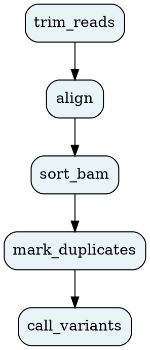

# `oxo-flow graph`

Output the workflow DAG for visualization.

---

## Usage

```
oxo-flow graph [OPTIONS] <WORKFLOW>
```

---

## Arguments

| Argument | Description |
|---|---|
| `<WORKFLOW>` | Path to the `.oxoflow` workflow file |

---

## Options

| Option | Short | Description |
|---|---|---|
| `--format <FORMAT>` | `-f` | Output format: `ascii` (terminal), `dot` (Graphviz), `dot-clustered` (enhanced). Default: `ascii` |
| `--output <FILE>` | `-o` | Save output to a file (useful for dot/svg generation) |
| `--verbose` | `-v` | Enable debug-level logging |
| `--quiet` | | Suppress non-essential output (errors only) |
| `--no-color` | | Disable colored output |

---

## Examples

### Print ASCII graph to terminal (default)

```bash
oxo-flow graph pipeline.oxoflow
```

### Print DOT format

```bash
oxo-flow graph pipeline.oxoflow -f dot
```

### Render to PNG with Graphviz

```bash
oxo-flow graph pipeline.oxoflow -f dot | dot -Tpng -o dag.png
```

### Save DOT to file

```bash
oxo-flow graph pipeline.oxoflow -f dot -o graph.dot
```

### Render clustered view

```bash
oxo-flow graph pipeline.oxoflow -f dot-clustered -o clustered.dot
```

---

## Output Formats

### ASCII (default)

```
┌─────────────────────────────────────────────────────────────────────┐
│ Workflow: wgs-germline-calling                                       │
│ Rules: 10, Dependencies: 11                                          │
└─────────────────────────────────────────────────────────────────────┘

  fastp_qc ──► bwa_mem2_align ──► mark_duplicates ──► bqsr_apply
       │                              │                    │
       ▼                              ▼                    ▼
  (parallel)                    (parallel)            (parallel)

  bqsr_apply ──► gatk_haplotypecaller ──► gatk_vqsr ──► annotate_variants
```

### DOT



---

## Notes

- Default output is ASCII for terminal viewing
- DOT format requires Graphviz (`dot` command) to render images. Install with:
    - **macOS**: `brew install graphviz`
    - **Linux**: `apt install graphviz` or `yum install graphviz`
    - **Conda**: `conda install graphviz`
- Nodes represent rules, edges represent dependencies
- The graph direction is top-to-bottom (`rankdir = TB`)
