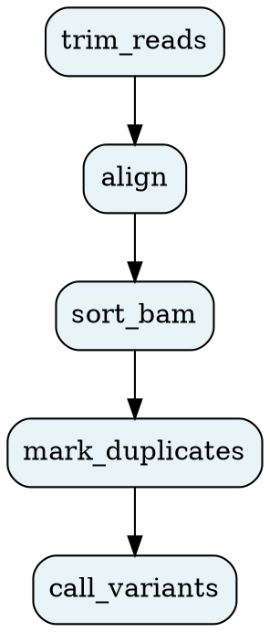

# `oxo-flow graph`

Output the workflow DAG in DOT format for visualization.

---

## Usage

```
oxo-flow graph <WORKFLOW>
```

---

## Arguments

| Argument | Description |
|---|---|
| `<WORKFLOW>` | Path to the `.oxoflow` workflow file |

---

## Options

| Option | Short | Description |
|---|---|---|
| `--verbose` | `-v` | Enable debug-level logging |

---

## Examples

### Print DOT to stdout

```bash
oxo-flow graph pipeline.oxoflow
```

### Render to PNG with Graphviz

```bash
oxo-flow graph pipeline.oxoflow | dot -Tpng -o dag.png
```

### Render to SVG

```bash
oxo-flow graph pipeline.oxoflow | dot -Tsvg -o dag.svg
```

### Render to PDF

```bash
oxo-flow graph pipeline.oxoflow | dot -Tpdf -o dag.pdf
```

---

## Output



---

## Notes

- Output is in [Graphviz DOT](https://graphviz.org/doc/info/lang.html) format
- Requires Graphviz (`dot` command) to render images — install with your package manager: `apt install graphviz`, `brew install graphviz`, or `conda install graphviz`
- Nodes represent rules, edges represent dependencies
- The graph direction is top-to-bottom (`rankdir = TB`)
