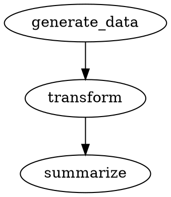
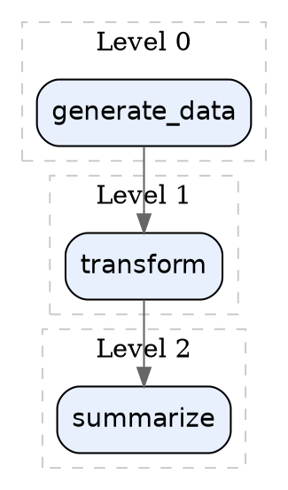

# `oxo-flow graph`

Output the workflow DAG for visualization.

---

## Usage

```
oxo-flow graph [OPTIONS] <WORKFLOW>
```

---

## Arguments

| Argument | Description |
|---|---|
| `<WORKFLOW>` | Path to the `.oxoflow` workflow file |

---

## Options

| Option | Short | Description |
|---|---|---|
| `--format <FORMAT>` | `-f` | Output format: `ascii` (terminal), `dot` (Graphviz), `dot-clustered` (level-grouped), `tree` (indented tree). Default: `ascii` |
| `--output <FILE>` | `-o` | Save output to a file (useful for dot/svg generation) |
| `--expanded` | | Show the DAG after wildcard/sample/scatter expansion (the actual runtime DAG) |
| `--verbose` | `-v` | Enable debug-level logging |
| `--quiet` | | Suppress non-essential output (errors only) |
| `--no-color` | | Disable colored output |
| `--json` | | Output machine-readable JSON to stdout |

---

## Examples

### Print ASCII graph to terminal (default)

```bash
oxo-flow graph pipeline.oxoflow
```

### Print DOT format

```bash
oxo-flow graph pipeline.oxoflow -f dot
```

### Render to PNG with Graphviz

The graph command prints log output (e.g. resource warnings) to stdout before the DOT body, so piping stdout into `dot` does not work reliably. Write the DOT to a file first, then render it:

```bash
oxo-flow graph -f dot -o graph.dot pipeline.oxoflow
dot -Tpng -o dag.png graph.dot
```

### Save DOT to file

```bash
oxo-flow graph pipeline.oxoflow -f dot -o graph.dot
```

### Render clustered view

```bash
oxo-flow graph pipeline.oxoflow -f dot-clustered -o clustered.dot
```

### View the expanded runtime DAG

By default, `graph` shows the template DAG — one node per `[[rules]]` block. Use `--expanded` to show the actual runtime DAG after wildcard, sample, and scatter expansion: each generated task becomes its own node (rule names get a `_<group>_<sample>` or `_<pair_id>` suffix).

```bash
oxo-flow graph pipeline.oxoflow --expanded
```

For example, a workflow with a `cohort` sample group of three samples shows the template DAG as 12 rules, while the expanded view shows 22 rules — one per (rule, sample) task:

```
┌────────────────────────────────────────────────┐
│  Workflow DAG: 22 rules, 28 dependencies       │
│  Depth: 12, Width: 3, Critical path: 12 steps  │
└────────────────────────────────────────────────┘

Level 0 (parallel: 3 rules)
┌─── fastp_qc_cohort_NA12878
│─── fastp_qc_cohort_NA12879
└─── fastp_qc_cohort_NA12880
     │
     ▼
Level 1 (parallel: 3 rules)
┌─── bwa_mem2_align_cohort_NA12878 [depends: fastp_qc_cohort_NA12878]
│─── bwa_mem2_align_cohort_NA12879 [depends: fastp_qc_cohort_NA12879]
└─── bwa_mem2_align_cohort_NA12880 [depends: fastp_qc_cohort_NA12880]
```

---

## Output Formats

### ASCII (default)

```
┌──────────────────────────────────────────────┐
│  Workflow DAG: 3 rules, 2 dependencies       │
│  Depth: 3, Width: 1, Critical path: 3 steps  │
└──────────────────────────────────────────────┘

Level 0 (sequential)
     generate_data
     │
     ▼
Level 1 (sequential)
     transform [depends: generate_data]
     │
     ▼
Level 2 (sequential)
     summarize [depends: transform]

Critical path: generate_data → transform → summarize
```

### DOT


```dot
digraph {
    0 [ label = "generate_data"]
    1 [ label = "transform"]
    2 [ label = "summarize"]
    0 -> 1 [ ]
    1 -> 2 [ ]
}
```

The `dot-clustered` format adds level-based clusters, `rankdir = TB` (top-to-bottom), and node/edge styling:


```dot
digraph workflow {
  rankdir=TB;
  node [shape=box, style="rounded,filled", fillcolor="#e8f0fe", fontname="Helvetica"];
  edge [color="#666666"];

  subgraph cluster_0 {
    label = "Level 0";
    style = dashed;
    color = "#cccccc";
    "generate_data";
  }

  subgraph cluster_1 {
    label = "Level 1";
    style = dashed;
    color = "#cccccc";
    "transform";
  }

  subgraph cluster_2 {
    label = "Level 2";
    style = dashed;
    color = "#cccccc";
    "summarize";
  }

  "generate_data" -> "transform";
  "transform" -> "summarize";
}
```

---

## Notes

- Default output is ASCII for terminal viewing
- DOT format requires Graphviz (`dot` command) to render images. Install with:
    - **macOS**: `brew install graphviz`
    - **Linux**: `apt install graphviz` or `yum install graphviz`
    - **Conda**: `conda install graphviz`
- Nodes represent rules, edges represent dependencies
- The `dot-clustered` format is laid out top-to-bottom (`rankdir = TB`); the plain `dot` format does not set a direction

### Understanding Metrics

The header shows key workflow metrics:

| Metric | Meaning |
|---|---|
| **Rules** | Total workflow rules (DAG nodes) |
| **Dependencies** | Total edges connecting rules |
| **Depth** | Critical path length (longest chain) |
| **Width** | Maximum parallelism (rules at same level) |

**Dependencies count:** The total number of edges in the DAG. When a rule has multiple input files from different upstream rules, each creates a separate edge. For example, a merge rule combining outputs from 3 parallel branches contributes 3 dependencies.
