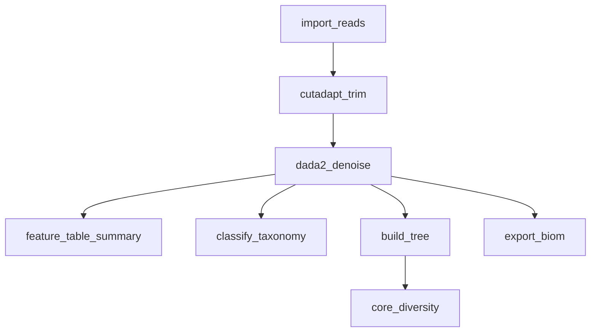

# 16 — 16S Amplicon Analysis with QIIME2

A 16S rRNA amplicon pipeline built on QIIME2's standard moving-pictures backbone: import demultiplexed reads, trim primers, denoise with DADA2, assign taxonomy, build a phylogenetic tree, compute core diversity metrics, and export the feature table for downstream analysis in R/Python.

!!! info "Concepts Covered"
    - QIIME2 artifact (.qza) and visualization (.qzv) chaining
    - Paired-end DADA2 denoising with quality truncation
    - Phylogenetic diversity metrics (core-metrics-phylogenetic)
    - Exporting QIIME2 artifacts back to open formats (BIOM/TSV)

## Pipeline Overview



**Steps:**

1. **import_reads** — Import Casava demultiplexed FASTQs into a QIIME2 `SampleData[PairedEndSequencesWithQuality]` artifact
2. **cutadapt_trim** — Trim adapter/primer bases and truncate to the configured quality length
3. **dada2_denoise** — Error-correcting denoising → feature table, representative sequences, denoising statistics
4. **feature_table_summary** — Per-sample frequency and depth summary (needs `metadata.tsv`)
5. **classify_taxonomy** — Sklearn taxonomy classification against a pre-trained classifier (see prerequisites)
6. **build_tree** — MAFFT alignment + FastTree for phylogenetic diversity input
7. **core_diversity** — Alpha/beta diversity at the configured sampling depth
8. **export_biom** — Convert the feature table back to BIOM and TSV for downstream tooling

## Workflow Definition

```toml
# examples/gallery/16_16s_qiime2_amplicon.oxoflow
--8<-- "examples/gallery/16_16s_qiime2_amplicon.oxoflow"
```

## Key Design Decisions

### Sampling Depth

Rarefaction (`{config.sampling_depth}`, default 1000) is required by `core-metrics-phylogenetic` so that alpha diversity values are comparable across samples. Inspect `table-summary.qzv` before lowering it — samples below the depth are dropped from the diversity analysis (not from the feature table).

### Taxonomy Classifier

`{config.classifier}` must point to a pre-trained classifier matching your target region (e.g. `silva-138-99-515-806-nb-classifier.qza` for V4). QIIME2 does not ship classifiers; download or train one before running this rule.

### Denoising Parameters

`trunc_len_f`/`trunc_len_r` (default 250) must be chosen from the read quality profile — inspect the interactive quality plot of `trimmed-demux.qza` and truncate where the median quality drops below ~Q30.

## Running It

```bash
# After installing a QIIME2 conda environment:
oxo-flow run examples/gallery/16_16s_qiime2_amplicon.oxoflow --profile conda
```
