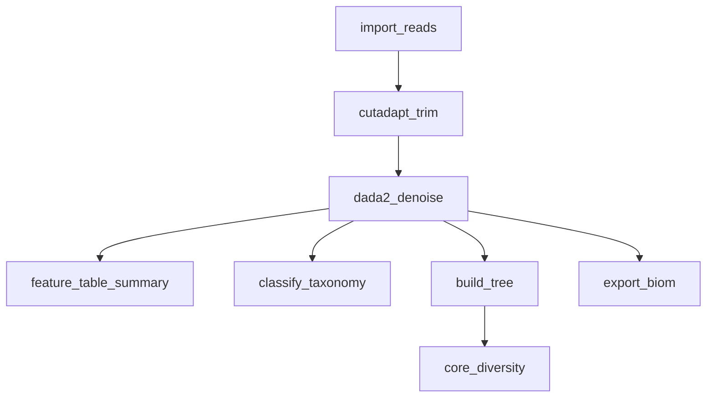

# 16 — 16S Amplicon Analysis with QIIME2

A 16S rRNA amplicon pipeline built on QIIME2's standard moving-pictures backbone: import demultiplexed reads, trim low-quality ends with cutadapt, denoise with DADA2, assign taxonomy, build a phylogenetic tree, compute core diversity metrics, and export the feature table for downstream analysis in R/Python.

!!! info "Concepts Covered"
    - QIIME2 artifact (.qza) and visualization (.qzv) chaining
    - Paired-end DADA2 denoising with quality truncation
    - Phylogenetic diversity metrics (core-metrics-phylogenetic)
    - Exporting QIIME2 artifacts back to open formats (BIOM/TSV)

## Pipeline Overview



**Steps:**

1. **import_reads** — Import Casava demultiplexed FASTQs into a QIIME2 `SampleData[PairedEndSequencesWithQuality]` artifact
2. **cutadapt_trim** — Trim low-quality 3' ends (`quality_cutoff_3end`) and drop reads shorter than `min_length`; quality truncation itself is DADA2's job (`trunc_len_f`/`trunc_len_r`)
3. **dada2_denoise** — Error-correcting denoising → feature table, representative sequences, denoising statistics
4. **feature_table_summary** — Per-sample frequency and depth summary (needs `metadata.tsv`)
5. **classify_taxonomy** — Sklearn taxonomy classification against a pre-trained classifier (see prerequisites)
6. **build_tree** — MAFFT alignment + FastTree for phylogenetic diversity input
7. **core_diversity** — Alpha/beta diversity at the configured sampling depth
8. **export_biom** — Convert the feature table back to BIOM and TSV for downstream tooling

## Workflow Definition

```toml
# examples/gallery/16_16s_qiime2_amplicon.oxoflow
--8<-- "examples/gallery/16_16s_qiime2_amplicon.oxoflow"
```

## Key Design Decisions

### Sampling Depth

Rarefaction (`{config.sampling_depth}`, default 1000) is required by `core-metrics-phylogenetic` so that alpha diversity values are comparable across samples. Inspect `table-summary.qzv` before lowering it — samples below the depth are dropped from the diversity analysis (not from the feature table).

### Taxonomy Classifier

`{config.classifier}` must point to a pre-trained classifier matching your target region (e.g. `silva-138-99-515-806-nb-classifier.qza` for V4). QIIME2 does not ship classifiers; download or train one before running this rule.

Two hard-won gotchas surfaced in live testing:

- **scikit-learn version gate.** `classify-sklearn` hard-fails when the classifier artifact was trained under a different scikit-learn version than the one in your QIIME2 env:

  ```
  ValueError: The scikit-learn version (0.24.1) used to generate this
  artifact does not match the current version of scikit-learn installed
  (1.4.2). Please retrain your classifier for your current deployment ...
  ```

  Release-matched downloads from `data.qiime2.org/<release>/common/` only carry reference sequences and taxonomy (e.g. `silva-138-99-seqs-515-806.qza` + `silva-138-99-tax-515-806.qza`), **not** pre-trained classifiers — the historical pre-trained `.qza` files predate 2024.10. Train a compatible classifier in your own env (single-threaded, ~40–60 min for the 515-806 SILVA subset):

  ```bash
  qiime feature-classifier fit-classifier-naive-bayes \
    --i-reference-reads silva-138-99-seqs-515-806.qza \
    --i-reference-taxonomy silva-138-99-tax-515-806.qza \
    --o-classifier silva-515-806-nb-classifier.qza
  ```

- **Empty default fails opaquely.** `classifier = ""` is the workflow default; with it unset, `classify_taxonomy` fails with `--i-classifier option requires an argument` plus a full usage dump — the error never mentions `config.classifier`. Always pass `classifier=/path/to/classifier.qza` on the command line, or skip the rule (`oxo-flow run -t` on the other rules).

### Denoising Parameters

`trunc_len_f`/`trunc_len_r` (default 250) must be chosen from the read quality profile — inspect the interactive quality plot of `trimmed-demux.qza` and truncate where the median quality drops below ~Q30. On clean 250 bp simulated reads with ~Q37→Q30 decay, truncation at 250 passed ~100% of reads and merged ~97%; on reads still carrying **IUPAC ambiguity codes** in primer-derived bases (Y/S/M from degenerate primers like 515F/806R), DADA2 filtered ~100% of reads and every downstream diversity step collapsed. Resolve degenerate primers to concrete ACGT bases before importing (or trim primers with cutadapt `--p-front-f/--p-front-r`).

### Metadata Format

`metadata.tsv` is validated by QIIME2 on load. Two rules the docs of the example rely on:

- The first column must be `sample-id` (or `#SampleID`), and every sample in the FASTQs must appear.
- The optional `#q2:types` directive row must sit **immediately after the header row** — placing it first (or omitting the header) fails with `Found directive '#q2:types' while searching for header. Directives may only appear immediately after the header.`

## Running It

```bash
# The workflow expects `qiime` on PATH — activate your QIIME2 conda env first:
conda activate qiime2-amplicon-2024.10
oxo-flow run examples/gallery/16_16s_qiime2_amplicon.oxoflow \
    classifier=/path/to/silva-515-806-nb-classifier.qza
```

The env name `qiime2-amplicon-2024.10` is QIIME2's default naming; any env providing `qiime` works (the example was live-tested against an env named `qiime2-amplicon` with q2cli 2024.10.1). Seven of the eight rules are independent of the classifier: `classify_taxonomy` is the only one that needs it, and the run verifies outputs (53 MB of artifacts across 10 files) before reporting success.

!!! note "Live-run verified results"
    On a simulated 12-sample moving-pictures-style dataset (4 body sites, 8,000 × 250 bp pairs/sample, ~10 V4 variants with body-site-specific abundances): DADA2 passed ~100% of reads through filtering, merged ~97%, and produced a 12 × 10 feature table; core-metrics-phylogenetic produced all 17 expected artifacts/visualizations at sampling depth 1000 (Shannon 2.33–2.68, gut samples separating from palm/tongue in unweighted UniFrac PCoA).
