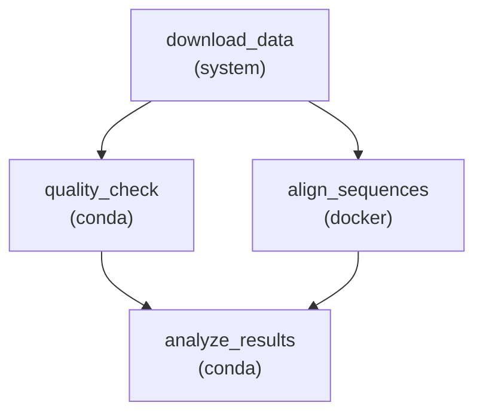

# 05 — Environment Management

Use different software environments for different pipeline steps. This is critical in bioinformatics where tools have conflicting dependencies.

!!! info "Concepts Covered"
    - Per-rule environment declarations
    - Conda environment specifications
    - Docker container execution
    - Dependency isolation patterns
    - Mixed-environment workflows

## Workflow Definition

```toml
# examples/gallery/05_conda_environments.oxoflow

[workflow]
name = "environment-showcase"
version = "1.0.0"
description = "Demonstrates per-rule environment isolation with conda, docker, and venv"
author = "oxo-flow examples"

[defaults]
threads = 2
memory = "4G"

[[rules]]
name = "download_data"
output = ["data/sequences.fasta"]
shell = """
mkdir -p data
echo '>seq1' > {output[0]}
echo 'ATCGATCGATCGATCGATCG' >> {output[0]}
echo '>seq2' >> {output[0]}
echo 'GCTAGCTAGCTAGCTAGCTA' >> {output[0]}
"""

[[rules]]
name = "quality_check"
input = ["data/sequences.fasta"]
output = ["qc/report.txt"]
shell = """
mkdir -p qc
count=$(grep -c '^>' {input[0]})
echo "Sequence count: $count" > {output[0]}
echo "QC: PASS" >> {output[0]}
"""

[rules.environment]
conda = "envs/qc.yaml"

[[rules]]
name = "align_sequences"
input = ["data/sequences.fasta"]
output = ["aligned/alignment.bam"]
threads = 8
memory = "16G"
shell = "echo 'Alignment placeholder' > {output[0]}"

[rules.environment]
docker = "biocontainers/bwa-mem2:2.2.1"

[[rules]]
name = "analyze_results"
input = ["aligned/alignment.bam", "qc/report.txt"]
output = ["results/analysis.json"]
shell = """
mkdir -p results
echo '{"status": "complete", "qc": "pass", "aligned": true}' > {output[0]}
"""

[rules.environment]
conda = "envs/analysis.yaml"
```

## Key Concepts

### Per-Rule Environment Isolation

Each rule can declare its own isolated software environment. oxo-flow supports five environment backends:

| Backend | Declaration | Use Case |
|---------|-------------|----------|
| **Conda** | `conda = "envs/tool.yaml"` | Tool-specific environments with precise version pinning |
| **Docker** | `docker = "image:tag"` | Container-based isolation with full reproducibility |
| **Singularity** | `singularity = "docker://image:tag"` | HPC-compatible containers (no root required) |
| **Pixi** | `pixi = "pixi.toml"` | Fast conda alternative with lockfile support |
| **Venv** | `venv = "path/to/venv"` | Python virtual environments |

### Why Per-Rule Environments?

Bioinformatics tools often have conflicting dependencies:

- **FastQC** requires Java 11
- **BWA-MEM2** requires a specific libdeflate version
- **GATK** requires Java 17 with specific Spark libraries
- **VEP** requires Perl with custom modules

Per-rule environment isolation eliminates dependency conflicts entirely. Each step runs in its own clean environment.

### Environment Resolution Order

When a rule specifies an environment, oxo-flow:

1. **Detects** whether the backend is available on the system
2. **Creates** the environment (if it doesn't exist)
3. **Activates** the environment
4. **Runs** the shell command inside the environment
5. **Deactivates** the environment after completion

### DAG with Mixed Environments



## Running the Workflow

### Validate

```bash
$ oxo-flow validate examples/gallery/05_conda_environments.oxoflow
✓ examples/gallery/05_conda_environments.oxoflow — 4 rules, 4 dependencies
```

### Check Available Environments

```bash
$ oxo-flow env list
Available environment backends:
  ✓ system   — Default system shell
  ✓ conda    — Conda package manager
  ✓ docker   — Docker containers
  ✓ singularity — Singularity/Apptainer containers
  ✗ pixi     — Not found
  ✗ venv     — Not configured
```

## What's Next?

Move on to [RNA-seq Quantification](rnaseq.md) for a complete transcriptomics analysis pipeline.
