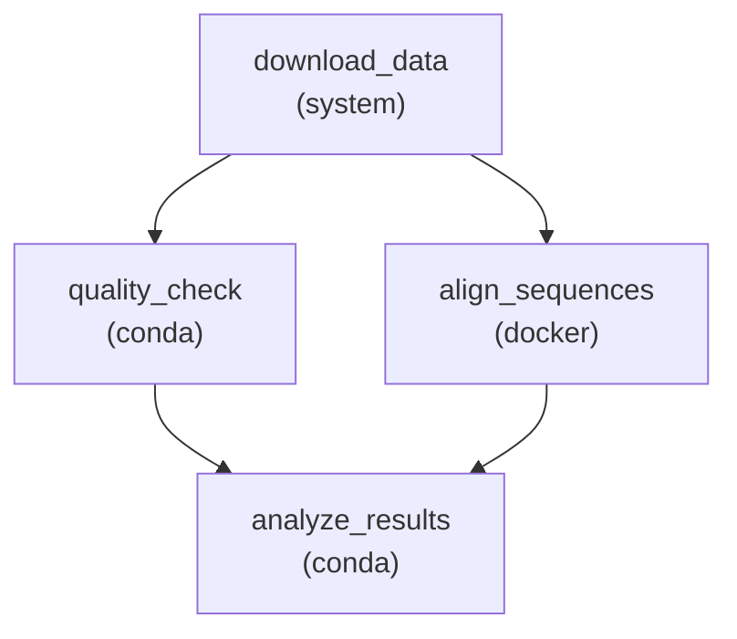

# 05 — Environment Management

Use different software environments for different pipeline steps. This is critical in bioinformatics where tools have conflicting dependencies.

!!! info "Concepts Covered"
    - Per-rule environment declarations
    - Conda environment specifications
    - Docker container execution
    - Dependency isolation patterns
    - Mixed-environment workflows

## Workflow Definition

```toml
# examples/gallery/05_conda_environments.oxoflow
--8<-- "examples/gallery/05_conda_environments.oxoflow"
```

## Key Concepts

### Per-Rule Environment Isolation

Each rule can declare its own isolated software environment. oxo-flow supports eight environment backends:

| Backend | Declaration | Use Case |
|---------|-------------|----------|
| **Conda** | `conda = "envs/tool.yaml"` | Tool-specific environments with precise version pinning |
| **Mamba** | `mamba = "envs/tool.yaml"` | Fast C++ reimplementation of conda with parallel dependency solving |
| **Pixi** | `pixi = "pixi.toml"` | Fast conda alternative with lockfile support |
| **Docker** | `docker = "image:tag"` | Container-based isolation with full reproducibility |
| **Singularity** | `singularity = "docker://image:tag"` | HPC-compatible containers (no root required) |
| **Venv** | `venv = "path/to/venv"` | Python virtual environments |
| **System** | *(no declaration — default)* | Use the system's default tools without isolation |
| **Modules** | `modules = "tool/1.0"` | HPC environment modules (Lmod/Environment Modules) |

!!! note "Ready-made environment specs"

    Every `envs/*.yaml` referenced by the gallery and top-level examples
    ships in [`examples/envs/`](https://github.com/Traitome/oxo-flow/tree/main/examples/envs)
    (18 specs, version-pinned). Copy the directory next to a workflow to
    resolve its environment declarations; see
    [`examples/README.md`](https://github.com/Traitome/oxo-flow/blob/main/examples/README.md).

### Why Per-Rule Environments?

Bioinformatics tools often have conflicting dependencies:

- **FastQC** requires Java 11+
- **BWA-MEM2** requires an x86 CPU with AVX2 (SIMD-accelerated build)
- **GATK** requires Java 17 with specific Spark libraries
- **VEP** requires Perl with custom modules

Per-rule environment isolation eliminates dependency conflicts entirely. Each step runs in its own clean environment.

### Environment Resolution Order

When a rule specifies an environment, oxo-flow:

1. **Detects** whether the backend is available on the system
2. **Creates** the environment (if it doesn't exist)
3. **Activates** the environment
4. **Runs** the shell command inside the environment
5. **Deactivates** the environment after completion

The full backend matrix (conda, mamba, pixi, docker, singularity, venv, modules) and activation semantics are documented in the [environment system reference](../reference/environment-system.md).

### DAG with Mixed Environments


```mermaid
graph TD
    A["download_data<br/>(system)"] --> B["quality_check<br/>(conda)"]
    A --> C["align_sequences<br/>(docker)"]
    B --> D["analyze_results<br/>(conda)"]
    C --> D
```

## Running the Workflow

### Validate

```bash
$ oxo-flow validate examples/gallery/05_conda_environments.oxoflow
✓ examples/gallery/05_conda_environments.oxoflow — 4 rules, 4 dependencies
```

### Check Available Environments

```bash
$ oxo-flow env list
oxo-flow 0.14.0 — Bioinformatics Pipeline Engine
Available environment backends:
  ✓ system
  ✓ mamba
  ✓ conda
  ✓ docker
  ✓ venv
```

Only backends installed on the current system are listed, so the output varies from machine to machine.

## What's Next?

Move on to [RNA-seq Quantification](rnaseq.md) for a complete transcriptomics analysis pipeline.
