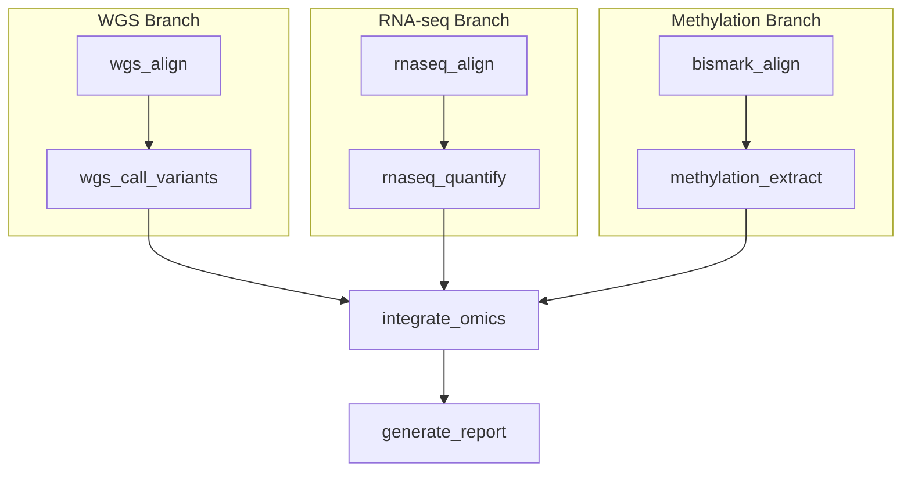

# 08 — Multi-Omics Integration

Integrate whole-genome sequencing (WGS), RNA-seq, and bisulfite sequencing (methylation) data into a unified analysis. This represents the most complex DAG topology in the gallery, with three independent processing branches that converge at an integration step.

!!! info "Concepts Covered"
    - Complex branching DAG topology with three independent data branches
    - Cross-omics data integration (WGS + RNA-seq + Methylation)
    - Multiple environment backends in a single pipeline
    - Fan-in convergence from independent branches
    - Clinical-grade multi-omics reporting

## Pipeline Overview



**Branches:**

1. **WGS Branch** — Alignment → Variant calling (DNA mutations)
2. **RNA-seq Branch** — Splice-aware alignment → Gene expression quantification
3. **Methylation Branch** — Bisulfite alignment → CpG methylation extraction

**Convergence:**

4. **Integration** — Combine variant, expression, and methylation data per sample
5. **Report** — Generate a multi-omics summary report

## Workflow Definition

```toml
# examples/gallery/08_multiomics_integration.oxoflow

[workflow]
name = "multiomics-integration"
version = "1.0.0"
description = "Multi-omics data integration: WGS + RNA-seq + Methylation"
author = "oxo-flow examples"

[config]
reference = "/data/references/GRCh38/genome.fa"
gene_annotation = "/data/references/GRCh38/genes.gtf"
samples = "samples.csv"
genome_build = "GRCh38"

[defaults]
threads = 4
memory = "8G"

# === WGS Branch ===

[[rules]]
name = "wgs_align"
input = ["wgs/{sample}_R1.fastq.gz", "wgs/{sample}_R2.fastq.gz"]
output = ["wgs_aligned/{sample}.sorted.bam"]
threads = 16
memory = "32G"
description = "WGS read alignment with BWA-MEM2"
shell = """
mkdir -p wgs_aligned
bwa-mem2 mem -t {threads} {config.reference} {input[0]} {input[1]} \
    | samtools sort -@ 4 -o {output[0]}
samtools index {output[0]}
"""

[rules.environment]
docker = "biocontainers/bwa-mem2:2.2.1"

[[rules]]
name = "wgs_call_variants"
input = ["wgs_aligned/{sample}.sorted.bam"]
output = ["wgs_variants/{sample}.vcf.gz"]
threads = 8
memory = "16G"
description = "Variant calling with GATK HaplotypeCaller"
shell = """
mkdir -p wgs_variants
gatk HaplotypeCaller \
    -I {input[0]} -R {config.reference} \
    -O {output[0]} --native-pair-hmm-threads {threads}
"""

[rules.environment]
singularity = "docker://broadinstitute/gatk:4.5.0.0"

# === RNA-seq Branch ===

[[rules]]
name = "rnaseq_align"
input = ["rnaseq/{sample}_R1.fastq.gz", "rnaseq/{sample}_R2.fastq.gz"]
output = ["rnaseq_aligned/{sample}/Aligned.sortedByCoord.out.bam"]
threads = 16
memory = "32G"
description = "RNA-seq splice-aware alignment with STAR"
shell = """
mkdir -p rnaseq_aligned/{sample}
STAR --runThreadN {threads} \
     --genomeDir /data/references/GRCh38/star_index \
     --readFilesIn {input[0]} {input[1]} \
     --readFilesCommand zcat \
     --outSAMtype BAM SortedByCoordinate \
     --outFileNamePrefix rnaseq_aligned/{sample}/
"""

[rules.environment]
conda = "envs/star.yaml"

[[rules]]
name = "rnaseq_quantify"
input = ["rnaseq_aligned/{sample}/Aligned.sortedByCoord.out.bam"]
output = ["expression/{sample}.counts.txt"]
threads = 4
description = "Gene expression quantification with featureCounts"
shell = """
mkdir -p expression
featureCounts -T {threads} \
              -a {config.gene_annotation} \
              -o {output[0]} -p --countReadPairs \
              {input[0]}
"""

[rules.environment]
conda = "envs/subread.yaml"

# === Methylation Branch ===

[[rules]]
name = "bismark_align"
input = ["methyl/{sample}_R1.fastq.gz", "methyl/{sample}_R2.fastq.gz"]
output = ["methyl_aligned/{sample}.deduplicated.bam"]
threads = 8
memory = "32G"
description = "Bisulfite-seq alignment with Bismark"
shell = """
mkdir -p methyl_aligned
bismark --genome /data/references/GRCh38/bismark_index \
        -1 {input[0]} -2 {input[1]} \
        --parallel {threads} -o methyl_aligned/
deduplicate_bismark --bam methyl_aligned/{sample}_R1_bismark_bt2_pe.bam \
        -o methyl_aligned/{sample}
"""

[rules.environment]
conda = "envs/bismark.yaml"

[[rules]]
name = "methylation_extract"
input = ["methyl_aligned/{sample}.deduplicated.bam"]
output = ["methylation/{sample}.CpG_report.txt"]
threads = 4
memory = "16G"
description = "Extract CpG methylation calls"
shell = """
mkdir -p methylation
bismark_methylation_extractor --paired-end --comprehensive \
    --genome_folder /data/references/GRCh38/bismark_index \
    --parallel {threads} --CX --cytosine_report \
    -o methylation/ {input[0]}
"""

[rules.environment]
conda = "envs/bismark.yaml"

# === Integration ===

[[rules]]
name = "integrate_omics"
input = [
    "wgs_variants/{sample}.vcf.gz",
    "expression/{sample}.counts.txt",
    "methylation/{sample}.CpG_report.txt"
]
output = ["integration/{sample}.integrated.json"]
threads = 4
memory = "16G"
description = "Integrate multi-omics data layers for each sample"
shell = """
mkdir -p integration
echo '{' > {output[0]}
echo '  "sample": "{sample}",' >> {output[0]}
echo '  "genome_build": "{config.genome_build}",' >> {output[0]}
echo '  "data_layers": ["wgs_variants", "rnaseq_expression", "methylation"],' >> {output[0]}
echo '  "variant_file": "{input[0]}",' >> {output[0]}
echo '  "expression_file": "{input[1]}",' >> {output[0]}
echo '  "methylation_file": "{input[2]}",' >> {output[0]}
echo '  "status": "integrated"' >> {output[0]}
echo '}' >> {output[0]}
"""

[[rules]]
name = "generate_report"
input = ["integration/{sample}.integrated.json"]
output = ["results/{sample}.multiomics_report.html"]
description = "Generate multi-omics integration report"
shell = """
mkdir -p results
echo '<html><body>' > {output[0]}
echo '<h1>Multi-Omics Integration Report</h1>' >> {output[0]}
echo '<h2>Sample: {sample}</h2>' >> {output[0]}
echo '<p>Genome Build: {config.genome_build}</p>' >> {output[0]}
echo '<p>Data layers integrated: WGS, RNA-seq, Methylation</p>' >> {output[0]}
echo '</body></html>' >> {output[0]}
"""

[report]
template = "multiomics_report"
format = ["html", "json"]
sections = ["summary", "variants", "expression", "methylation", "integration", "provenance"]
```

## Scientific Context

### Why Multi-Omics?

Single-omics analyses provide incomplete pictures:

| Data Type | Information | Limitation |
|-----------|-------------|------------|
| **WGS** | DNA mutations, structural variants | Cannot reveal functional impact |
| **RNA-seq** | Gene expression levels | Cannot identify causal mutations |
| **Methylation** | Epigenetic regulation | Cannot directly show gene activity |

Integrating all three layers enables:

- **Variant-to-expression correlation** — Do mutations affect gene expression?
- **Epigenetic-expression coupling** — Does promoter methylation silence gene expression?
- **Multi-layer biomarker discovery** — Combine signals for stronger clinical predictions

### DAG Parallelism

The three branches (WGS, RNA-seq, Methylation) are entirely independent and execute in parallel. With sufficient resources (`-j 6`), all six alignment and analysis steps can run simultaneously:

```bash
# Execute with 6 parallel jobs to maximize branch parallelism
oxo-flow run examples/gallery/08_multiomics_integration.oxoflow -j 6
```

## Running the Workflow

### Validate

```bash
$ oxo-flow validate examples/gallery/08_multiomics_integration.oxoflow
✓ examples/gallery/08_multiomics_integration.oxoflow — 8 rules, 7 dependencies
```

### Resource Summary

| Rule | Threads | Memory | Environment | Branch |
|------|---------|--------|-------------|--------|
| wgs_align | 16 | 32G | docker | WGS |
| wgs_call_variants | 8 | 16G | singularity | WGS |
| rnaseq_align | 16 | 32G | conda | RNA-seq |
| rnaseq_quantify | 4 | 8G | conda | RNA-seq |
| bismark_align | 8 | 32G | conda | Methylation |
| methylation_extract | 4 | 16G | conda | Methylation |
| integrate_omics | 4 | 16G | system | Integration |
| generate_report | 4 | 8G | system | Report |

## Further Reading

- [Venus Pipeline](../reference/venus-pipeline.md) — Clinical-grade somatic variant calling built on oxo-flow
- [DAG Engine](../reference/dag-engine.md) — How oxo-flow resolves dependencies and optimizes parallel execution
- [Environment System](../reference/environment-system.md) — Technical details on environment backend isolation
