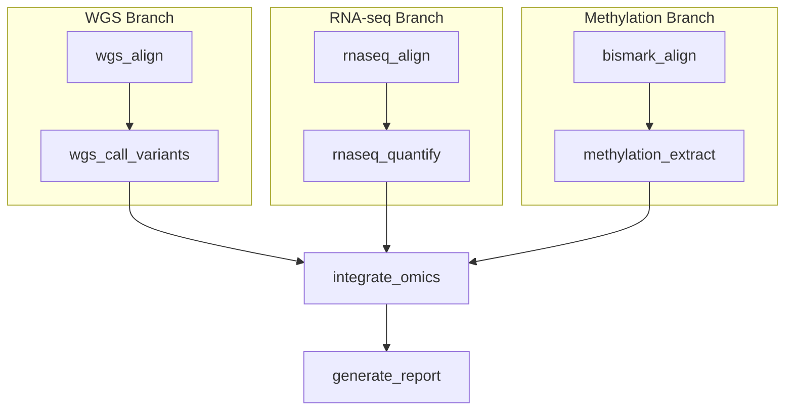

# 08 — Multi-Omics Integration

Integrate whole-genome sequencing (WGS), RNA-seq, and bisulfite sequencing (methylation) data into a unified analysis. This represents the most complex DAG topology in the gallery, with three independent processing branches that converge at an integration step.

!!! info "Concepts Covered"
    - Complex branching DAG topology with three independent data branches
    - Cross-omics data integration (WGS + RNA-seq + Methylation)
    - Multiple environment backends in a single pipeline
    - Fan-in convergence from independent branches
    - `{sample}` wildcard expansion ([wildcards reference](../reference/wildcards.md))
    - Multi-omics integration and reporting

## Pipeline Overview


```mermaid
graph TD
    subgraph WGS Branch
        A1[wgs_align] --> A2[wgs_call_variants]
    end
    subgraph RNA-seq Branch
        B1[rnaseq_align] --> B2[rnaseq_quantify]
    end
    subgraph Methylation Branch
        C1[bismark_align] --> C2[methylation_extract]
    end
    A2 --> D[integrate_omics]
    B2 --> D
    C2 --> D
    D --> E[generate_report]
```

**Branches:**

1. **WGS Branch** — Alignment → Variant calling (DNA mutations)
2. **RNA-seq Branch** — Splice-aware alignment → Gene expression quantification
3. **Methylation Branch** — Bisulfite alignment → CpG methylation extraction

**Convergence:**

4. **Integration** — Combine variant, expression, and methylation data per sample
5. **Report** — Generate a multi-omics summary report

## Workflow Definition

```toml
# examples/gallery/08_multiomics_integration.oxoflow
--8<-- "examples/gallery/08_multiomics_integration.oxoflow"
```

## Scientific Context

### Why Multi-Omics?

Single-omics analyses provide incomplete pictures:

| Data Type | Information | Limitation |
|-----------|-------------|------------|
| **WGS** | DNA mutations (SNVs, indels) | Cannot reveal functional impact |
| **RNA-seq** | Gene expression levels | Cannot identify causal mutations |
| **Methylation** | Epigenetic regulation | Cannot directly show gene activity |

Integrating all three layers enables:

- **Variant-to-expression correlation** — Do mutations affect gene expression?
- **Epigenetic-expression coupling** — Does promoter methylation silence gene expression?
- **Multi-layer biomarker discovery** — Combine signals for stronger clinical predictions

!!! note "What this example actually computes"
    The three branches here produce the raw data layers (variants, counts, methylation calls). The `integrate_omics` and `generate_report` steps are structural placeholders — they record file provenance and build a report skeleton rather than computing correlations. A production workflow would replace them with real joint analyses (e.g., eQTL-style association tests, methylation–expression coupling models).

### DAG Parallelism

The three branches (WGS, RNA-seq, Methylation) are entirely independent and execute in parallel. `-j` controls how many rules may be *submitted* concurrently, but the engine's resource pool schedules the actual execution by thread capacity — the 16-thread align rules cannot oversubscribe the CPU:

```bash
# The dry-run hint suggests -j from machine threads ÷ per-rule threads
# (e.g. 32-thread machine ÷ 16-thread align = -j 2).
# The resource pool queues any excess safely either way.
oxo-flow run examples/gallery/08_multiomics_integration.oxoflow -j 2
```

## Running the Workflow

### Validate

```bash
$ oxo-flow validate examples/gallery/08_multiomics_integration.oxoflow
✓ examples/gallery/08_multiomics_integration.oxoflow — 8 rules, 7 dependencies
```

### Run

Samples come from the `[[sample_groups]]` block in the workflow file (edit the list to match your data, or pass `--sample` on the CLI). Each sample needs all three input pairs on disk under `wgs/`, `rnaseq/`, and `methyl/`:

```bash
oxo-flow run examples/gallery/08_multiomics_integration.oxoflow -j 2
```

`-j 2` lets the engine submit up to two rules concurrently; the resource pool schedules the rest by thread capacity.

### Resource Summary

| Rule | Threads | Memory | Environment | Branch |
|------|---------|--------|-------------|--------|
| wgs_align | 16 | 32G | docker | WGS |
| wgs_call_variants | 8 | 16G | singularity | WGS |
| rnaseq_align | 16 | 32G | conda | RNA-seq |
| rnaseq_quantify | 4 | 8G | conda | RNA-seq |
| bismark_align | 8 | 32G | conda | Methylation |
| methylation_extract | 4 | 16G | conda | Methylation |
| integrate_omics | 4 | 16G | system | Integration |
| generate_report | 4 | 8G | system | Report |

## Further Reading

- [DAG Engine](../reference/dag-engine.md) — How oxo-flow resolves dependencies and optimizes parallel execution
- [Environment System](../reference/environment-system.md) — Technical details on environment backend isolation
