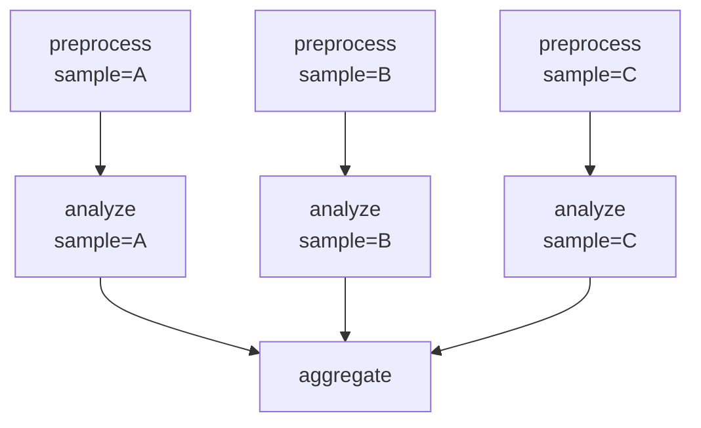

# 03 — Parallel Samples

Process multiple samples in parallel using wildcard expansion. This pattern is fundamental to bioinformatics — one workflow definition handles any number of samples.

!!! info "Concepts Covered"
    - `{sample}` wildcard expansion
    - Fan-out / fan-in patterns
    - Per-rule resource declarations (threads, memory)
    - Default resource settings via `[defaults]`

## Workflow Definition

```toml
# examples/gallery/03_parallel_samples.oxoflow

[workflow]
name = "parallel-samples"
version = "1.0.0"
description = "Process multiple samples in parallel using wildcards"
author = "oxo-flow examples"

[config]
samples = "samples.csv"

[defaults]
threads = 2
memory = "4G"

[[rules]]
name = "preprocess"
input = ["raw/{sample}.txt"]
output = ["processed/{sample}.clean.txt"]
shell = """
mkdir -p processed
sed '/^$/d' {input[0]} | sort > {output[0]}
"""

[[rules]]
name = "analyze"
input = ["processed/{sample}.clean.txt"]
output = ["analysis/{sample}.stats.txt"]
threads = 4
memory = "8G"
shell = """
mkdir -p analysis
lines=$(wc -l < {input[0]})
words=$(wc -w < {input[0]})
chars=$(wc -c < {input[0]})
echo "sample: {sample}" > {output[0]}
echo "lines: $lines" >> {output[0]}
echo "words: $words" >> {output[0]}
echo "chars: $chars" >> {output[0]}
"""

[[rules]]
name = "aggregate"
input = ["analysis/{sample}.stats.txt"]
output = ["results/combined_report.txt"]
shell = """
mkdir -p results
echo "=== Combined Analysis Report ===" > {output[0]}
echo "Generated by oxo-flow" >> {output[0]}
echo "" >> {output[0]}
cat {input[0]} >> {output[0]}
"""
```

## Key Concepts

### Wildcard Expansion

The `{sample}` pattern in file paths is a wildcard. When oxo-flow encounters wildcards, it expands the rule into concrete instances based on:

1. **Input file discovery** — scanning the filesystem for files matching the pattern
2. **Explicit configuration** — reading sample names from a config file (e.g., `samples.csv`)

For example, with three samples (`A`, `B`, `C`), the `preprocess` rule expands into three independent jobs that can run in parallel.

### Resource Declarations

Each rule can declare its resource requirements:

```toml
threads = 4     # CPU cores needed
memory = "8G"   # RAM needed (supports G, M, K, T suffixes)
```

The `[defaults]` section provides fallback values for rules that don't specify resources.

### Fan-Out / Fan-In

- **Fan-out**: The `preprocess` and `analyze` rules create one job per sample → parallel execution
- **Fan-in**: The `aggregate` rule collects all per-sample results into a single output

## Running the Workflow

### Validate

```bash
$ oxo-flow validate examples/gallery/03_parallel_samples.oxoflow
✓ examples/gallery/03_parallel_samples.oxoflow — 3 rules, 2 dependencies
```

### DAG Structure



## What's Next?

Move on to [Scatter-Gather](scatter-gather.md) to learn how to split data into chunks, process them in parallel, and merge the results.
