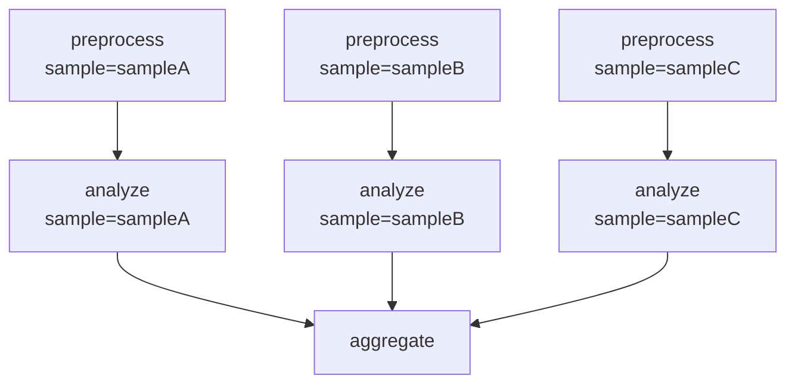

# 03 — Parallel Samples

Process multiple samples in parallel using wildcard expansion. This pattern is fundamental to bioinformatics — one workflow definition handles any number of samples.

!!! info "Concepts Covered"
    - `{sample}` wildcard expansion
    - Fan-out / fan-in patterns
    - Per-rule resource declarations (threads, memory)
    - Default resource settings via `[defaults]`

## Workflow Definition

```toml
# examples/gallery/03_parallel_samples.oxoflow
--8<-- "examples/gallery/03_parallel_samples.oxoflow"
```

## Key Concepts

### Wildcard Expansion

The `{sample}` pattern in file paths is a wildcard. When oxo-flow encounters wildcards, it expands the rule into concrete instances based on:

1. **Input file discovery** — scanning the filesystem for files matching the pattern
2. **Explicit configuration** — listing sample names in a `[[sample_groups]]` table

Here, the `[[sample_groups]]` table defines three samples (`sampleA`, `sampleB`, `sampleC`), so the `preprocess` rule expands into three independent jobs that can run in parallel.

See the [wildcards reference](../reference/wildcards.md) for every expansion source (file discovery, pairs, sample groups) and for regex constraints.

### Resource Declarations

Each rule can declare its resource requirements:

```toml
[rules.resources]
threads = 4     # CPU cores needed
memory = "8G"   # RAM needed (supports G, M, K, T suffixes)
```

The `[defaults]` section provides fallback values for rules that don't specify resources.

### Fan-Out / Fan-In

- **Fan-out**: The `preprocess` and `analyze` rules create one job per sample → parallel execution
- **Fan-in**: The `aggregate` rule collects all per-sample results into a single output

This example writes the fan-in inputs out explicitly to keep it minimal. In real workflows, [`expand_inputs`](../reference/wildcards.md#gathering-inputs-with-expand_inputs) derives them from the sample list automatically. Full mechanics: [Fan-out vs Fan-in](../reference/wildcards.md#fan-out-vs-fan-in).

## Running the Workflow

### Validate

```bash
$ oxo-flow validate examples/gallery/03_parallel_samples.oxoflow
✓ examples/gallery/03_parallel_samples.oxoflow — 3 rules, 2 dependencies

  ⚠ Warning: The following input files do not exist:
    - analysis/sampleA.stats.txt
    - analysis/sampleB.stats.txt
    - analysis/sampleC.stats.txt
```

The `✓` line is what matters — validate exits 0 and the workflow is well-formed. The warning is expected here: `aggregate` lists its fan-in inputs as literal paths (`analysis/sampleA.stats.txt`, …), and at validate time oxo-flow compares them against rules' *unexpanded* output templates (`analysis/{sample}.stats.txt`), so the match isn't visible yet. At run time the wildcards expand to exactly those concrete paths and the run proceeds normally. Validate only warns for missing inputs; a genuinely missing *source* file (no rule produces it) fails the run at start — see [the troubleshooting entry](../how-to/troubleshooting.md#missing-required-source-input-fail-fast-at-run-start).

### DAG Structure


```mermaid
graph TD
    A1[preprocess<br/>sample=sampleA] --> B1[analyze<br/>sample=sampleA]
    A2[preprocess<br/>sample=sampleB] --> B2[analyze<br/>sample=sampleB]
    A3[preprocess<br/>sample=sampleC] --> B3[analyze<br/>sample=sampleC]
    B1 --> C[aggregate]
    B2 --> C
    B3 --> C
```

## What's Next?

!!! note "Input data"

    The `raw/{sample}.txt` inputs are placeholders — create your own files
    (e.g. `mkdir -p raw && for s in sampleA sampleB sampleC; do echo "$s" >
    raw/$s.txt; done`) before running the workflow.

Move on to [Scatter-Gather](scatter-gather.md) to learn how to scatter work by chromosome, process the partitions in parallel, and merge the results.
