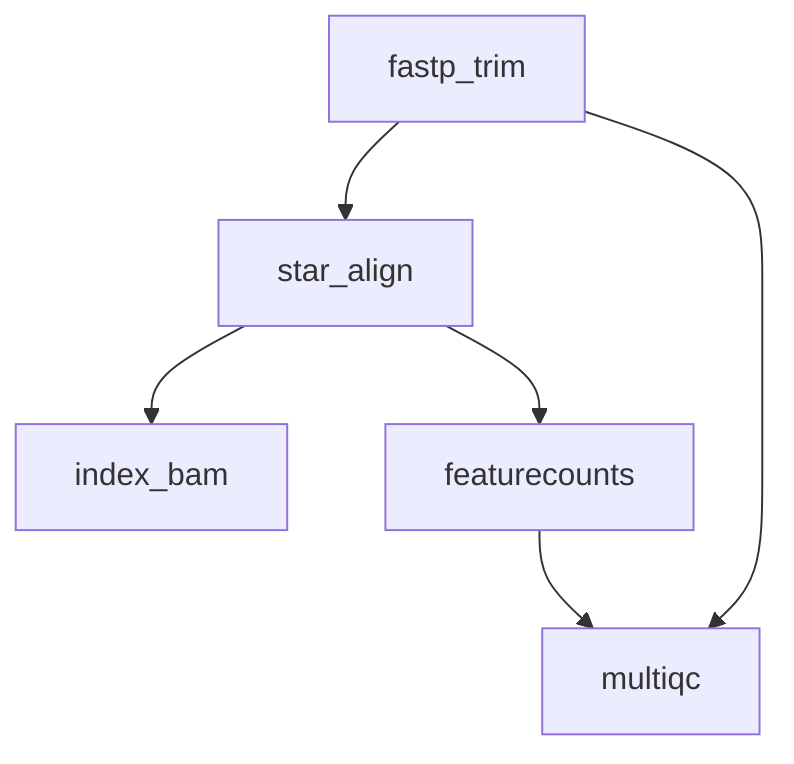

# 06 — RNA-seq Quantification

A complete RNA-seq gene expression quantification pipeline from raw FASTQ to count matrices and QC reports. This workflow follows established best practices for bulk RNA-seq analysis.

!!! info "Concepts Covered"
    - Real-world transcriptomics analysis pipeline
    - STAR alignment, featureCounts quantification, MultiQC reporting
    - Complex DAG with branching dependencies
    - Report configuration for automated QC summaries

## Pipeline Overview



**Steps:**

1. **fastp_trim** — Adapter removal and quality filtering
2. **star_align** — Splice-aware alignment to reference genome with STAR
3. **index_bam** — Index aligned BAM for downstream tools
4. **featurecounts** — Gene-level read counting
5. **multiqc** — Aggregate QC metrics into a single interactive report

## Workflow Definition

```toml
# examples/gallery/06_rnaseq_quantification.oxoflow

[workflow]
name = "rnaseq-quantification"
version = "1.0.0"
description = "RNA-seq gene expression quantification pipeline"
author = "oxo-flow examples"

[config]
reference_genome = "/data/references/GRCh38/genome.fa"
gene_annotation = "/data/references/GRCh38/genes.gtf"
star_index = "/data/references/GRCh38/star_index"
samples = "samples.csv"

[defaults]
threads = 4
memory = "8G"

[[rules]]
name = "fastp_trim"
input = ["raw/{sample}_R1.fastq.gz", "raw/{sample}_R2.fastq.gz"]
output = [
    "trimmed/{sample}_R1.fastq.gz",
    "trimmed/{sample}_R2.fastq.gz",
    "qc/{sample}_fastp.json"
]
threads = 8
description = "Adapter trimming and quality filtering with fastp"
shell = """
mkdir -p trimmed qc
fastp -i {input[0]} -I {input[1]} \
      -o {output[0]} -O {output[1]} \
      --json {output[2]} \
      --thread {threads} \
      --qualified_quality_phred 20 \
      --length_required 50
"""

[rules.environment]
conda = "envs/fastp.yaml"

[[rules]]
name = "star_align"
input = ["trimmed/{sample}_R1.fastq.gz", "trimmed/{sample}_R2.fastq.gz"]
output = [
    "aligned/{sample}/Aligned.sortedByCoord.out.bam",
    "aligned/{sample}/ReadsPerGene.out.tab"
]
threads = 16
memory = "32G"
description = "Splice-aware alignment with STAR"
shell = """
mkdir -p aligned/{sample}
STAR --runThreadN {threads} \
     --genomeDir {config.star_index} \
     --readFilesIn {input[0]} {input[1]} \
     --readFilesCommand zcat \
     --outSAMtype BAM SortedByCoordinate \
     --quantMode GeneCounts \
     --outFileNamePrefix aligned/{sample}/
"""

[rules.environment]
conda = "envs/star.yaml"

[[rules]]
name = "index_bam"
input = ["aligned/{sample}/Aligned.sortedByCoord.out.bam"]
output = ["aligned/{sample}/Aligned.sortedByCoord.out.bam.bai"]
description = "Index aligned BAM file"
shell = "samtools index {input[0]}"

[rules.environment]
conda = "envs/samtools.yaml"

[[rules]]
name = "featurecounts"
input = ["aligned/{sample}/Aligned.sortedByCoord.out.bam"]
output = ["counts/{sample}.counts.txt"]
threads = 4
description = "Gene-level read counting with featureCounts"
shell = """
mkdir -p counts
featureCounts -T {threads} \
              -a {config.gene_annotation} \
              -o {output[0]} \
              -p --countReadPairs \
              -s 2 \
              {input[0]}
"""

[rules.environment]
conda = "envs/subread.yaml"

[[rules]]
name = "multiqc"
input = ["qc/{sample}_fastp.json", "counts/{sample}.counts.txt"]
output = ["results/multiqc_report.html"]
description = "Aggregate QC metrics into a single report"
shell = """
mkdir -p results
multiqc qc/ counts/ -o results/ --force
"""

[rules.environment]
conda = "envs/multiqc.yaml"

[report]
template = "rnaseq_report"
format = ["html", "json"]
sections = ["summary", "qc_metrics", "alignment_stats", "gene_counts"]
```

## Key Design Decisions

### Splice-Aware Alignment

RNA-seq reads span exon-exon junctions. STAR's splice-aware alignment correctly handles reads that cross intron boundaries, critical for accurate gene expression quantification.

### Strandedness

The `featureCounts -s 2` flag specifies reverse-strand counting, appropriate for the most common library preparation methods (Illumina dUTP). Adjust this based on your library protocol.

### Quality Thresholds

- **Phred ≥ 20**: Only bases with ≥99% accuracy are retained
- **Length ≥ 50**: Reads shorter than 50 bp after trimming are discarded to ensure reliable alignment

## Running the Workflow

### Validate

```bash
$ oxo-flow validate examples/gallery/06_rnaseq_quantification.oxoflow
✓ examples/gallery/06_rnaseq_quantification.oxoflow — 5 rules, 6 dependencies
```

### Resource Summary

| Rule | Threads | Memory | Environment |
|------|---------|--------|-------------|
| fastp_trim | 8 | 8G | conda |
| star_align | 16 | 32G | conda |
| index_bam | 4 | 8G | conda |
| featurecounts | 4 | 8G | conda |
| multiqc | 4 | 8G | conda |

## What's Next?

Move on to [WGS Germline Calling](wgs-germline.md) for a complete GATK best-practices variant calling pipeline.
