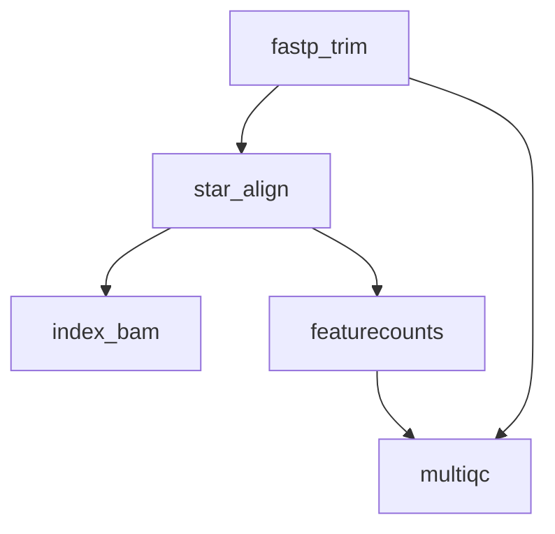

# 06 — RNA-seq Quantification

A complete RNA-seq gene expression quantification pipeline from raw FASTQ to count matrices and QC reports. This workflow follows established best practices for bulk RNA-seq analysis.

!!! info "Concepts Covered"
    - Real-world transcriptomics analysis pipeline
    - STAR alignment, featureCounts quantification, MultiQC reporting
    - Complex DAG with branching dependencies
    - Report configuration for automated QC summaries

## Pipeline Overview


```mermaid
graph TD
    A[fastp_trim] --> B[star_align]
    B --> C[index_bam]
    B --> D[featurecounts]
    A --> E[multiqc]
    D --> E
```

**Steps:**

1. **fastp_trim** — Adapter removal and quality filtering
2. **star_align** — Splice-aware alignment to reference genome with STAR
3. **index_bam** — Index aligned BAM for downstream tools
4. **featurecounts** — Gene-level read counting
5. **multiqc** — Aggregate QC metrics (fastp JSON + featureCounts summaries) into a single interactive report. Depends on the rules whose outputs it parses — not on every upstream rule.

## Workflow Definition

```toml
# examples/gallery/06_rnaseq_quantification.oxoflow
--8<-- "examples/gallery/06_rnaseq_quantification.oxoflow"
```

## Key Design Decisions

### Splice-Aware Alignment

RNA-seq reads span exon-exon junctions. STAR's splice-aware alignment correctly handles reads that cross intron boundaries, critical for accurate gene expression quantification.

### Strandedness

The `featureCounts -s 2` flag specifies reverse-strand counting, appropriate for the most common library preparation methods (Illumina dUTP). Adjust this based on your library protocol.

### Quality Thresholds

- **Phred ≥ 20**: Only bases with ≥99% accuracy are retained
- **Length ≥ 50**: Reads shorter than 50 bp after trimming are discarded to ensure reliable alignment

### `config.samples` Is Inert

The `samples = "samples.csv"` key in `[config]` is inert: no rule references it, and it does not control wildcard expansion. Sample expansion is driven by `[[sample_groups]]` (see [Parallel Samples](parallel-samples.md) and the [wildcards reference](../reference/wildcards.md)); the `multiqc` rule's `depends_on` ensures it runs exactly once regardless of how samples are expanded.

## Running the Workflow

### Validate

```bash
$ oxo-flow validate examples/gallery/06_rnaseq_quantification.oxoflow
✓ examples/gallery/06_rnaseq_quantification.oxoflow — 5 rules, 6 dependencies
```

### Resource Summary

| Rule | Threads | Memory | Environment |
|------|---------|--------|-------------|
| fastp_trim | 8 | 8G | conda |
| star_align | 16 | 32G | conda |
| index_bam | 4 | 8G | conda |
| featurecounts | 4 | 8G | conda |
| multiqc | 4 | 8G | conda |

## What's Next?

Move on to [WGS Germline Calling](wgs-germline.md) for a complete GATK best-practices variant calling pipeline.
