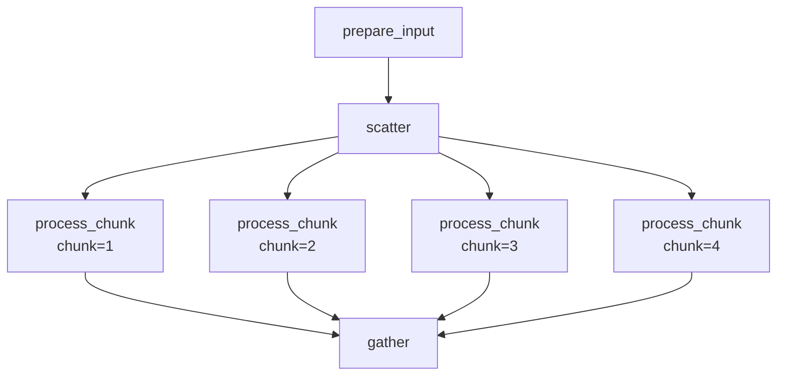

# 04 — Scatter-Gather

Split a dataset into chunks, process each chunk in parallel, then merge the results. This pattern is essential for parallelizing compute-intensive steps over large datasets.

!!! info "Concepts Covered"
    - Data partitioning (scatter)
    - Parallel chunk processing
    - Result merging (gather)
    - Config-driven parameterization

## Workflow Definition

```toml
# examples/gallery/04_scatter_gather.oxoflow

[workflow]
name = "scatter-gather"
version = "1.0.0"
description = "Scatter-gather parallel processing pattern"
author = "oxo-flow examples"

[config]
chunks = "4"

[defaults]
threads = 1
memory = "2G"

[[rules]]
name = "prepare_input"
output = ["data/full_dataset.txt"]
shell = """
mkdir -p data
for i in $(seq 1 1000); do
    echo "record_$i,$((RANDOM % 100)),$((RANDOM % 50))"
done > {output[0]}
"""

[[rules]]
name = "scatter"
input = ["data/full_dataset.txt"]
output = ["chunks/chunk_{chunk}.txt"]
shell = """
mkdir -p chunks
split -n l/{config.chunks} {input[0]} chunks/chunk_
ls chunks/chunk_* | head -1 | while read f; do mv "$f" {output[0]}; done
"""

[[rules]]
name = "process_chunk"
input = ["chunks/chunk_{chunk}.txt"]
output = ["processed/chunk_{chunk}.result.txt"]
threads = 2
shell = """
mkdir -p processed
awk -F',' '{sum += $2; count++} END {print "count=" count, "mean=" sum/count}' \
    {input[0]} > {output[0]}
"""

[[rules]]
name = "gather"
input = ["processed/chunk_{chunk}.result.txt"]
output = ["results/merged_result.txt"]
shell = """
mkdir -p results
echo "=== Scatter-Gather Results ===" > {output[0]}
cat {input[0]} >> {output[0]}
echo "Processing complete." >> {output[0]}
"""
```

## Key Concepts

### The Scatter-Gather Pattern

This is a classic parallel computing pattern:

1. **Prepare**: Generate or load the full dataset
2. **Scatter**: Partition the data into independent chunks
3. **Process**: Apply compute-intensive operations to each chunk in parallel
4. **Gather**: Merge the per-chunk results into a final output

### Config-Driven Parallelism

The number of chunks is controlled by a config variable:

```toml
[config]
chunks = "4"
```

Changing this value scales the parallelism without modifying any rules.

## Running the Workflow

### Validate

```bash
$ oxo-flow validate examples/gallery/04_scatter_gather.oxoflow
✓ examples/gallery/04_scatter_gather.oxoflow — 4 rules, 3 dependencies
```

### DAG Structure



## Use Cases

The scatter-gather pattern is widely used in bioinformatics:

- **Per-chromosome variant calling** — scatter by chromosome, call variants in parallel, merge VCFs
- **Parallel BLAST** — split query sequences, search in parallel, combine hits
- **Large-scale annotation** — partition a VCF, annotate chunks, merge results

## What's Next?

Move on to [Environment Management](environment-mgmt.md) to learn how to use conda, docker, and singularity environments per rule.
