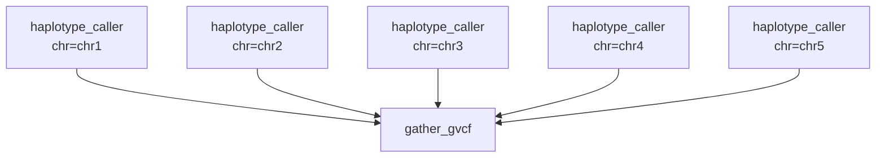

# 04 — Scatter-Gather

Call variants per chromosome in parallel, then merge the per-chromosome GVCFs into a single file. This pattern is essential for parallelizing compute-intensive steps over large datasets.

!!! info "Concepts Covered"
    - Per-chromosome variant calling (scatter)
    - Parallel chromosome processing
    - Result merging with a `gather` rule
    - Config-driven parameterization

## Workflow Definition

```toml
# examples/gallery/04_scatter_gather.oxoflow
--8<-- "examples/gallery/04_scatter_gather.oxoflow"
```

## Key Concepts

### The Scatter-Gather Pattern

This is a classic parallel computing pattern:

1. **Scatter**: The `haplotype_caller` rule declares a `scatter` key with `variable = "chr"` and `values_from = "config.chromosomes"`. oxo-flow expands one job per chromosome, and all jobs run in parallel.
2. **Process**: Each scattered job runs GATK HaplotypeCaller restricted to a single chromosome (`-L {chr}`), producing one per-chromosome GVCF.
3. **Gather**: The `gather_gvcf` rule receives the outputs of all scattered jobs as its `{input}` and merges them with GATK GatherVcfs.

Scatter variables (`{chr}` here) are **not** wildcards — the fan-out comes from the `scatter` declaration, not from `{...}` in paths (see [Wildcards](../reference/wildcards.md) for the difference). Within each scattered job the variable substitutes into `input`, `output`, `shell`, `log`, `script`, and the hook fields (`pre_exec` / `on_success` / `on_failure`) — so a per-chromosome script invocation like `script = "scripts/call_{chr}.sh"` resolves per instance. When the pattern is split → map → combine within a single rule, use the [`transform` operator](../reference/workflow-format.md#transform-unified-scatter-gather-operator) — see the [Transform Operator](transform-operator.md) gallery.

!!! info "Gather routing is declared, not inferred"
    Each scatter rule **explicitly names its gather rule** via the `gather = "..."` field — the engine routes outputs by that declaration, never by guessing:

    ```toml
    [[rules]]
    name = "call_by_chr"
    scatter = { variable = "chr", values_from = "config.chromosomes",
                gather = "gather_variants" }   # my outputs → gather_variants

    [[rules]]
    name = "qc_by_sample"
    scatter = { variable = "sample", values_from = "config.samples",
                gather = "gather_qc" }          # my outputs → gather_qc
    ```

    This makes complex scenarios reliable:

    - **Two scatters + two gathers** — each gather receives only its own scatter's outputs, no cross-contamination (verified: 2 chr outputs → gather_variants, 3 sample outputs → gather_qc)
    - **Multiple scatters → one gather** — name the same gather rule in several scatter rules and their outputs accumulate
    - **Explicit gather inputs preserved** — any `input` you declare on the gather rule is kept alongside the injected ones
    - **Independent rules unaffected** — non-scatter rules run concurrently without interference

    Note that `oxo-flow graph` shows the *unexpanded* template DAG (scatter rules before per-value expansion), while `oxo-flow dry-run` shows the fully expanded DAG with all per-chromosome jobs and gather edges.

### Config-Driven Parallelism

The chromosomes to scatter over are controlled by a config variable:

```toml
[config]
chromosomes = ["chr1", "chr2", "chr3", "chr4", "chr5"]
```

Changing this list scales the parallelism without modifying any rules.

### How the Gather Rule Works

The gather rule has no `input` of its own — oxo-flow automatically wires the outputs of every scattered instance into its `{input}` wildcard. The shell command iterates over them:

```bash
gatk GatherVcfs $(for f in {input}; do echo "-I $f "; done) -O {output[0]}
```

## Running the Workflow

### Validate

```bash
$ oxo-flow validate examples/gallery/04_scatter_gather.oxoflow
✓ examples/gallery/04_scatter_gather.oxoflow — 2 rules, 0 dependencies
```

### DAG Structure


```mermaid
graph TD
    A1[haplotype_caller<br/>chr=chr1] --> G[gather_gvcf]
    A2[haplotype_caller<br/>chr=chr2] --> G
    A3[haplotype_caller<br/>chr=chr3] --> G
    A4[haplotype_caller<br/>chr=chr4] --> G
    A5[haplotype_caller<br/>chr=chr5] --> G
```

## Use Cases

The scatter-gather pattern is widely used in bioinformatics:

- **Per-chromosome variant calling** — scatter by chromosome, call variants in parallel, merge GVCFs
- **Parallel BLAST** — split query sequences, search in parallel, combine hits
- **Large-scale annotation** — partition a VCF, annotate chunks, merge results

## What's Next?

Move on to [Environment Management](environment-mgmt.md) to learn how to use conda, docker, and singularity environments per rule.
