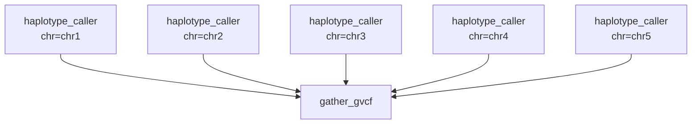

# 04 — Scatter-Gather

Call variants per chromosome in parallel, then merge the per-chromosome GVCFs into a single file. This pattern is essential for parallelizing compute-intensive steps over large datasets.

!!! info "Concepts Covered"
    - Per-chromosome variant calling (scatter)
    - Parallel chromosome processing
    - Result merging with a `gather` rule
    - Config-driven parameterization

## Workflow Definition

```toml
# examples/gallery/04_scatter_gather.oxoflow

[workflow]
name = "scatter-gather-chromosomes"
version = "1.0.0"
description = "Per-chromosome scatter-gather processing"
author = "Traitome"

[config]
chromosomes = ["chr1", "chr2", "chr3", "chr4", "chr5"]
reference = "/data/references/GRCh38/genome.fa"

[defaults]
threads = 4
memory = "8G"

[[rules]]
name = "haplotype_caller"
input = ["aligned/sample.bam"]
output = ["variants/sample.{chr}.g.vcf.gz"]
scatter = { variable = "chr", values_from = "config.chromosomes", gather = "gather_gvcf" }
shell = "gatk HaplotypeCaller -R {config.reference} -I {input[0]} -L {chr} -O {output[0]} -ERC GVCF"

[[rules]]
name = "gather_gvcf"
# The gather rule receives the output of all scattered rules as inputs
output = ["variants/sample.g.vcf.gz"]
shell = "gatk GatherVcfs $(for f in {input}; do echo \"-I $f \"; done) -O {output[0]}"
```

## Key Concepts

### The Scatter-Gather Pattern

This is a classic parallel computing pattern:

1. **Scatter**: The `haplotype_caller` rule declares a `scatter` key with `variable = "chr"` and `values_from = "config.chromosomes"`. oxo-flow expands one job per chromosome, and all jobs run in parallel.
2. **Process**: Each scattered job runs GATK HaplotypeCaller restricted to a single chromosome (`-L {chr}`), producing one per-chromosome GVCF.
3. **Gather**: The `gather_gvcf` rule receives the outputs of all scattered jobs as its `{input}` and merges them with GATK GatherVcfs.

!!! info "Gather inference is reliable in complex workflows"
    The gather rule's inputs are injected automatically by the expansion engine — you never declare them by hand. This stays reliable in complex scenarios:

    - **Multiple scatter rules feeding one gather** — all outputs accumulate (verified: two scatters with 3 + 2 values injected 5 inputs into one gather)
    - **Explicit inputs preserved** — any inputs you DO declare on the gather rule are kept alongside the injected ones
    - **Independent rules unaffected** — non-scatter rules run concurrently without interference

    Note that `oxo-flow graph` shows the *unexpanded* template DAG (scatter rules before per-value expansion), while `oxo-flow dry-run` shows the fully expanded DAG with all per-chromosome jobs and gather edges.

### Config-Driven Parallelism

The chromosomes to scatter over are controlled by a config variable:

```toml
[config]
chromosomes = ["chr1", "chr2", "chr3", "chr4", "chr5"]
```

Changing this list scales the parallelism without modifying any rules.

### How the Gather Rule Works

The gather rule has no `input` of its own — oxo-flow automatically wires the outputs of every scattered instance into its `{input}` wildcard. The shell command iterates over them:

```bash
gatk GatherVcfs $(for f in {input}; do echo "-I $f "; done) -O {output[0]}
```

## Running the Workflow

### Validate

```bash
$ oxo-flow validate examples/gallery/04_scatter_gather.oxoflow
✓ examples/gallery/04_scatter_gather.oxoflow — 2 rules, 0 dependencies
```

### DAG Structure


```mermaid
graph TD
    A1[haplotype_caller<br/>chr=chr1] --> G[gather_gvcf]
    A2[haplotype_caller<br/>chr=chr2] --> G
    A3[haplotype_caller<br/>chr=chr3] --> G
    A4[haplotype_caller<br/>chr=chr4] --> G
    A5[haplotype_caller<br/>chr=chr5] --> G
```

## Use Cases

The scatter-gather pattern is widely used in bioinformatics:

- **Per-chromosome variant calling** — scatter by chromosome, call variants in parallel, merge GVCFs
- **Parallel BLAST** — split query sequences, search in parallel, combine hits
- **Large-scale annotation** — partition a VCF, annotate chunks, merge results

## What's Next?

Move on to [Environment Management](environment-mgmt.md) to learn how to use conda, docker, and singularity environments per rule.
