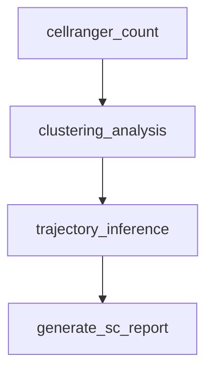

# 09 — Single-Cell RNA-seq

Scale transcriptome analysis to individual cells using droplet-based single-cell RNA sequencing (scRNA-seq). This workflow demonstrates a high-throughput pipeline for processing thousands of cells per sample, including barcode demultiplexing, quantification, and downstream clustering.

!!! info "Concepts Covered"
    - Droplet-based scRNA-seq processing (10x Genomics style)
    - Custom rule templates for repetitive preprocessing
    - High-concurrency scatter across cell barcodes
    - Resource-intensive alignment with splice-aware aligners
    - Integration with specialized scRNA-seq R/Python environments

## Pipeline Overview



**Steps:**

1. **Quantification** — Align reads to transcriptome and count UMI/barcodes (e.g., CellRanger)
2. **Analysis** — Quality control, normalization, and cell clustering (e.g., Seurat/Scanpy)
3. **Inference** — Developmental trajectory and cell type identification
4. **Report** — Generate an interactive single-cell analysis report

## Workflow Definition

```toml
# examples/gallery/09_single_cell_rnaseq.oxoflow

[workflow]
name = "sc-rnaseq-pipeline"
version = "1.0.0"
description = "Single-cell RNA-seq pipeline: CellRanger + Seurat"
author = "oxo-flow examples"

[config]
reference = "/data/references/GRCh38/cellranger_index"
samples = "sc_samples.csv"

[defaults]
threads = 8
memory = "32G"

[[rules]]
name = "cellranger_count"
input = ["raw/{sample}_R1.fastq.gz", "raw/{sample}_R2.fastq.gz"]
output = ["counts/{sample}/outs/filtered_feature_bc_matrix.h5"]
threads = 16
memory = "64G"
description = "scRNA-seq quantification with CellRanger"
shell = """
cellranger count --id={sample} \
                 --fastqs=raw/ \
                 --sample={sample} \
                 --transcriptome={config.reference} \
                 --localcores={threads} \
                 --localmem=60
"""

[rules.environment]
docker = "10xgenomics/cellranger:7.1.0"

[[rules]]
name = "clustering_analysis"
input = ["counts/{sample}/outs/filtered_feature_bc_matrix.h5"]
output = ["analysis/{sample}/seurat_object.rds", "analysis/{sample}/tsne_plot.png"]
threads = 4
memory = "16G"
description = "Cell clustering and visualization with Seurat"
shell = "Rscript scripts/seurat_analysis.R --input {input[0]} --output-dir analysis/{sample}/"

[rules.environment]
conda = "envs/seurat.yaml"

[[rules]]
name = "generate_sc_report"
input = ["analysis/{sample}/seurat_object.rds", "analysis/{sample}/tsne_plot.png"]
output = ["results/{sample}.sc_report.html"]
description = "Generate single-cell analysis report"
shell = "Rscript -e \"rmarkdown::render('templates/sc_report.Rmd', output_file='{output[0]}')\""

[rules.environment]
conda = "envs/rmarkdown.yaml"
```

## Scientific Context

### Why Single-Cell?

Traditional "bulk" RNA-seq measures the average expression across thousands of cells, masking biological heterogeneity. scRNA-seq reveals:

- **Cellular Heterogeneity** — Identify rare cell types and sub-populations
- **Dynamic Processes** — Trace cell differentiation and state transitions
- **Spatial Resolution** — Map cell types back to tissue architecture

### Computational Challenges

scRNA-seq workflows are significantly more resource-intensive than bulk RNA-seq:

- **Memory Pressure** — Alignment to large transcriptomes and UMI counting can require 64GB+ of RAM.
- **Sparse Data** — Downstream analysis handles sparse matrices with millions of entries (cells × genes).
- **Environment Management** — Often requires complex combinations of R (Seurat) and Python (Scanpy) tools.

## Running the Workflow

### Validate

```bash
$ oxo-flow validate examples/gallery/09_single_cell_rnaseq.oxoflow
✓ examples/gallery/09_single_cell_rnaseq.oxoflow — 3 rules, 2 dependencies
```

## Further Reading

- [RNA-seq Quantification](./rnaseq.md) — Standard bulk RNA-seq pipeline
- [Resource Management](../how-to/run-on-cluster.md) — How to handle memory-intensive steps on clusters
- [Environment Backends](../reference/environment-system.md) — Using Docker and Conda together
