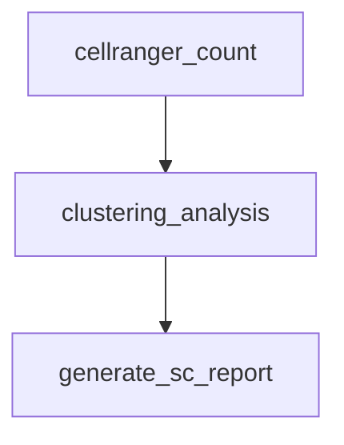

# 09 — Single-Cell RNA-seq

Scale transcriptome analysis to individual cells using droplet-based single-cell RNA sequencing (scRNA-seq). This workflow demonstrates a high-throughput pipeline for processing thousands of cells per sample, including barcode demultiplexing, quantification, and downstream clustering.

!!! info "Concepts Covered"
    - Droplet-based scRNA-seq processing (10x Genomics style)
    - Resource-intensive quantification with CellRanger
    - Cell clustering and visualization with Seurat
    - Per-sample report generation with RMarkdown
    - Mixed environments: Docker (CellRanger) and Conda (R)
    - `{sample}` cohort expansion via `[[sample_groups]]` ([wildcards reference](../reference/wildcards.md))

## Pipeline Overview


```mermaid
graph TD
    A[cellranger_count] --> B[clustering_analysis]
    B --> C[generate_sc_report]
```

**Steps:**

1. **Quantification** — Align reads to the transcriptome and count UMI/barcodes with CellRanger
2. **Analysis** — Quality control, normalization, and cell clustering with Seurat
3. **Report** — Generate an interactive single-cell analysis report

## Workflow Definition

```toml
# examples/gallery/09_single_cell_rnaseq.oxoflow
# 09 — Single-Cell RNA-seq
# Demonstrates high-throughput droplet-based scRNA-seq processing.

[workflow]
name = "sc-rnaseq-pipeline"
version = "1.0.0"
description = "Single-cell RNA-seq pipeline: CellRanger + Seurat"
author = "Traitome"

[config]
reference = "/data/references/GRCh38/cellranger_index"

[defaults]
threads = 8
memory = "32G"

# Define the sample cohort for {sample} wildcard expansion.
# Edit this list (or pass --sample on the CLI) to match your data.
[[sample_groups]]
name = "cohort"
samples = ["sample1", "sample2"]

[[rules]]
name = "cellranger_count"
# CellRanger expects standard 10x FASTQ naming: {sample}_S1_L001_R1_001.fastq.gz
input = ["raw/{sample}_S1_L001_R1_001.fastq.gz", "raw/{sample}_S1_L001_R2_001.fastq.gz"]
output = ["counts/{sample}/outs/filtered_feature_bc_matrix.h5"]
description = "scRNA-seq quantification with CellRanger"
shell = """
mkdir -p counts && cd counts
cellranger count --id={sample} \
                 --fastqs=../raw/ \
                 --sample={sample} \
                 --transcriptome={config.reference} \
                 --localcores={threads} \
                 --localmem=60  # keep in sync with memory = "64G" (leave headroom)
"""

[rules.resources]
threads = 16
memory = "64G"

[rules.environment]
docker = "10xgenomics/cellranger:7.1.0"

[[rules]]
name = "clustering_analysis"
input = ["counts/{sample}/outs/filtered_feature_bc_matrix.h5"]
output = ["analysis/{sample}/seurat_object.rds", "analysis/{sample}/umap_plot.png"]
description = "Cell clustering and visualization with Seurat (UMAP)"
shell = """
mkdir -p analysis/{sample}
Rscript scripts/seurat_analysis.R --input {input[0]} --output-dir analysis/{sample}/
"""

[rules.resources]
threads = 4
memory = "16G"

[rules.environment]
conda = "envs/seurat.yaml"

[[rules]]
name = "generate_sc_report"
input = ["analysis/{sample}/seurat_object.rds", "analysis/{sample}/umap_plot.png"]
output = ["results/{sample}.sc_report.html"]
description = "Generate single-cell analysis report"
shell = """
mkdir -p results
Rscript -e "rmarkdown::render('templates/sc_report.Rmd', output_file='{output[0]}')"
"""

[rules.environment]
conda = "envs/rmarkdown.yaml"
```

## Scientific Context

### Why Single-Cell?

Traditional "bulk" RNA-seq measures the average expression across thousands of cells, masking biological heterogeneity. scRNA-seq reveals:

- **Cellular Heterogeneity** — Identify rare cell types and sub-populations
- **Dynamic Processes** — Trace cell differentiation and state transitions
- **Regulatory Networks** — Infer gene regulatory relationships from co-expression across cells

!!! note "Auxiliary files"
    This workflow expects a few user-provided files next to the `.oxoflow` definition: `scripts/seurat_analysis.R` (QC, normalization, clustering, UMAP), `templates/sc_report.Rmd` (the report template), and the Conda environment files under `envs/`. They are omitted from the gallery to keep the example focused on the workflow structure.

### Computational Challenges

scRNA-seq workflows are significantly more resource-intensive than bulk RNA-seq:

- **Memory Pressure** — Alignment to large transcriptomes and UMI counting can require 64GB+ of RAM.
- **Sparse Data** — Downstream analysis handles sparse matrices with millions of entries (cells × genes).
- **Environment Management** — Often requires complex combinations of R (Seurat) and Python (Scanpy) tools.

## Running the Workflow

### Validate

```bash
$ oxo-flow validate examples/gallery/09_single_cell_rnaseq.oxoflow
✓ examples/gallery/09_single_cell_rnaseq.oxoflow — 3 rules, 3 dependencies
```

### Run

Samples come from the `[[sample_groups]]` block in the workflow file (edit the list to match your data, or pass `--sample` on the CLI). CellRanger expects standard 10x demultiplexed FASTQs under `raw/`, named `{sample}_S1_L001_R1_001.fastq.gz` / `..._R2_001.fastq.gz`; `--sample={sample}` selects the matching files:

```bash
oxo-flow run examples/gallery/09_single_cell_rnaseq.oxoflow -j 2
```

## Further Reading

- [RNA-seq Quantification](./rnaseq.md) — Standard bulk RNA-seq pipeline
- [Resource Management](../how-to/run-on-cluster.md) — How to handle memory-intensive steps on clusters
- [Environment Backends](../reference/environment-system.md) — Using Docker and Conda together
