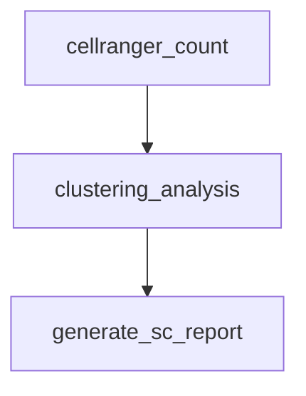

# 09 — Single-Cell RNA-seq

Scale transcriptome analysis to individual cells using droplet-based single-cell RNA sequencing (scRNA-seq). This workflow demonstrates a high-throughput pipeline for processing thousands of cells per sample, including barcode demultiplexing, quantification, and downstream clustering.

!!! info "Concepts Covered"
    - Droplet-based scRNA-seq processing (10x Genomics style)
    - Resource-intensive quantification with CellRanger
    - Cell clustering and visualization with Seurat
    - Per-sample report generation with RMarkdown
    - Mixed environments: Docker (CellRanger) and Conda (R)
    - `{sample}` cohort expansion via `[[sample_groups]]` ([wildcards reference](../reference/wildcards.md))

## Pipeline Overview


```mermaid
graph TD
    A[cellranger_count] --> B[clustering_analysis]
    B --> C[generate_sc_report]
```

**Steps:**

1. **Quantification** — Align reads to the transcriptome and count UMI/barcodes with CellRanger
2. **Analysis** — Quality control, normalization, and cell clustering with Seurat
3. **Report** — Generate an interactive single-cell analysis report

## Workflow Definition

```toml
# examples/gallery/09_single_cell_rnaseq.oxoflow
--8<-- "examples/gallery/09_single_cell_rnaseq.oxoflow"
```

## Scientific Context

### Why Single-Cell?

Traditional "bulk" RNA-seq measures the average expression across thousands of cells, masking biological heterogeneity. scRNA-seq reveals:

- **Cellular Heterogeneity** — Identify rare cell types and sub-populations
- **Dynamic Processes** — Trace cell differentiation and state transitions
- **Regulatory Networks** — Infer gene regulatory relationships from co-expression across cells

!!! note "Auxiliary files"
    This workflow references a few helper files that ship with the gallery: `scripts/seurat_analysis.R` (QC, normalization, clustering, UMAP), `templates/sc_report.Rmd` (the report template), and the Conda environment files under `envs/`. Browse them in [examples/gallery/](https://github.com/Traitome/oxo-flow/tree/main/examples/gallery) alongside the `.oxoflow` definition.

### Computational Challenges

scRNA-seq workflows are significantly more resource-intensive than bulk RNA-seq:

- **Memory Pressure** — Alignment to large transcriptomes and UMI counting can require 64GB+ of RAM.
- **Sparse Data** — Downstream analysis handles sparse matrices with millions of entries (cells × genes).
- **Environment Management** — Often requires complex combinations of R (Seurat) and Python (Scanpy) tools.

## Running the Workflow

### Validate

```bash
$ oxo-flow validate examples/gallery/09_single_cell_rnaseq.oxoflow
✓ examples/gallery/09_single_cell_rnaseq.oxoflow — 3 rules, 2 dependencies
```

### Run

Samples come from the `[[sample_groups]]` block in the workflow file (edit the list to match your data, or pass `--samples` on the CLI). CellRanger expects standard 10x demultiplexed FASTQs under `raw/`, named `{sample}_S1_L001_R1_001.fastq.gz` / `..._R2_001.fastq.gz`; `--sample={sample}` in the CellRanger command selects the matching files:

```bash
oxo-flow run examples/gallery/09_single_cell_rnaseq.oxoflow -j 2
```

## Further Reading

- [RNA-seq Quantification](./rnaseq.md) — Standard bulk RNA-seq pipeline
- [Resource Management](../how-to/run-on-cluster.md) — How to handle memory-intensive steps on clusters
- [Environment Backends](../reference/environment-system.md) — Using Docker and Conda together
