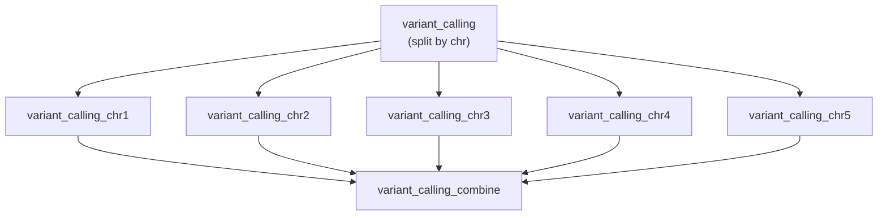

# 10 — Transform Operator

Unify split → map → combine scatter-gather patterns into a single rule declaration — similar to dplyr's `group_by() %>% summarize()` or pandas' `groupby().apply()`. This is the recommended pattern for scatter-gather workflows.

!!! info "Concepts Covered"
    - Unified split → map → combine operator
    - Per-chunk parallelism (`by`, `values_from`)
    - Automatic combine (`aggregate`) or explicit combine shell
    - Chunk cleanup (`cleanup = true`)

## Workflow Definition

```toml
# examples/gallery/10_transform_operator.oxoflow

[workflow]
name = "transform-demo"
version = "1.0.0"
description = "Demonstrates the transform operator for scatter-gather patterns"
author = "oxo-flow examples"

[config]
chromosomes = ["chr1", "chr2", "chr3", "chr4", "chr5"]
reference = "/data/references/GRCh38/genome.fa"

[defaults]
threads = 4
memory = "8G"

# ── Mode A: Split → Map → Combine ──────────────────────────────────────────────
# Classic scatter-gather: split by chromosome, process each, merge results

[[rules]]
name = "variant_calling"
input = ["aligned/sample.bam"]
output = ["variants/sample.vcf.gz"]

[rules.resources]
threads = 8

[rules.transform.split]
by = "chr"
values_from = "config.chromosomes"

[rules.transform]
map = "gatk HaplotypeCaller -R {config.reference} -I {input} -L {chr} -O {output} -ERC GVCF"
cleanup = true

[rules.transform.combine]
shell = "gatk GatherVcfs {chunks} -O {output}"

# ── Mode B: Split → Map (no combine) ────────────────────────────────────────────
# Parallel processing without merging - each split produces independent output

[[rules]]
name = "parallel_qc"
input = ["aligned/sample.bam"]

[rules.resources]
threads = 4

[rules.transform.split]
by = "chr"
values_from = "config.chromosomes"

[rules.transform]
map = "samtools flagstat {input} > {output}"
# No combine - produces separate qc/chr1.flagstat.txt, qc/chr2.flagstat.txt, etc.
```

## Key Concepts

### The Transform Operator

A single rule declaration that expands into a fan-out of map chunks and an
optional combine step:

1. **Split**: Partition work by a variable (`by`) with explicit `values`, a
   config reference (`values_from`), a chunk count (`n`), or a `glob`
2. **Map**: Run the `map` command once per split value, in parallel
3. **Combine**: Merge chunk outputs with an explicit `shell` command or
   automatic aggregation (`aggregate = true`, `method = "concat" | "json_merge"`)

Chunk failures are retried independently (`retries` on the rule); the combine
step runs only after all chunks succeed.

### Expanded Rule Naming

Transform rules expand into:

- Map rules: `{rule_name}_{split_value}` (e.g., `variant_calling_chr1`)
- Combine rule: `{rule_name}_combine` (e.g., `variant_calling_combine`)

## Running the Workflow

### Validate

```bash
$ oxo-flow validate examples/gallery/10_transform_operator.oxoflow
✓ examples/gallery/10_transform_operator.oxoflow — 2 rules, 0 dependencies
```

### DAG Structure



## Use Cases

- **Per-chromosome variant calling** — scatter GVCF calling by chromosome, merge with `GatherVcfs`
- **Independent per-chunk QC** — flagstat/coverage metrics per chromosome, no merge needed
- **Large file processing** — split big inputs into chunks, process in parallel, concatenate results

## What's Next?

See the [Workflow Format reference](../reference/workflow-format.md#transform-unified-scatter-gather-operator) for the full `transform` operator specification, or revisit [Scatter-Gather](scatter-gather.md) for the explicit multi-rule pattern.
