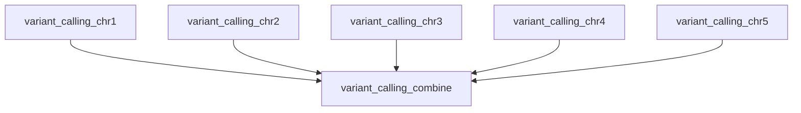

# 10 — Transform Operator

Unify split → map → combine scatter-gather patterns into a single rule declaration — similar to dplyr's `group_by() %>% summarize()` or pandas' `groupby().apply()`. This is the recommended pattern for scatter-gather workflows.

!!! info "Concepts Covered"
    - Unified split → map → combine operator
    - Per-chunk parallelism (`by`, `values_from`)
    - Automatic combine (`aggregate`) or explicit combine shell
    - Chunk cleanup (`cleanup = true`)

## Workflow Definition

```toml
# examples/gallery/10_transform_operator.oxoflow
--8<-- "examples/gallery/10_transform_operator.oxoflow"
```

## Key Concepts

### The Transform Operator

A single rule declaration that expands into a fan-out of map chunks and an
optional combine step:

1. **Split**: Partition work by a variable (`by`) with explicit `values`, a
   config reference (`values_from`), an instance count (`n`, which yields the
   labels `"0"`…`"n-1"` — it does not slice the input data), or a `glob`
2. **Map**: Run the `map` command once per split value, in parallel
3. **Combine**: Merge chunk outputs with an explicit `shell` command or
   automatic aggregation (`aggregate = true`, `method = "concat" | "json_merge"`)

Chunk failures are retried independently (`retries` on the rule); the combine
step runs only after all chunks succeed.

### Expanded Rule Naming

Transform rules expand into:

- Map rules: `{rule_name}_{split_value}` (e.g., `variant_calling_chr1`)
- Combine rule: `{rule_name}_combine` (e.g., `variant_calling_combine`)

### Chunk Outputs

Each map rule writes to an internal chunk path derived from the declared
output:

- `.oxo-flow/chunks/{by}/{value}.{ext}` — where `{ext}` is the declared
  output's *full* extension (e.g. `g.vcf.gz`), so tools can infer the file
  format from the name. Rules without an output use `.out`.
- The combine rule receives all chunk paths via `{chunks}` (space-separated).
  Wrap them as your tool requires — GATK's `GatherVcfs`, for example, needs
  `-I` before each input (the example uses a `for` loop to add them).
- With `cleanup = true`, the chunk files are removed once the whole run
  finishes successfully (emptied chunk directories are cleaned up too —
  directories still holding chunks from other rules are left alone).
  Failed runs keep their chunks for debugging.

## Running the Workflow

### Demo Data for a Live Run

Like the explicit scatter-gather pattern, the demo expects
`aligned/sample.bam` and the reference in `config.reference`. The split
values are labels (one `{chr}` substitution per map chunk), so a small
multi-chromosome reference whose contig names match `config.chromosomes`
is enough: FASTA + `bwa index` + `samtools faidx` + `samtools dict`, any
reads aligned and sorted into `aligned/sample.bam`.

### Validate

```bash
$ oxo-flow validate examples/gallery/10_transform_operator.oxoflow
✓ examples/gallery/10_transform_operator.oxoflow — 2 rules, 0 dependencies
```

### DAG Structure



`parallel_qc` (Mode B) expands the same way — five chunk rules
(`parallel_qc_chr1` … `parallel_qc_chr5`) run in parallel with the map
rules above but have no combine step; the diagram shows only the Mode A
expansion for readability.

!!! note "Live-run verified results"
    On the same simulated 5-chromosome fixture used for scatter-gather:
    Mode A's combine output was **byte-identical** (md5-verified) to the
    explicit gather path of workflow 04, and Mode B's per-chromosome
    flagstat chunks summed to exactly the BAM's read count (5 x 1,470 =
    7,350), confirming the chunk partitioning covers every read.

## Use Cases

- **Per-chromosome variant calling** — scatter GVCF calling by chromosome, merge with `GatherVcfs`
- **Independent per-chunk QC** — flagstat/coverage metrics per chromosome, no merge needed
- **Fan-out over a declared domain** — repeat a command once per value (chromosome, sample, shard file) and concatenate the results. The split values are labels: the engine does not slice the input for you, so the `map` command (or an input path containing `{split_var}`) must select each instance's slice

## What's Next?

See the [Workflow Format reference](../reference/workflow-format.md#transform-unified-scatter-gather-operator) for the full `transform` operator specification, or revisit [Scatter-Gather](scatter-gather.md) for the explicit multi-rule pattern.
