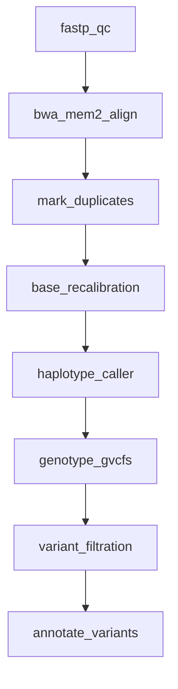

# 07 — WGS Germline Variant Calling

A complete whole-genome sequencing (WGS) germline variant calling pipeline following GATK best practices: QC → alignment → deduplication → BQSR → variant calling → filtration → annotation.

!!! info "Concepts Covered"
    - GATK best-practices workflow
    - Eight-step DAG with strict linear dependencies
    - Mixed environments (conda, docker, singularity)
    - Clinical-grade variant annotation with VEP
    - Report configuration with provenance tracking

## Pipeline Overview



**Steps:**

1. **fastp_qc** — Read quality control and adapter trimming
2. **bwa_mem2_align** — Paired-end alignment with BWA-MEM2 (faster than BWA-MEM)
3. **mark_duplicates** — Mark PCR and optical duplicates with GATK MarkDuplicates
4. **base_recalibration** — Base quality score recalibration (BQSR) using known variant sites
5. **haplotype_caller** — Per-sample variant calling in GVCF mode
6. **genotype_gvcfs** — Genotype GVCFs to produce final variant calls
7. **variant_filtration** — Hard-filter variants using GATK recommended thresholds
8. **annotate_variants** — Functional annotation with Ensembl VEP

## Workflow Definition

```toml
# examples/gallery/07_wgs_germline.oxoflow

[workflow]
name = "wgs-germline-calling"
version = "1.0.0"
description = "GATK best-practices whole-genome germline variant calling pipeline"
author = "oxo-flow examples"

[config]
reference = "/data/references/GRCh38/genome.fa"
known_sites = "/data/references/GRCh38/dbsnp_146.hg38.vcf.gz"
known_indels = "/data/references/GRCh38/Mills_and_1000G.indels.hg38.vcf.gz"
intervals = "/data/references/GRCh38/wgs_calling_regions.hg38.interval_list"
samples = "samples.csv"

[defaults]
threads = 4
memory = "8G"

[[rules]]
name = "fastp_qc"
input = ["raw/{sample}_R1.fastq.gz", "raw/{sample}_R2.fastq.gz"]
output = [
    "trimmed/{sample}_R1.fastq.gz",
    "trimmed/{sample}_R2.fastq.gz",
    "qc/{sample}_fastp.json"
]
threads = 8
memory = "16G"
description = "Read QC and adapter trimming"
shell = """
mkdir -p trimmed qc
fastp -i {input[0]} -I {input[1]} \
      -o {output[0]} -O {output[1]} \
      --json {output[2]} --thread {threads} \
      --qualified_quality_phred 20 --length_required 50
"""

[rules.environment]
conda = "envs/fastp.yaml"

[[rules]]
name = "bwa_mem2_align"
input = ["trimmed/{sample}_R1.fastq.gz", "trimmed/{sample}_R2.fastq.gz"]
output = ["aligned/{sample}.sorted.bam"]
threads = 16
memory = "32G"
description = "Paired-end alignment with BWA-MEM2 and coordinate sorting"
shell = """
mkdir -p aligned
bwa-mem2 mem -t {threads} \
    -R '@RG\\tID:{sample}\\tSM:{sample}\\tPL:ILLUMINA' \
    {config.reference} {input[0]} {input[1]} \
    | samtools sort -@ 4 -m 2G -o {output[0]}
samtools index {output[0]}
"""

[rules.environment]
docker = "biocontainers/bwa-mem2:2.2.1"

[[rules]]
name = "mark_duplicates"
input = ["aligned/{sample}.sorted.bam"]
output = ["dedup/{sample}.dedup.bam", "dedup/{sample}.dedup.metrics.txt"]
threads = 4
memory = "16G"
description = "Mark PCR and optical duplicates"
shell = """
mkdir -p dedup
gatk MarkDuplicates \
    -I {input[0]} -O {output[0]} -M {output[1]} \
    --CREATE_INDEX true
"""

[rules.environment]
singularity = "docker://broadinstitute/gatk:4.5.0.0"

[[rules]]
name = "base_recalibration"
input = ["dedup/{sample}.dedup.bam"]
output = ["bqsr/{sample}.recal.bam"]
threads = 4
memory = "16G"
description = "Base quality score recalibration (BQSR)"
shell = """
mkdir -p bqsr
gatk BaseRecalibrator \
    -I {input[0]} -R {config.reference} \
    --known-sites {config.known_sites} \
    --known-sites {config.known_indels} \
    -O bqsr/{sample}.recal_data.table
gatk ApplyBQSR \
    -I {input[0]} -R {config.reference} \
    --bqsr-recal-file bqsr/{sample}.recal_data.table \
    -O {output[0]}
"""

[rules.environment]
singularity = "docker://broadinstitute/gatk:4.5.0.0"

[[rules]]
name = "haplotype_caller"
input = ["bqsr/{sample}.recal.bam"]
output = ["variants/{sample}.g.vcf.gz"]
threads = 4
memory = "16G"
description = "Per-sample variant calling in GVCF mode"
shell = """
mkdir -p variants
gatk HaplotypeCaller \
    -I {input[0]} -R {config.reference} \
    -O {output[0]} -ERC GVCF \
    --native-pair-hmm-threads {threads} \
    -L {config.intervals}
"""

[rules.environment]
singularity = "docker://broadinstitute/gatk:4.5.0.0"

[[rules]]
name = "genotype_gvcfs"
input = ["variants/{sample}.g.vcf.gz"]
output = ["variants/{sample}.genotyped.vcf.gz"]
threads = 4
memory = "16G"
description = "Genotype GVCFs to produce final variant calls"
shell = """
gatk GenotypeGVCFs \
    -R {config.reference} \
    -V {input[0]} -O {output[0]}
"""

[rules.environment]
singularity = "docker://broadinstitute/gatk:4.5.0.0"

[[rules]]
name = "variant_filtration"
input = ["variants/{sample}.genotyped.vcf.gz"]
output = ["variants/{sample}.filtered.vcf.gz"]
threads = 2
memory = "8G"
description = "Hard-filter variants with GATK recommended thresholds"
shell = """
gatk VariantFiltration \
    -R {config.reference} -V {input[0]} -O {output[0]} \
    --filter-expression 'QD < 2.0' --filter-name 'LowQD' \
    --filter-expression 'MQ < 40.0' --filter-name 'LowMQ' \
    --filter-expression 'FS > 60.0' --filter-name 'HighFS' \
    --filter-expression 'SOR > 3.0' --filter-name 'HighSOR'
"""

[rules.environment]
singularity = "docker://broadinstitute/gatk:4.5.0.0"

[[rules]]
name = "annotate_variants"
input = ["variants/{sample}.filtered.vcf.gz"]
output = ["annotation/{sample}.annotated.vcf.gz"]
threads = 4
memory = "16G"
description = "Functional variant annotation with VEP"
shell = """
mkdir -p annotation
vep --input_file {input[0]} --output_file {output[0]} \
    --format vcf --vcf --compress_output bgzip \
    --assembly GRCh38 --offline --cache \
    --sift b --polyphen b --symbol --numbers --biotype \
    --total_length --canonical --ccds \
    --force_overwrite --fork {threads}
"""

[rules.environment]
conda = "envs/vep.yaml"

[report]
template = "germline_report"
format = ["html", "json"]
sections = ["summary", "qc_metrics", "coverage", "variants", "annotations", "provenance"]
```

## Clinical Considerations

### BQSR (Base Quality Score Recalibration)

BQSR corrects systematic errors in base quality scores assigned by the sequencer. It uses known variant sites (dbSNP, Mills indels) to distinguish true variants from sequencing artifacts. This step is critical for clinical-grade variant calling accuracy.

### GVCF Mode

HaplotypeCaller runs in GVCF mode (`-ERC GVCF`) to produce genomic VCFs that contain information about both variant and reference-confident sites. This enables downstream joint genotyping across cohorts without re-running variant calling.

### Hard Filtering Thresholds

The variant filtration step applies GATK-recommended hard filters:

| Filter | Threshold | Meaning |
|--------|-----------|---------|
| QD | < 2.0 | Variant quality normalized by depth |
| MQ | < 40.0 | Root mean square mapping quality |
| FS | > 60.0 | Fisher strand bias |
| SOR | > 3.0 | Symmetric odds ratio strand bias |

For production use, consider VQSR (Variant Quality Score Recalibration) instead of hard filters when sufficient training data is available.

## Running the Workflow

### Validate

```bash
$ oxo-flow validate examples/gallery/07_wgs_germline.oxoflow
✓ examples/gallery/07_wgs_germline.oxoflow — 8 rules, 8 dependencies
```

### Resource Summary

| Rule | Threads | Memory | Environment |
|------|---------|--------|-------------|
| fastp_qc | 8 | 16G | conda |
| bwa_mem2_align | 16 | 32G | docker |
| mark_duplicates | 4 | 16G | singularity |
| base_recalibration | 4 | 16G | singularity |
| haplotype_caller | 4 | 16G | singularity |
| genotype_gvcfs | 4 | 16G | singularity |
| variant_filtration | 2 | 8G | singularity |
| annotate_variants | 4 | 16G | conda |

## What's Next?

Move on to [Multi-Omics Integration](multiomics.md) for a complex pipeline that combines WGS, RNA-seq, and methylation data.
