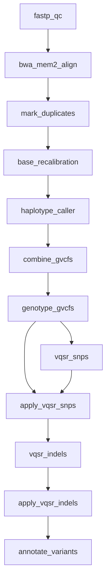

# 07 — WGS Germline Variant Calling

A complete whole-genome sequencing (WGS) germline variant calling pipeline following GATK best practices: QC → alignment → deduplication → BQSR → variant calling → joint genotyping → VQSR → annotation.

!!! info "Concepts Covered"
    - GATK best-practices workflow
    - Twelve-rule cohort DAG with a branching VQSR path
    - Cohort joint genotyping with CombineGVCFs
    - Per-sample rule expansion and `expand_inputs` fan-in
    - Mixed environments (conda, singularity)
    - Clinical-grade variant annotation with VEP
    - Report configuration with provenance tracking

## Pipeline Overview


```mermaid
graph TD
    A[fastp_qc] --> B[bwa_mem2_align]
    B --> C[mark_duplicates]
    C --> D[base_recalibration]
    D --> E[haplotype_caller]
    E --> F[combine_gvcfs]
    F --> G[genotype_gvcfs]
    G --> H[vqsr_snps]
    G --> I[apply_vqsr_snps]
    H --> I
    I --> J[vqsr_indels]
    J --> K[apply_vqsr_indels]
    K --> L[annotate_variants]
```

Edges are shown as realized after per-sample expansion (for example,
`haplotype_caller` → `combine_gvcfs` exists because `expand_inputs`
resolves the three per-sample GVCFs). Note that the unexpanded template
DAG (`oxo-flow graph`) already contains an edge from `combine_gvcfs` to
`haplotype_caller` — `expand_inputs` patterns register template-level
dataflow even before per-sample paths materialize. See
[Fan-out vs Fan-in](../reference/wildcards.md#fan-out-vs-fan-in) for
how the two expansion mechanisms differ.

**Steps:**

1. **fastp_qc** — Read quality control and adapter trimming
2. **bwa_mem2_align** — Paired-end alignment with BWA-MEM2 (faster than BWA-MEM)
3. **mark_duplicates** — Mark PCR and optical duplicates with GATK MarkDuplicates
4. **base_recalibration** — Base quality score recalibration (BQSR) using known variant sites
5. **haplotype_caller** — Per-sample variant calling in GVCF mode
6. **combine_gvcfs** — Combine the per-sample GVCFs into a cohort GVCF
7. **genotype_gvcfs** — Joint genotyping across the cohort
8. **vqsr_snps** — Variant Quality Score Recalibration (VQSR) for SNPs
9. **apply_vqsr_snps** — Apply the VQSR model to filter the cohort's SNPs
10. **vqsr_indels** — Variant Quality Score Recalibration (VQSR) for INDELs
11. **apply_vqsr_indels** — Apply the VQSR model to filter the cohort's INDELs
12. **annotate_variants** — Functional annotation with Ensembl VEP

## Workflow Definition

```toml
# examples/gallery/07_wgs_germline.oxoflow
--8<-- "examples/gallery/07_wgs_germline.oxoflow"
```

!!! note "Read Group Escape Sequences"
    The shell here builds the read group with `printf '@RG\tID:...'` —
    note the single `\t` in the TOML source. Inside the `"""` TOML string
    a `\t` escape becomes a real TAB character, so the shell's `printf`
    receives an actual tab in the format string and emits it verbatim.
    bwa-mem2 writes that read group line into the SAM header with real
    tabs — the delimiter it expects between read group fields.

```toml
[[rules]]
name = "mark_duplicates"
input = ["aligned/{sample}.sorted.bam"]
output = ["dedup/{sample}.dedup.bam", "dedup/{sample}.dedup.metrics.txt"]
description = "Mark PCR and optical duplicates"
shell = """
mkdir -p dedup
gatk MarkDuplicates --VALIDATION_STRINGENCY SILENT \
    -I {input[0]} \
    -O {output[0]} \
    -M {output[1]} \
    --CREATE_INDEX true
"""

[rules.resources]
threads = 4
memory = "16G"

[rules.environment]
singularity = "docker://broadinstitute/gatk:4.5.0.0"

[[rules]]
name = "base_recalibration"
input = ["dedup/{sample}.dedup.bam"]
output = ["bqsr/{sample}.recal.bam"]
description = "Base quality score recalibration (BQSR)"
shell = """
mkdir -p bqsr
gatk BaseRecalibrator --read-validation-stringency SILENT \
    -I {input[0]} -R {config.reference} \
    --known-sites {config.known_sites} \
    --known-sites {config.thousand_g} \
    --known-sites {config.known_indels} \
    -O bqsr/{sample}.recal_data.table

gatk ApplyBQSR --read-validation-stringency SILENT \
    -I {input[0]} -R {config.reference} \
    --bqsr-recal-file bqsr/{sample}.recal_data.table \
    -O {output[0]}
"""

[rules.resources]
threads = 4
memory = "16G"

[rules.environment]
singularity = "docker://broadinstitute/gatk:4.5.0.0"

[[rules]]
name = "haplotype_caller"
input = ["bqsr/{sample}.recal.bam"]
output = ["variants/{sample}.g.vcf.gz"]
description = "Per-sample variant calling in GVCF mode"
shell = """
mkdir -p variants
gatk HaplotypeCaller --read-validation-stringency SILENT \
    -I {input[0]} -R {config.reference} \
    -O {output[0]} \
    -ERC GVCF \
    --native-pair-hmm-threads {threads} \
    -L {config.intervals}
"""

[rules.resources]
threads = 4
memory = "16G"

[rules.environment]
singularity = "docker://broadinstitute/gatk:4.5.0.0"

[[rules]]
name = "combine_gvcfs"
input = []
expand_inputs = [
    { pattern = "variants/{sample}.g.vcf.gz", variables = { sample = "config.samples_list" } }
]
output = ["variants/cohort.g.vcf.gz"]
description = "Combine per-sample GVCFs into a multi-sample GVCF"
shell = """
gatk CombineGVCFs \
    -R {config.reference} \
    $(for f in {input}; do echo "-V $f "; done) \
    -O {output[0]}
"""

[rules.resources]
threads = 4
memory = "16G"

[rules.environment]
singularity = "docker://broadinstitute/gatk:4.5.0.0"
```

!!! note "Why `input = []` + `expand_inputs` — not `{sample}` in `input`"
    `combine_gvcfs` must run **once**, with all per-sample GVCFs in its
    input list. `expand_inputs` does exactly that: the engine splits the
    injected `config.samples_list` (`"NA12878,NA12879,NA12880"`) into its
    three values, substitutes each into the pattern, and appends the three
    paths to the rule's input list — while the rule itself stays **one task**.

    Writing `input = ["variants/{sample}.g.vcf.gz"]` instead would have the
    opposite effect: `{sample}` clones the rule once per sample, producing
    three one-sample combines that all write the same output file.

    Full mechanics: [Fan-out vs Fan-in](../reference/wildcards.md#fan-out-vs-fan-in),
    [Gathering Inputs with `expand_inputs`](../reference/wildcards.md#gathering-inputs-with-expand_inputs),
    and the [field reference](../reference/workflow-format.md#expand-inputs).

```toml
[[rules]]
name = "genotype_gvcfs"
input = ["variants/cohort.g.vcf.gz"]
output = ["variants/cohort.genotyped.vcf.gz"]
description = "Joint genotyping across the cohort"
shell = """
gatk GenotypeGVCFs \
    -R {config.reference} \
    -V {input[0]} \
    -O {output[0]}
"""

[rules.resources]
threads = 4
memory = "16G"

[rules.environment]
singularity = "docker://broadinstitute/gatk:4.5.0.0"

[[rules]]
name = "vqsr_snps"
input = ["variants/cohort.genotyped.vcf.gz"]
output = [
    "variants/cohort.snps.recal",
    "variants/cohort.snps.tranches"
]
description = "Variant Quality Score Recalibration (VQSR) for SNPs"
shell = """
gatk VariantRecalibrator \
    -R {config.reference} \
    -V {input[0]} \
    -resource:hapmap,known=false,training=true,truth=true,prior=15.0 {config.hapmap} \
    -resource:omni,known=false,training=true,truth=false,prior=12.0 {config.omni} \
    -resource:1000G,known=false,training=true,truth=false,prior=10.0 {config.thousand_g} \
    -resource:dbsnp,known=true,training=false,truth=false,prior=2.0 {config.known_sites} \
    -an QD -an MQ -an MQRankSum -an ReadPosRankSum -an FS -an SOR \
    -mode SNP \
    -O {output[0]} \
    --tranches-file {output[1]}
"""

[rules.resources]
threads = 4
memory = "16G"

[rules.environment]
singularity = "docker://broadinstitute/gatk:4.5.0.0"

[[rules]]
name = "apply_vqsr_snps"
input = [
    "variants/cohort.genotyped.vcf.gz",
    "variants/cohort.snps.recal",
    "variants/cohort.snps.tranches"
]
output = ["variants/cohort.snps.filtered.vcf.gz"]
description = "Apply VQSR model to filter SNPs"
shell = """
gatk ApplyVQSR \
    -R {config.reference} \
    -V {input[0]} \
    -O {output[0]} \
    --truth-sensitivity-filter-level 99.7 \
    --tranches-file {input[2]} \
    --recal-file {input[1]} \
    -mode SNP \
    --create-output-variant-index true
"""

[rules.resources]
threads = 4
memory = "8G"

[rules.environment]
singularity = "docker://broadinstitute/gatk:4.5.0.0"

[[rules]]
name = "vqsr_indels"
input = ["variants/cohort.snps.filtered.vcf.gz"]
output = [
    "variants/cohort.indels.recal",
    "variants/cohort.indels.tranches"
]
description = "Variant Quality Score Recalibration (VQSR) for INDELs"
shell = """
gatk VariantRecalibrator \
    -R {config.reference} \
    -V {input[0]} \
    -resource:mills,known=false,training=true,truth=true,prior=12.0 {config.known_indels} \
    -resource:dbsnp,known=true,training=false,truth=false,prior=2.0 {config.known_sites} \
    -an QD -an FS -an SOR -an MQRankSum -an ReadPosRankSum \
    -mode INDEL \
    -O {output[0]} \
    --tranches-file {output[1]}
"""

[rules.resources]
threads = 4
memory = "16G"

[rules.environment]
singularity = "docker://broadinstitute/gatk:4.5.0.0"

[[rules]]
name = "apply_vqsr_indels"
input = [
    "variants/cohort.snps.filtered.vcf.gz",
    "variants/cohort.indels.recal",
    "variants/cohort.indels.tranches"
]
output = ["variants/cohort.filtered.vcf.gz"]
description = "Apply VQSR model to filter INDELs"
shell = """
gatk ApplyVQSR \
    -R {config.reference} \
    -V {input[0]} \
    -O {output[0]} \
    --truth-sensitivity-filter-level 99.7 \
    --tranches-file {input[2]} \
    --recal-file {input[1]} \
    -mode INDEL \
    --create-output-variant-index true
"""

[rules.resources]
threads = 4
memory = "8G"

[rules.environment]
singularity = "docker://broadinstitute/gatk:4.5.0.0"

[[rules]]
name = "annotate_variants"
input = ["variants/cohort.filtered.vcf.gz"]
output = ["annotation/cohort.annotated.vcf.gz"]
description = "Functional variant annotation with VEP"
shell = """
mkdir -p annotation
vep --input_file {input[0]} \
    --output_file {output[0]} \
    --format vcf --vcf --compress_output bgzip \
    --assembly GRCh38 --offline --cache \
    --sift b --polyphen b --symbol --numbers --biotype \
    --total_length --canonical --ccds \
    --force_overwrite --fork {threads}
"""

[rules.resources]
threads = 4
memory = "16G"

[rules.environment]
conda = "envs/vep.yaml"

[report]
# Optional HTML template override — "report.html" is the built-in default;
# any other value is a Tera template path resolved next to the workflow file.
# template = "report.html"
#
# Section IDs are the built-in generator names (oxo-flow report --list-sections).
# The output format is chosen on the CLI with -f (html, json, md, pdf).
sections = ["universal", "workflow-info", "execution-status", "metrics", "software-versions", "provenance"]
```

!!! note "About `[report]` in this workflow"
    The `[report]` block above is copied verbatim from the example file.
    `[report].sections` acts as a whitelist filter over the
    engine's built-in section IDs (`universal`, `execution-status`,
    `failure-diagnosis`, `clinical-compliance`, `workflow-info`, `commands`,
    `rule-captions`, `file-manifest`, `environment`, `metrics`,
    `aggregate-metrics`, `sample-matrix`, `provenance`,
    `task-summary`, `software-versions`). All six names here are
    built-in generator IDs — a report generated from this workflow
    includes all six sections. The output format itself is chosen on
    the CLI with `--format`/`-f`. See [the report
    command](../commands/report.md) for the supported surface.

### Sample Expansion

The `[[sample_groups]]` table is the single source of truth for the cohort:

- Rules with `{sample}` in their paths (fastp_qc through haplotype_caller)
  are expanded once per sample: `fastp_qc_cohort_NA12878`, and so on.
- The engine merges all sample sources into `config.samples_list`
  (`"NA12878,NA12879,NA12880"`), and `combine_gvcfs` references it in
  `expand_inputs` to collect the three per-sample GVCFs — no duplicate
  sample list is needed anywhere else.

See the [wildcards reference](../reference/wildcards.md) for the complete
mechanics of per-sample expansion and `expand_inputs`.

## Clinical Considerations

### BQSR (Base Quality Score Recalibration)

BQSR corrects systematic errors in base quality scores assigned by the sequencer. It uses known variant sites (dbSNP, Mills indels) to distinguish true variants from sequencing artifacts. This step is critical for clinical-grade variant calling accuracy.

### GVCF Mode

HaplotypeCaller runs in GVCF mode (`-ERC GVCF`) to produce genomic VCFs that contain information about both variant and reference-confident sites. This enables downstream joint genotyping across cohorts without re-running variant calling.

The `combine_gvcfs` rule merges the per-sample GVCFs into a single cohort GVCF (`variants/cohort.g.vcf.gz`), and `genotype_gvcfs` performs joint genotyping across the cohort in one run.

### VQSR (Variant Quality Score Recalibration)

Instead of fixed hard filters, the pipeline applies VQSR for clinical-grade variant calling:

1. **vqsr_snps** — GATK VariantRecalibrator builds a recalibration model from annotation features (QD, MQ, MQRankSum, ReadPosRankSum, FS, SOR), using hapmap, omni, and 1000G as training/truth resources and dbSNP as a known-sites resource.
2. **apply_vqsr_snps** — GATK ApplyVQSR applies the SNP model at `--truth-sensitivity-filter-level 99.7`, retaining high sensitivity while filtering false positives.
3. **vqsr_indels** — VariantRecalibrator builds a recalibration model for INDELs using the Mills gold-standard indels as the training/truth resource.
4. **apply_vqsr_indels** — GATK ApplyVQSR applies the INDEL model at `--truth-sensitivity-filter-level 99.7` to produce the final filtered variant set.

VQSR adaptively models the variant quality profile rather than applying fixed thresholds, which generally preserves more true variants than hard filtering.

!!! note "VQSR assumes a large callset"
    GATK recommends VQSR for cohorts of roughly 30+ samples, where enough
    sites are available to train the model reliably. For a small cohort
    like the three samples here, GATK instead recommends hard filtering
    with VariantFiltration (e.g. `QD < 2.0`, `FS > 60.0`, `MQ < 40.0` for
    SNPs). The example keeps VQSR to demonstrate the tool; match the
    filtering strategy to your cohort size. The engine's scientific
    preflight flags this automatically: `oxo-flow dry-run` emits
    `SCI-VQSR-COHORT` for small-cohort VQSR runs, so a pilot never wastes
    compute failing at this step for scientific reasons.

!!! note "GATK writes index files the example does not declare"
    GATK steps emit `.tbi` (and `.idx`) sidecar files next to their VCF
    outputs — `variants/call.vcf.gz` also produces `variants/call.vcf.gz.tbi`.
    This example's `output` lists declare only the data files (the
    variant-calling tutorial declares the `.tbi` counterparts for its
    Mutect2 chain). Declaring index outputs is optional, but undeclared
    sidecars escape freshness tracking and `oxo-flow clean`; declare them
    when incremental resume over these steps matters.

!!! warning "Live-tested: VariantRecalibrator also needs annotation *variance*, not just samples"
    Even with training resources in place, VariantRecalibrator hard-fails
    when any `-an` annotation has **zero variance across the callset**:

    ```
    A USER ERROR has occurred: Bad input: Found annotations with zero
    variance. They must be excluded before proceeding.
    ```

    On the live-test fixture (20 variants from 3 samples called on a
    mini-genome) the run died here: every variant aligned with MAPQ 60, so
    `MQ` had `standard deviation = 0.00` and `MQRankSum` had
    `mean = 0.00` — two of the six SNP annotations carried no information.
    This is not a mini-genome artifact: any narrow target (small capture
    region, single exon panel) can produce constant-annotation callsets.
    If you hit it, either drop the offending annotations
    (`-an QD -an FS -an SOR` only) or switch the whole chain to hard
    filtering (`gatk VariantFiltration`), which is the documented
    alternative for small callsets anyway.

    Cohort size is not the only prerequisite: VariantRecalibrator also
    needs enough *variants* to train the Gaussian mixture model. A
    full-cohort run restricted to a small interval list (or a mini-genome
    reference for testing) can still starve the trainer even with 30+
    samples — in that case hard filtering is again the right fallback.
    For INDELs the analogous hard-filter thresholds are
    `QD < 2.0`, `FS > 200.0`, `ReadPosRankSum < 20.0`.

## Running the Workflow

### Run

Samples come from the `[[sample_groups]]` block in the workflow file (edit the list to match your data, or pass `--samples` on the CLI). Each sample needs a paired FASTQ under `raw/`, named `{sample}_R1.fastq.gz` / `{sample}_R2.fastq.gz`.

The `[config]` block points at seven GRCh38 reference assets that you must provision before running (paths are examples — edit them to your layout):

| Config key | Used by | Typical resource |
|------------|---------|------------------|
| `reference` | all GATK rules, bwa-mem2 | reference FASTA **plus** BWA-MEM2 index, `.fai`, and `.dict` |
| `known_sites` (dbSNP) | BQSR, VQSR resources | `dbsnp_146.hg38.vcf.gz` (with `.tbi`) |
| `known_indels` | BQSR, INDEL VQSR training | `Mills_and_1000G_gold_standard.indels.hg38.vcf.gz` |
| `intervals` | HaplotypeCaller `-L` | `wgs_calling_regions.hg38.interval_list` |
| `hapmap` | VQSR SNP truth set | `hapmap_3.3.hg38.vcf.gz` |
| `omni` | VQSR SNP training | `1000G_omni2.5.hg38.vcf.gz` |
| `thousand_g` | VQSR SNP training, BQSR | `1000G_phase1.snps.high_confidence.hg38.vcf.gz` |

The VEP step runs with `--offline --cache`, which requires a local VEP cache for GRCh38 (install it once with `vep_install -a cache -s homo_sapiens_merged_vep_110_GRCh38` or the matching installer for your VEP version — the conda env pins `ensembl-vep=110.1`).

```bash
oxo-flow run examples/gallery/07_wgs_germline.oxoflow -j 2
```

!!! warning "Small cohorts will stop at VQSR"
    With the default three-sample cohort, both `vqsr_snps` and
    `vqsr_indels` fail for scientific reasons (VariantRecalibrator needs
    ~30+ samples to train). `oxo-flow dry-run` flags this up front with
    `SCI-VQSR-COHORT` — for a small pilot, either stop before VQSR with
    `-t annotate_variants`-style task selection or switch to hard
    filtering (see the note above).

### Validate

```bash
$ oxo-flow validate examples/gallery/07_wgs_germline.oxoflow
✓ examples/gallery/07_wgs_germline.oxoflow — 12 rules, 14 dependencies
```

### Resource Summary

| Rule | Threads | Memory | Environment |
|------|---------|--------|-------------|
| fastp_qc | 8 | 16G | conda |
| bwa_mem2_align | 16 | 32G | conda |
| mark_duplicates | 4 | 16G | singularity |
| base_recalibration | 4 | 16G | singularity |
| haplotype_caller | 4 | 16G | singularity |
| combine_gvcfs | 4 | 16G | singularity |
| genotype_gvcfs | 4 | 16G | singularity |
| vqsr_snps | 4 | 16G | singularity |
| apply_vqsr_snps | 4 | 8G | singularity |
| vqsr_indels | 4 | 16G | singularity |
| apply_vqsr_indels | 4 | 8G | singularity |
| annotate_variants | 4 | 16G | conda |

## What's Next?

Move on to [Multi-Omics Integration](multiomics.md) for a complex pipeline that combines WGS, RNA-seq, and methylation data.
