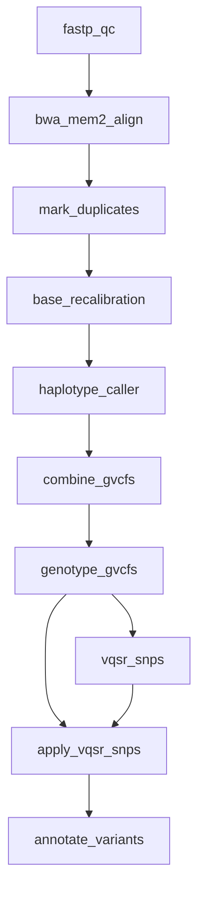

# 07 — WGS Germline Variant Calling

A complete whole-genome sequencing (WGS) germline variant calling pipeline following GATK best practices: QC → alignment → deduplication → BQSR → variant calling → joint genotyping → VQSR → annotation.

!!! info "Concepts Covered"
    - GATK best-practices workflow
    - Ten-rule cohort DAG with a branching VQSR path
    - Cohort joint genotyping with CombineGVCFs
    - Mixed environments (conda, docker, singularity)
    - Clinical-grade variant annotation with VEP
    - Report configuration with provenance tracking

## Pipeline Overview


```mermaid
graph TD
    A[fastp_qc] --> B[bwa_mem2_align]
    B --> C[mark_duplicates]
    C --> D[base_recalibration]
    D --> E[haplotype_caller]
    E --> F[combine_gvcfs]
    F --> G[genotype_gvcfs]
    G --> H[vqsr_snps]
    G --> I[apply_vqsr_snps]
    H --> I
    I --> J[annotate_variants]
```

**Steps:**

1. **fastp_qc** — Read quality control and adapter trimming
2. **bwa_mem2_align** — Paired-end alignment with BWA-MEM2 (faster than BWA-MEM)
3. **mark_duplicates** — Mark PCR and optical duplicates with GATK MarkDuplicates
4. **base_recalibration** — Base quality score recalibration (BQSR) using known variant sites
5. **haplotype_caller** — Per-sample variant calling in GVCF mode
6. **combine_gvcfs** — Combine the per-sample GVCFs into a cohort GVCF
7. **genotype_gvcfs** — Joint genotyping across the cohort
8. **vqsr_snps** — Variant Quality Score Recalibration (VQSR) for SNPs
9. **apply_vqsr_snps** — Apply the VQSR model to filter the cohort's SNPs
10. **annotate_variants** — Functional annotation with Ensembl VEP

## Workflow Definition

```toml
# examples/gallery/07_wgs_germline.oxoflow

[workflow]
name = "wgs-germline-calling"
version = "1.0.0"
description = "GATK best-practices whole-genome germline variant calling pipeline"
author = "oxo-flow examples"

[config]
reference = "/data/references/GRCh38/genome.fa"
known_sites = "/data/references/GRCh38/dbsnp_146.hg38.vcf.gz"
known_indels = "/data/references/GRCh38/Mills_and_1000G.indels.hg38.vcf.gz"
intervals = "/data/references/GRCh38/wgs_calling_regions.hg38.interval_list"

[[sample_groups]]
name = "cohort"
samples = ["NA12878", "NA12879", "NA12880"]

[defaults]
threads = 4
memory = "8G"

[[rules]]
name = "fastp_qc"
input = ["raw/{sample}_R1.fastq.gz", "raw/{sample}_R2.fastq.gz"]
output = ["trimmed/{sample}_R1.fastq.gz", "trimmed/{sample}_R2.fastq.gz", "qc/{sample}_fastp.json"]
description = "Read QC and adapter trimming"
shell = """
mkdir -p trimmed qc
fastp -i {input[0]} -I {input[1]} \
      -o {output[0]} -O {output[1]} \
      --json {output[2]} --thread {threads} \
      --qualified_quality_phred 20 --length_required 50
"""

[rules.resources]
threads = 8
memory = "16G"

[rules.environment]
conda = "envs/fastp.yaml"

[[rules]]
name = "bwa_mem2_align"
input = ["trimmed/{sample}_R1.fastq.gz", "trimmed/{sample}_R2.fastq.gz"]
output = ["aligned/{sample}.sorted.bam"]
description = "Paired-end alignment with BWA-MEM2 and coordinate sorting"
shell = """
mkdir -p aligned
bwa-mem2 mem -t {threads} -R '@RG\\tID:{sample}\\tSM:{sample}\\tPL:ILLUMINA' \
    {config.reference} {input[0]} {input[1]} \
    | samtools sort -@ 4 -m 2G -o {output[0]}
samtools index {output[0]}
"""

[rules.resources]
threads = 16
memory = "32G"

[rules.environment]
docker = "biocontainers/bwa-mem2:2.2.1"
```

!!! note "Read Group Escape Sequences"
    The `\\t` in the read group string (`-R '@RG\\tID:...'`) is a double-escaped tab character. TOML requires `\\` to represent a literal backslash, which the shell then interprets as `\t` (tab) — the delimiter BWA expects between read group fields.

```toml
[[rules]]
name = "mark_duplicates"
input = ["aligned/{sample}.sorted.bam"]
output = ["dedup/{sample}.dedup.bam", "dedup/{sample}.dedup.metrics.txt"]
description = "Mark PCR and optical duplicates"
shell = """
mkdir -p dedup
gatk MarkDuplicates \
    -I {input[0]} \
    -O {output[0]} \
    -M {output[1]} \
    --CREATE_INDEX true
"""

[rules.resources]
threads = 4
memory = "16G"

[rules.environment]
singularity = "docker://broadinstitute/gatk:4.5.0.0"

[[rules]]
name = "base_recalibration"
input = ["dedup/{sample}.dedup.bam"]
output = ["bqsr/{sample}.recal.bam"]
description = "Base quality score recalibration (BQSR)"
shell = """
mkdir -p bqsr
gatk BaseRecalibrator \
    -I {input[0]} -R {config.reference} \
    --known-sites {config.known_sites} \
    --known-sites {config.known_indels} \
    -O bqsr/{sample}.recal_data.table

gatk ApplyBQSR \
    -I {input[0]} -R {config.reference} \
    --bqsr-recal-file bqsr/{sample}.recal_data.table \
    -O {output[0]}
"""

[rules.resources]
threads = 4
memory = "16G"

[rules.environment]
singularity = "docker://broadinstitute/gatk:4.5.0.0"

[[rules]]
name = "haplotype_caller"
input = ["bqsr/{sample}.recal.bam"]
output = ["variants/{sample}.g.vcf.gz"]
description = "Per-sample variant calling in GVCF mode"
shell = """
mkdir -p variants
gatk HaplotypeCaller \
    -I {input[0]} -R {config.reference} \
    -O {output[0]} \
    -ERC GVCF \
    --native-pair-hmm-threads {threads} \
    -L {config.intervals}
"""

[rules.resources]
threads = 4
memory = "16G"

[rules.environment]
singularity = "docker://broadinstitute/gatk:4.5.0.0"

[[rules]]
name = "combine_gvcfs"
input = []
expand_inputs = [
    { pattern = "variants/{sample}.g.vcf.gz", variables = { sample = "config.samples_list" } }
]
output = ["variants/cohort.g.vcf.gz"]
description = "Combine per-sample GVCFs into a multi-sample GVCF"
shell = """
gatk CombineGVCFs \
    -R {config.reference} \
    $(for f in {input}; do echo "-V $f "; done) \
    -O {output[0]}
"""

[rules.resources]
threads = 4
memory = "16G"

[rules.environment]
singularity = "docker://broadinstitute/gatk:4.5.0.0"

[[rules]]
name = "genotype_gvcfs"
input = ["variants/cohort.g.vcf.gz"]
output = ["variants/cohort.genotyped.vcf.gz"]
description = "Joint genotyping across the cohort"
shell = """
gatk GenotypeGVCFs \
    -R {config.reference} \
    -V {input[0]} \
    -O {output[0]}
"""

[rules.resources]
threads = 4
memory = "16G"

[rules.environment]
singularity = "docker://broadinstitute/gatk:4.5.0.0"

[[rules]]
name = "vqsr_snps"
input = ["variants/cohort.genotyped.vcf.gz"]
output = [
    "variants/cohort.snps.recal",
    "variants/cohort.snps.tranches"
]
description = "Variant Quality Score Recalibration (VQSR) for SNPs"
shell = """
gatk VariantRecalibrator \
    -R {config.reference} \
    -V {input[0]} \
    -resource:hapmap,known=false,training=true,truth=true,prior=15.0 {config.known_sites} \
    -an QD -an MQ -an MQRankSum -an ReadPosRankSum -an FS -an SOR \
    -mode SNP \
    -O {output[0]} \
    --tranches-file {output[1]}
"""

[rules.resources]
threads = 4
memory = "16G"

[rules.environment]
singularity = "docker://broadinstitute/gatk:4.5.0.0"

[[rules]]
name = "apply_vqsr_snps"
input = [
    "variants/cohort.genotyped.vcf.gz",
    "variants/cohort.snps.recal",
    "variants/cohort.snps.tranches"
]
output = ["variants/cohort.filtered.vcf.gz"]
description = "Apply VQSR model to filter SNPs"
shell = """
gatk ApplyVQSR \
    -R {config.reference} \
    -V {input[0]} \
    -O {output[0]} \
    --truth-sensitivity-filter-level 99.0 \
    --tranches-file {input[2]} \
    --recal-file {input[1]} \
    -mode SNP
"""

[rules.resources]
threads = 4
memory = "8G"

[rules.environment]
singularity = "docker://broadinstitute/gatk:4.5.0.0"

[[rules]]
name = "annotate_variants"
input = ["variants/cohort.filtered.vcf.gz"]
output = ["annotation/cohort.annotated.vcf.gz"]
description = "Functional variant annotation with VEP"
shell = """
mkdir -p annotation
vep --input_file {input[0]} \
    --output_file {output[0]} \
    --format vcf --vcf --compress_output bgzip \
    --assembly GRCh38 --offline --cache \
    --sift b --polyphen b --symbol --numbers --biotype \
    --total_length --canonical --ccds \
    --force_overwrite --fork {threads}
"""

[rules.resources]
threads = 4
memory = "16G"

[rules.environment]
conda = "envs/vep.yaml"

[report]
template = "germline_report"
format = ["html", "json"]
sections = ["summary", "qc_metrics", "coverage", "variants", "annotations", "provenance"]
```

### Sample Expansion

The `[[sample_groups]]` table is the single source of truth for the cohort:

- Rules with `{sample}` in their paths (fastp_qc through haplotype_caller)
  are expanded once per sample: `fastp_qc_cohort_NA12878`, and so on.
- The engine merges all sample sources into `config.samples_list`
  (`"NA12878,NA12879,NA12880"`), and `combine_gvcfs` references it in
  `expand_inputs` to collect the three per-sample GVCFs — no duplicate
  sample list is needed anywhere else.

## Clinical Considerations

### BQSR (Base Quality Score Recalibration)

BQSR corrects systematic errors in base quality scores assigned by the sequencer. It uses known variant sites (dbSNP, Mills indels) to distinguish true variants from sequencing artifacts. This step is critical for clinical-grade variant calling accuracy.

### GVCF Mode

HaplotypeCaller runs in GVCF mode (`-ERC GVCF`) to produce genomic VCFs that contain information about both variant and reference-confident sites. This enables downstream joint genotyping across cohorts without re-running variant calling.

The `combine_gvcfs` rule merges the per-sample GVCFs into a single cohort GVCF (`variants/cohort.g.vcf.gz`), and `genotype_gvcfs` performs joint genotyping across the cohort in one run.

### VQSR (Variant Quality Score Recalibration)

Instead of fixed hard filters, the pipeline applies VQSR for clinical-grade variant calling:

1. **vqsr_snps** — GATK VariantRecalibrator builds a recalibration model from annotation features (QD, MQ, MQRankSum, ReadPosRankSum, FS, SOR), using dbSNP as a training/truth resource.
2. **apply_vqsr_snps** — GATK ApplyVQSR applies the model at `--truth-sensitivity-filter-level 99.0`, retaining high sensitivity while filtering false positives.

VQSR adaptively models the variant quality profile rather than applying fixed thresholds, which generally preserves more true variants than hard filtering.

## Running the Workflow

### Validate

```bash
$ oxo-flow validate examples/gallery/07_wgs_germline.oxoflow
✓ examples/gallery/07_wgs_germline.oxoflow — 10 rules, 11 dependencies
```

### Resource Summary

| Rule | Threads | Memory | Environment |
|------|---------|--------|-------------|
| fastp_qc | 8 | 16G | conda |
| bwa_mem2_align | 16 | 32G | docker |
| mark_duplicates | 4 | 16G | singularity |
| base_recalibration | 4 | 16G | singularity |
| haplotype_caller | 4 | 16G | singularity |
| combine_gvcfs | 4 | 16G | singularity |
| genotype_gvcfs | 4 | 16G | singularity |
| vqsr_snps | 4 | 16G | singularity |
| apply_vqsr_snps | 4 | 8G | singularity |
| annotate_variants | 4 | 16G | conda |

## What's Next?

Move on to [Multi-Omics Integration](multiomics.md) for a complex pipeline that combines WGS, RNA-seq, and methylation data.
