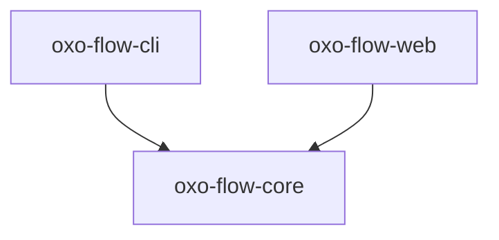
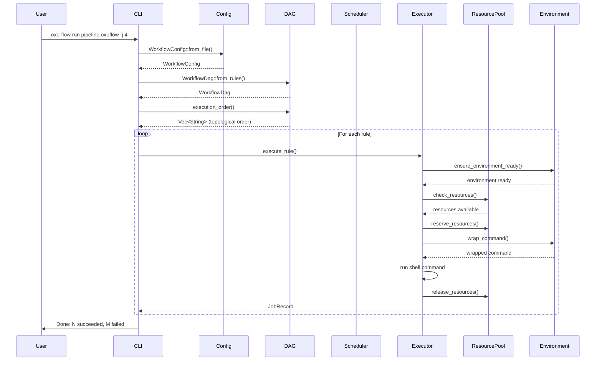

# System Architecture

oxo-flow is organized as a Cargo workspace with three crates that form a layered architecture.

---

## Workspace Layout

```
oxo-flow/
├── crates/
│   ├── oxo-flow-core/    # Core library
│   ├── oxo-flow-cli/     # CLI binary
│   └── oxo-flow-web/     # Web API server
├── pipelines/            # Pipeline definitions
├── examples/             # Example workflows
└── tests/                # Integration tests
```

---

## Crate Dependencies



- **oxo-flow-core** is the foundation — all other crates depend on it
- **oxo-flow-cli** is the user-facing binary that ties everything together
- **oxo-flow-web** provides the REST API layer on top of core

---

## Core Library Modules

The `oxo-flow-core` crate is organized into focused modules:

| Module | Responsibility |
|---|---|
| `config` | Parse `.oxoflow` TOML files into `WorkflowConfig` |
| `rule` | Rule definitions: inputs, outputs, shell, resources, environment |
| `dag` | Build and validate the dependency DAG, topological sorting |
| `executor` | Execute rules locally with checkpointing, resource enforcement |
| `scheduler` | Resource-aware job scheduling with ResourcePool |
| `environment` | Resolve and activate conda, docker, singularity, pixi, venv; cache setup state |
| `wildcard` | Expand `{sample}` patterns in file paths |
| `report` | Generate HTML and JSON reports from templates |
| `container` | Generate Dockerfile and Singularity definitions |
| `cluster` | Generate SLURM, PBS, SGE, LSF job scripts with environment wrapping |
| `error` | Unified error types (`OxoFlowError`) |
| `format` | Output formatting utilities |

---

## Data Flow

A typical workflow execution follows this path:



---

## Key Design Decisions

### DAG-first execution

All workflows are compiled into a Directed Acyclic Graph before any execution begins. This ensures:

- Dependencies are resolved up front
- Cycles are detected before compute is wasted
- Parallel execution groups are identified
- The execution order is deterministic

### Resource enforcement

Before executing each rule, the executor:

1. **Check**: Validates that required resources (threads, memory) are available in the ResourcePool
2. **Reserve**: Locks resources before starting execution
3. **Execute**: Runs the shell command within resource constraints
4. **Release**: Returns resources to the pool after completion (or on failure/timeout)

This prevents over-subscription of system resources when running multiple jobs concurrently.

### Environment isolation

Every rule can declare its own software environment. The executor:

1. **Resolve**: Maps environment spec to backend (conda, docker, singularity, pixi, venv)
2. **Setup**: Runs setup command on first use (e.g., `conda env create -f env.yaml`)
3. **Cache**: Marks environment as ready to skip setup on subsequent rules
4. **Wrap**: Wraps shell command through environment (e.g., `conda activate ...; <cmd>`)
5. **Execute**: Runs wrapped command

This prevents tool version conflicts between pipeline steps.

### Environment cache persistence

The EnvironmentCache can persist setup state to a JSON file:

- Enables faster startup on subsequent runs
- Skips redundant environment setup
- Shared across workflow runs using the same environments

### Error types

The core library uses `thiserror` for typed errors:

```rust
pub enum OxoFlowError {
    Config(String),
    Dag(String),
    Execution(String),
    Environment { kind: String, message: String },
    ResourceExhausted { rule: String, ... },
    // ...
}
```

The CLI uses `anyhow` for ergonomic error handling at the binary level.

### Async runtime

The executor uses `tokio` for async task execution. Each rule runs as a tokio task, enabling concurrent execution up to the `-j` limit. Resource management uses `Arc<Mutex<ResourcePool>>` for thread-safe access.

### Serialization

All configuration is TOML-based, parsed with `serde` and the `toml` crate. Report output supports both HTML (via Tera templates) and JSON (via serde_json).

---

## Technology Stack

| Component | Technology |
|---|---|
| Language | Rust (edition 2024) |
| Async runtime | tokio |
| CLI framework | clap (derive macros) |
| Web framework | axum |
| Serialization | serde + toml |
| Logging | tracing |
| Error handling | thiserror (lib) + anyhow (bin) |
| Templating | Tera |
| Graph algorithms | petgraph |
| System detection | num_cpus |

---

## Web Crate Architecture (v0.8+)

The `oxo-flow-web` crate follows a **domain-driven modular monolith** pattern:

```
crates/oxo-flow-web/src/
├── server.rs              # Router assembly (~200 lines)
├── domains/
│   ├── workflow/          # Pipeline parse, validate, prepare, DAG, format
│   │   ├── types.rs       # Request/response structs
│   │   ├── service.rs     # Pure logic — zero HTTP dependency
│   │   └── handlers.rs    # HTTP → service adapters
│   ├── execution/         # Run management, diagnostics, smart retry
│   │   ├── diagnostics.rs # Deterministic error pattern matching (30+ patterns)
│   │   └── runner.rs      # Background process spawn + monitor
│   ├── ai/                # AI translation layer (calls core APIs only)
│   │   └── provider.rs    # Claude/OpenAI/Ollama enum dispatch
│   ├── collaboration/     # Fork, diff, share, import
│   ├── auth/              # Authentication + OAuth2 (ORCID, GitHub)
│   └── observability/     # Health, metrics, structured logging, SSE
├── infra/
│   ├── db/                # StorageBackend trait + SQLite + PostgreSQL
│   ├── license.rs         # License notice management
│   └── sse.rs             # Real-time Server-Sent Events
└── templates/             # Embedded .oxoflow templates
```

**Key principles:**
- Each domain's `service.rs` has **zero HTTP dependency** — pure Rust functions
- HTTP is only in `handlers.rs` — parse request → call service → serialize response
- AI domain calls other domains' services, never bypasses boundaries
- Testing services requires no HTTP server

**Dependency direction:** `handlers.rs → service.rs → oxo_flow_core`

## See Also

- [DAG Engine](./dag-engine.md) — detailed DAG implementation
- [Environment System](./environment-system.md) — environment resolution architecture
- [Web API](./web-api.md) — REST endpoint design
- [AI Translation Layer](./ai-translation.md) — AI integration design
- [Diagnostics Engine](./diagnostics-engine.md) — error pattern library
- [Licensing](./license.md) — dual-license model
