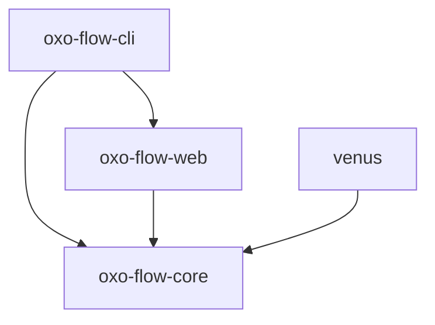
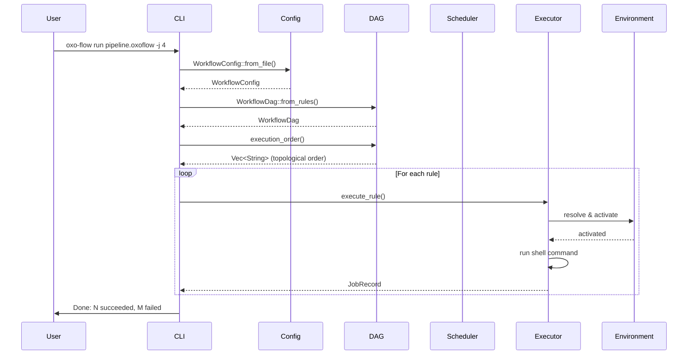

# System Architecture

oxo-flow is organized as a Cargo workspace with four crates that form a layered architecture.

---

## Workspace Layout

```
oxo-flow/
├── crates/
│   ├── oxo-flow-core/    # Core library
│   ├── oxo-flow-cli/     # CLI binary
│   ├── oxo-flow-web/     # Web API server
│   └── venus/            # Clinical pipeline
├── pipelines/            # Pipeline definitions
├── examples/             # Example workflows
└── tests/                # Integration tests
```

---

## Crate Dependencies



- **oxo-flow-core** is the foundation — all other crates depend on it
- **oxo-flow-cli** is the user-facing binary that ties everything together
- **oxo-flow-web** provides the REST API layer on top of core
- **venus** is a domain-specific pipeline crate built on core

---

## Core Library Modules

The `oxo-flow-core` crate is organized into focused modules:

| Module | Responsibility |
|---|---|
| `config` | Parse `.oxoflow` TOML files into `WorkflowConfig` |
| `rule` | Rule definitions: inputs, outputs, shell, resources, environment |
| `dag` | Build and validate the dependency DAG, topological sorting |
| `executor` | Execute rules locally with checkpointing |
| `scheduler` | Resource-aware job scheduling |
| `environment` | Resolve and activate conda, docker, singularity, pixi, venv |
| `wildcard` | Expand `{sample}` patterns in file paths |
| `report` | Generate HTML and JSON reports from templates |
| `container` | Generate Dockerfile and Singularity definitions |
| `cluster` | Generate SLURM, PBS, SGE, LSF job scripts |
| `error` | Unified error types (`OxoFlowError`) |
| `format` | Output formatting utilities |

---

## Data Flow

A typical workflow execution follows this path:



---

## Key Design Decisions

### DAG-first execution

All workflows are compiled into a Directed Acyclic Graph before any execution begins. This ensures:

- Dependencies are resolved up front
- Cycles are detected before compute is wasted
- Parallel execution groups are identified
- The execution order is deterministic

### Environment isolation

Every rule can declare its own software environment. The executor resolves the environment specification, activates it, runs the command, and deactivates it. This prevents tool version conflicts between pipeline steps.

### Error types

The core library uses `thiserror` for typed errors:

```rust
pub enum OxoFlowError {
    Config(String),
    Dag(String),
    Execution(String),
    Environment(String),
    // ...
}
```

The CLI uses `anyhow` for ergonomic error handling at the binary level.

### Async runtime

The executor uses `tokio` for async task execution. Each rule runs as a tokio task, enabling concurrent execution up to the `-j` limit.

### Serialization

All configuration is TOML-based, parsed with `serde` and the `toml` crate. Report output supports both HTML (via Tera templates) and JSON (via serde_json).

---

## Technology Stack

| Component | Technology |
|---|---|
| Language | Rust (edition 2024) |
| Async runtime | tokio |
| CLI framework | clap (derive macros) |
| Web framework | axum |
| Serialization | serde + toml |
| Logging | tracing |
| Error handling | thiserror (lib) + anyhow (bin) |
| Templating | Tera |
| Graph algorithms | petgraph |

---

## See Also

- [DAG Engine](./dag-engine.md) — detailed DAG implementation
- [Environment System](./environment-system.md) — environment resolution architecture
- [Web API](./web-api.md) — REST endpoint design
