# System Architecture

oxo-flow is a Rust-native bioinformatics pipeline engine. Workflows are
declared once, in a TOML `.oxoflow` file, and compiled into a directed
acyclic graph before any compute runs. The engine fans rules out across
samples, experiment pairs, and tool parameters, executes each step in a
declared software environment under explicit resource limits, checkpoints
every result for exact resume, and exposes the same engine through three
front doors: a CLI, a web server with a browser workspace, and an
AI-assistant layer grounded on deterministic core APIs.

This page is the architectural map: how the crates are cut, how the engine
is layered, and how a workflow travels from file to finished report. It is
written top-down — each layer links to a dedicated reference page.

---

## Design Pillars

Six commitments shape every subsystem:

1. **One declarative source of truth.** The `.oxoflow` TOML file fully
   describes the workflow: steps, wildcards, environments, resources,
   gates. Nothing meaningful lives only in a script or a UI state.
2. **Plan fully, then execute.** Wildcard expansion, DAG construction,
   cycle detection, and target selection all happen before the first job
   starts. What can be decided statically is decided statically.
3. **Hermetic per-rule environments.** Every rule names its software
   environment (conda, docker, …); the engine resolves, builds, caches,
   and wraps it — tool versions never leak between steps.
4. **Resources as first-class constraints.** Threads, memory, GPU, and
   custom pools are declared per rule and enforced by a scheduler that
   waits instead of over-subscribing.
5. **Resumable by construction.** A checkpoint captures the execution
   truth (per-rule state, wildcard domains, timings); resume replays it
   and re-runs only what provably changed.
6. **Observable and AI-native.** Machine-readable status/graph/JSON
   outputs on stdout, human logs on stderr, and an AI layer that explains
   and edits workflows only through deterministic engine APIs.

---

## System Context

oxo-flow sits between the person defining the analysis and the machines
running it. One engine, three interaction surfaces, a fully external
execution substrate.

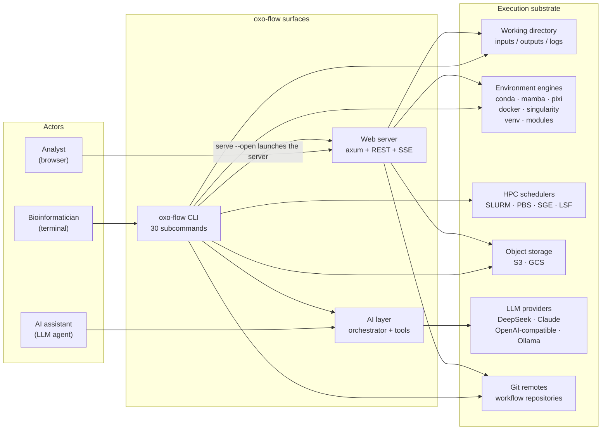
```mermaid
flowchart LR
    subgraph actors["Actors"]
        bio["Bioinformatician<br/>(terminal)"]
        webuser["Analyst<br/>(browser)"]
        agent["AI assistant<br/>(LLM agent)"]
    end

    subgraph surfaces["oxo-flow surfaces"]
        cli["oxo-flow CLI<br/>30 subcommands"]
        web["Web server<br/>axum + REST + SSE"]
        ai["AI layer<br/>orchestrator + tools"]
    end

    subgraph world["Execution substrate"]
        fs["Working directory<br/>inputs / outputs / logs"]
        env["Environment engines<br/>conda · mamba · pixi<br/>docker · singularity<br/>venv · modules"]
        hpc["HPC schedulers<br/>SLURM · PBS · SGE · LSF"]
        obj["Object storage<br/>S3 · GCS"]
        llm["LLM providers<br/>DeepSeek · Claude<br/>OpenAI-compatible · Ollama"]
        git["Git remotes<br/>workflow repositories"]
    end

    bio --> cli
    webuser --> web
    cli -- "serve --open launches the server" --> web
    agent --> ai
    cli --> ai

    cli --> fs
    web --> fs
    cli --> env
    web --> env
    cli --> hpc
    cli --> obj
    web --> obj
    cli --> git
    web --> git
    ai --> llm
```

The three surfaces are thin: they parse intent, call the engine, and
render results. All semantics live in one core library, so a workflow
behaves identically in a terminal, a browser, and an AI session.

---

## Workspace Topology

oxo-flow is a Cargo workspace. Dependency directions are strict and
acyclic — `oxo-flow-ai` is deliberately standalone so the AI layer can be
compiled, licensed, and audited in isolation.

| Crate | Kind | Depends on | Responsibility |
|---|---|---|---|
| `oxo-flow-core` | library | — | The engine: workflow model, expansion, DAG, execution, checkpointing, environments, storage, reporting |
| `oxo-flow-ai` | library | — | AI companion: provider abstraction, agent orchestrator, embedded knowledge bases, tool/skill system |
| `oxo-flow-web` | library | core, ai | REST/WebSocket server: 9 domains, storage backends, SSE broadcast, OpenAPI |
| `oxo-flow-cli` | binary | core, ai, web | User-facing `oxo-flow` binary: 30 subcommands, run loop, human rendering |

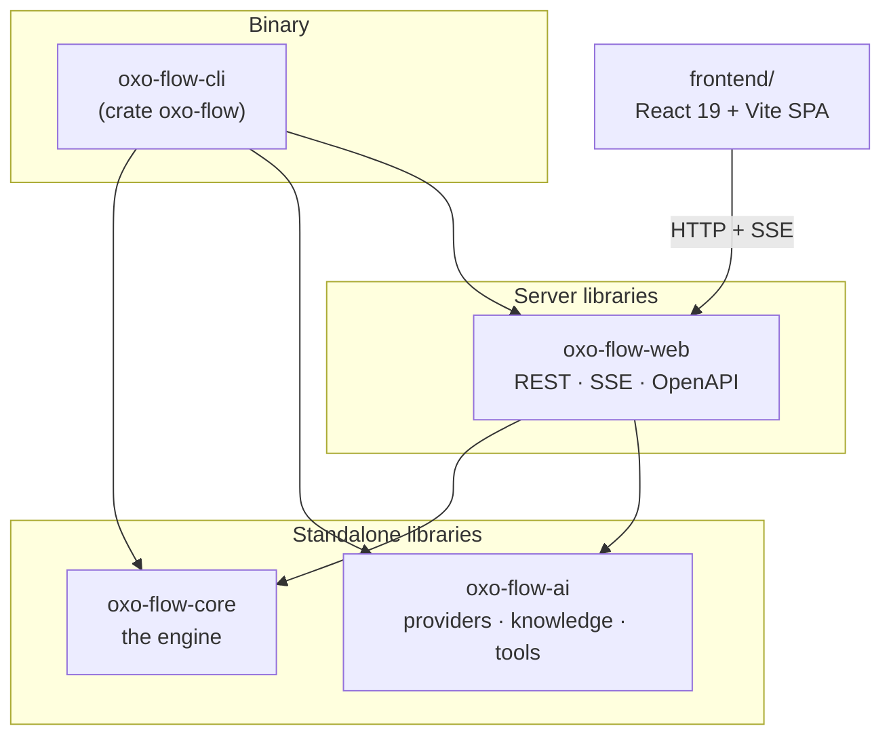
```mermaid
flowchart TB
    subgraph binary["Binary"]
        CLI["oxo-flow-cli<br/>(crate oxo-flow)"]
    end
    subgraph servers["Server libraries"]
        WEB["oxo-flow-web<br/>REST · SSE · OpenAPI"]
    end
    subgraph libs["Standalone libraries"]
        CORE["oxo-flow-core<br/>the engine"]
        AI["oxo-flow-ai<br/>providers · knowledge · tools"]
    end
    FE["frontend/<br/>React 19 + Vite SPA"]

    CLI --> CORE
    CLI --> AI
    CLI --> WEB
    WEB --> CORE
    WEB --> AI
    FE -- "HTTP + SSE" --> WEB
```

The AI crate never imports the engine. Where AI needs engine facts — a
workflow's rules, a DAG, a dry-run preview — the CLI and web crates pass
them in as data (see [AI Subsystem](#ai-subsystem)).

---

## The Core Engine: Layered Model

`oxo-flow-core` is organized as five layers. Dependencies point downward:
the execution layer knows the planning layer's outputs, never the reverse.

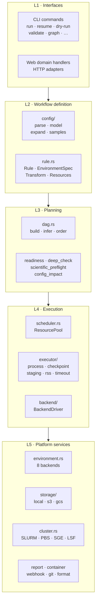
```mermaid
flowchart TB
    subgraph L1["L1 · Interfaces"]
        direction LR
        cmd["CLI commands<br/>run · resume · dry-run<br/>validate · graph · …"]
        api["Web domain handlers<br/>HTTP adapters"]
    end

    subgraph L2["L2 · Workflow definition"]
        direction LR
        model["config/<br/>parse · model<br/>expand · samples"]
        rulem["rule.rs<br/>Rule · EnvironmentSpec<br/>Transform · Resources"]
    end

    subgraph L3["L3 · Planning"]
        direction LR
        dagm["dag.rs<br/>build · infer · order"]
        plan["readiness · deep_check<br/>scientific_preflight<br/>config_impact"]
    end

    subgraph L4["L4 · Execution"]
        direction LR
        sched["scheduler.rs<br/>ResourcePool"]
        exec["executor/<br/>process · checkpoint<br/>staging · rss · timeout"]
        drv["backend/<br/>BackendDriver"]
    end

    subgraph L5["L5 · Platform services"]
        direction LR
        envm["environment.rs<br/>8 backends"]
        storm["storage/<br/>local · s3 · gcs"]
        clum["cluster.rs<br/>SLURM · PBS · SGE · LSF"]
        misc["report · container<br/>webhook · git · format"]
    end

    L1 --> L2
    L2 --> L3
    L3 --> L4
    L4 --> L5
```

### Layer 2 — Workflow definition

| Module | Responsibility |
|---|---|
| `config/` | `.oxoflow` TOML → `WorkflowConfig`: parsing, defaults, include composition, sample sheets, wildcard expansion, reference resolution |
| `rule.rs` | The rule record: inputs/outputs (list, map, dir patterns), shell/script, `when` gates, `[[transform]]` split→map→combine, `EnvironmentSpec`, `Resources` |
| `wildcard.rs` | Pattern grammar (`{sample}`, `{values.name}`, `{config.x}`, `{meta.col}`), pattern→regex compilation, discovery walkers, Cartesian combination |
| `references.rs` | `@reference` resolution against known databases |
| `deep_check.rs` | Static consistency checks beyond `validate` (D001–D004 codes) |
| `config_impact.rs` | Config-key → rule reference graph; fingerprints decide precise checkpoint invalidation |

### Layer 3 — Planning

| Module | Responsibility |
|---|---|
| `dag.rs` | `WorkflowDag`: output→producer registration (incl. `output_pattern`), exact-string + best-effort inference (glob, directory, template regex), topological order, parallel groups, cycle detection |
| `readiness.rs` | Per-sample readiness attribution: which samples a rule instance belongs to |
| `scientific_preflight.rs` | Deterministic, evidence-backed checks (GATK best practices and similar) that a design would fail *scientifically* — caught before hours of compute |
| `config_impact.rs` | What a config edit invalidates, precisely |

### Layer 4 — Execution

| Module | Responsibility |
|---|---|
| `scheduler.rs` | Ready-set computation (priority descending, name ascending), ResourcePool accounting |
| `executor/process.rs` | Job execution: one process group per run (`pgid`), timeout, cancellation |
| `executor/checkpoint.rs` | `CheckpointState`: per-rule status, wildcard domains, timings — the resume truth |
| `executor/staging.rs`, `content_cache.rs` | Input staging; content-addressed caching of completed work |
| `executor/rss.rs` | Peak-RSS sampling per job (reported in run reports) |
| `executor/workdir_lock.rs`, `env_create_lock.rs` | Concurrency guards: one writer per workdir; no concurrent env builds |
| `executor/output_invalidation.rs` | Output freshness evaluation against the checkpoint |
| `reentry.rs` | Checkpoint re-entry: re-expand the plan from templates, merge with recorded state |
| `backend/` | `BackendDriver` executes a `ScheduledPlan` through an `ExecutorBackend` — the local executor and cluster submissions produce the same `JobRecord` stream |

### Layer 5 — Platform services

| Module | Responsibility |
|---|---|
| `environment.rs` | Backend trait + resolver for 8 environment kinds; content-hash env naming; setup-state cache |
| `storage/` | Staging and remote storage: `local`, `s3`, `gcs` behind one trait |
| `cluster.rs` | SLURM / PBS / SGE / LSF job-script generation with environment wrapping |
| `container.rs` | Dockerfile / Singularity definition generation |
| `report.rs`, `report_metrics/` | HTML + JSON run reports; per-rule metrics sections |
| `webhook.rs` | `workflow_started` / `completed` / `failed` notifications |
| `git.rs` | Workflow-repo clone/pull with mirror fallback; git-ref-as-version |
| `software_versions.rs` | Tool-version capture for reproducibility statements |
| `result.rs`, `format.rs`, `plugin.rs`, `stage.rs` | Result registry, output formatting, plugin hooks, metro-map stage inference |

---

## Workflow Lifecycle

The configuration moves through a type-state machine — the compiler
refuses to execute an unvalidated workflow, because `WorkflowState<S>`
wraps the config and only exposes the transitions you have earned:

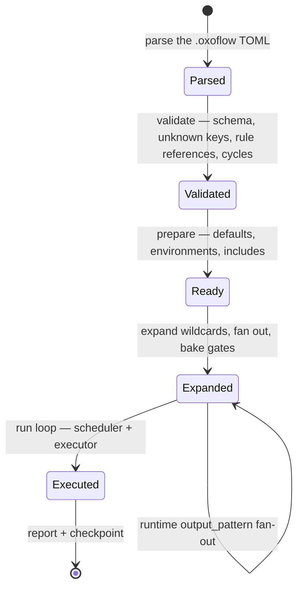
```mermaid
stateDiagram-v2
    [*] --> Parsed: parse the .oxoflow TOML
    Parsed --> Validated: validate — schema, unknown keys, rule references, cycles
    Validated --> Ready: prepare — defaults, environments, includes
    Ready --> Expanded: expand wildcards, fan out, bake gates
    Expanded --> Executed: run loop — scheduler + executor
    Expanded --> Expanded: runtime output_pattern fan-out
    Executed --> [*]: report + checkpoint
```

Two properties follow from this encoding:

- **Validation is not optional.** A `Ready` workflow has already passed
  every static check; the run loop never re-validates.
- **Re-expansion is safe.** Templates are preserved on first expansion
  (`rule_templates`), so checkpoint re-entry re-runs expansion from the
  original definitions and merges with recorded state.

---

## The Expansion Engine

Expansion is where a declarative workflow becomes concrete instances. It
is also the engine's most opinionated design: **all fan-out dimensions
are declared, none are discovered by accident.**

A rule can fan out along four dimensions:

| Dimension | Source | Declared by | Fan-out |
|---|---|---|---|
| Sample groups | `[[sample_groups]]` / sample sheets | `{sample}`, `{group}`, metadata columns | plan time |
| Experiment pairs | `[[pairs]]` | `{pair_id}`, `{experiment}`, `{control}`, pair metadata | plan time |
| Parameter values | `[[values]]` / `values_from` | `{name}` or `{values.name}` — in inputs, outputs, shell, `when`, `expand_inputs`, **or `output_pattern`** | plan time |
| Runtime outputs | `output_pattern` | fresh `{wildcards}` not bound by any table above | after the producer completes |

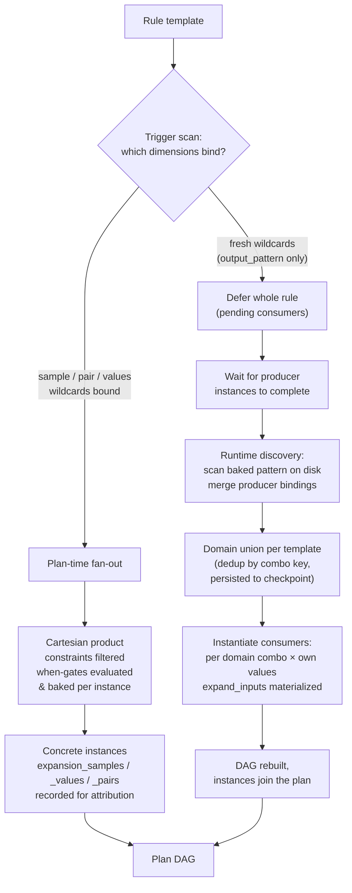
```mermaid
flowchart TB
    tmpl["Rule template"] --> scan{"Trigger scan:<br/>which dimensions bind?"}

    scan -- "sample / pair / values<br/>wildcards bound" --> static["Plan-time fan-out"]
    scan -- "fresh wildcards<br/>(output_pattern only)" --> defer["Defer whole rule<br/>(pending consumers)"]

    static --> cart["Cartesian product<br/>constraints filtered<br/>when-gates evaluated<br/>& baked per instance"]
    cart --> inst["Concrete instances<br/>expansion_samples / _values / _pairs<br/>recorded for attribution"]

    defer --> wait["Wait for producer<br/>instances to complete"]
    wait --> disc["Runtime discovery:<br/>scan baked pattern on disk<br/>merge producer bindings"]
    disc --> union["Domain union per template<br/>(dedup by combo key,<br/>persisted to checkpoint)"]
    union --> instantiate["Instantiate consumers:<br/>per domain combo × own values<br/>expand_inputs materialized"]
    instantiate --> rebuild["DAG rebuilt,<br/>instances join the plan"]

    inst --> dag["Plan DAG"]
    rebuild --> dag
```

Guarantees the engine enforces here:

- **Bound wildcards never stay literal.** A wildcard bound by a table is
  baked into every instance; a wildcard bound by nothing is either a
  fresh output_pattern wildcard (deferred) or a plan-time warning.
- **Fresh wildcards have one producer** (v1). A bare redeclaration is a
  validation error; a chained consumer-producer is legal.
- **Per-instance `when` gates are evaluated at plan time** (with
  `wildcard.*` / `{meta.*}` baked into the survivors), so the planned
  instance set equals the executed set — no phantom jobs.
- **Runtime fan-out is idempotent.** Discovered domains are persisted
  before consumers instantiate; resume replays them without re-running
  the producer.

---

## Execution Pipeline

A `run` travels through the engine like this (the `resume` path rejoins
at the checkpoint restore):

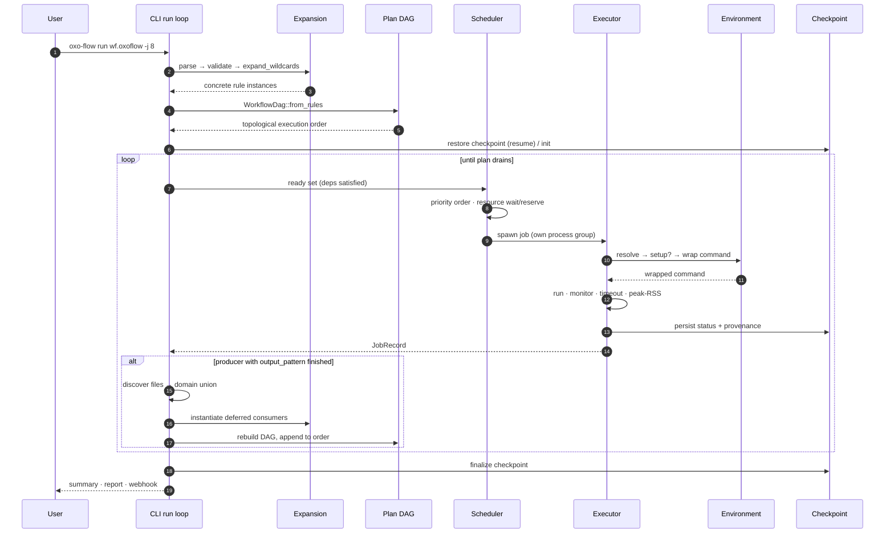
```mermaid
sequenceDiagram
    autonumber
    participant U as User
    participant C as CLI run loop
    participant E as Expansion
    participant D as Plan DAG
    participant S as Scheduler
    participant X as Executor
    participant V as Environment
    participant K as Checkpoint

    U->>C: oxo-flow run wf.oxoflow -j 8
    C->>E: parse → validate → expand_wildcards
    E-->>C: concrete rule instances
    C->>D: WorkflowDag::from_rules
    D-->>C: topological execution order
    C->>K: restore checkpoint (resume) / init

    loop until plan drains
        C->>S: ready set (deps satisfied)
        S->>S: priority order · resource wait/reserve
        S->>X: spawn job (own process group)
        X->>V: resolve → setup? → wrap command
        V-->>X: wrapped command
        X->>X: run · monitor · timeout · peak-RSS
        X->>K: persist status + provenance
        X-->>C: JobRecord

        alt producer with output_pattern finished
            C->>C: discover files → domain union
            C->>E: instantiate deferred consumers
            C->>D: rebuild DAG, append to order
        end
    end

    C->>K: finalize checkpoint
    C-->>U: summary · report · webhook
```

Forward-safety — new instances joining a plan that is already running —
comes from completion ordering, not DAG topology: consumers of runtime
domains are only created once every producer instance has succeeded, and
they enter the plan exactly where checkpoint re-entry inserts replayed
rules.

---

## Scheduling & Resources

The scheduler never over-subscribes. When a job's requirements cannot be
met, it waits; when they are impossible on this machine, it fails fast
and names the conflict.

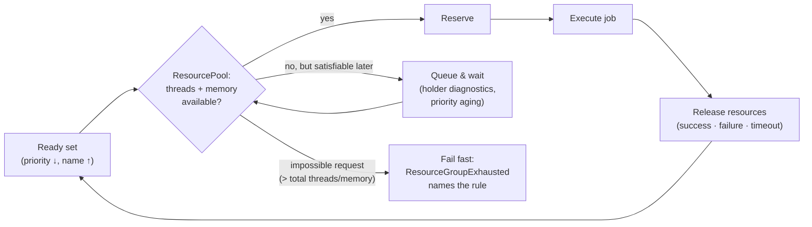
```mermaid
flowchart LR
    ready["Ready set<br/>(priority ↓, name ↑)"] --> check{"ResourcePool:<br/>threads + memory<br/>available?"}
    check -- yes --> reserve["Reserve"]
    check -- "no, but satisfiable later" --> wait["Queue & wait<br/>(holder diagnostics,<br/>priority aging)"]
    wait --> check
    check -- "impossible request<br/>(> total threads/memory)" --> fastfail["Fail fast:<br/>ResourceGroupExhausted<br/>names the rule"]
    reserve --> run["Execute job"]
    run --> release["Release resources<br/>(success · failure · timeout)"]
    release --> ready
```

Resources are declarative (`threads`, `memory`, `gpu`, custom groups) and
enforced per job; `threads <= 1` is the documented "unset" sentinel, and
every runtime read goes through `effective_threads()` / `effective_memory()`
so defaults, profiles, and cluster profiles compose deterministically.

---

## Checkpoint & Resume

The checkpoint is the execution truth — the run loop never trusts the
filesystem alone. Rule states, discovered wildcard domains, per-rule
timings, and input manifests live in one JSON document, persisted
first and replayed on resume.

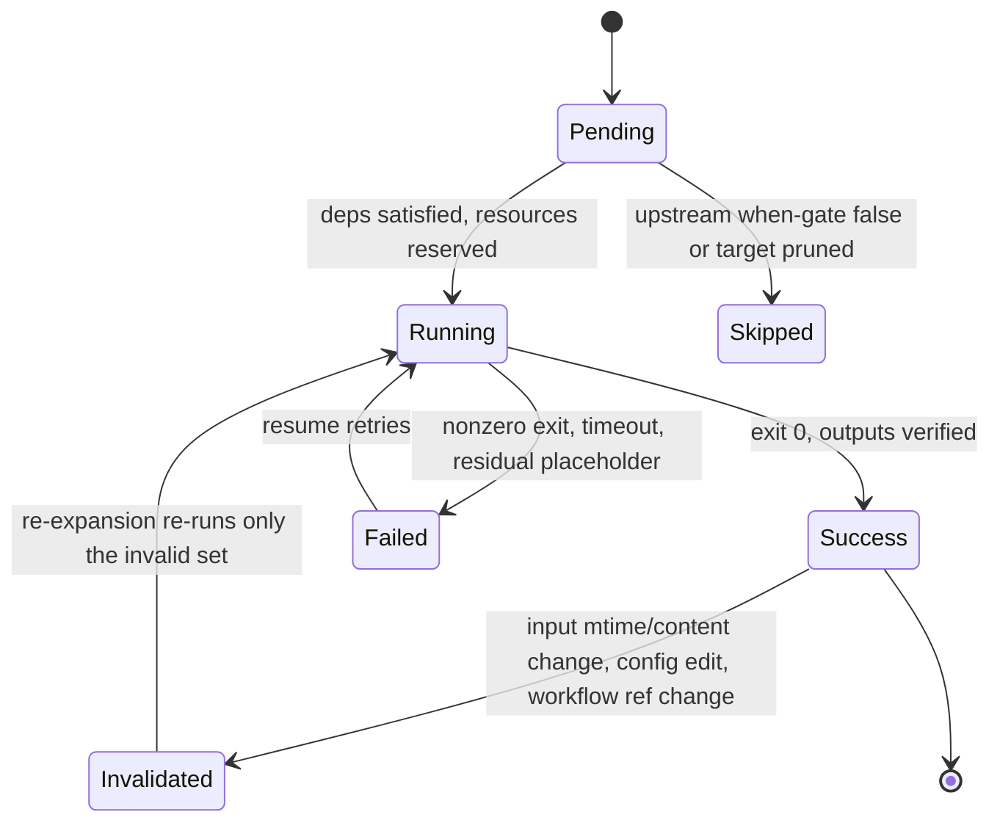
```mermaid
stateDiagram-v2
    [*] --> Pending
    Pending --> Running: deps satisfied, resources reserved
    Running --> Success: exit 0, outputs verified
    Running --> Failed: nonzero exit, timeout, residual placeholder
    Failed --> Running: resume retries
    Pending --> Skipped: upstream when-gate false or target pruned
    Success --> Invalidated: input mtime/content change, config edit, workflow ref change
    Invalidated --> Running: re-expansion re-runs only the invalid set
    Success --> [*]
```

Invalidation is precise, not conservative:

- **Content-addressed cache keys** hash the inputs that matter, so a
  touched-but-identical input does not re-trigger work.
- **`config_impact` fingerprints** map a config edit to exactly the rules
  that reference the changed key.
- **Input manifests** record path + size + mtime of every consumed file;
  checkpoint re-entry re-validates them.
- **Discovered domains are replayed** — consumers of a runtime fan-out
  re-instantiate without re-running their producer.

---

## Environment Subsystem

Every rule names an environment; the engine treats software provenance as
part of the workflow, not the machine. One trait, eight backends, one
cache.

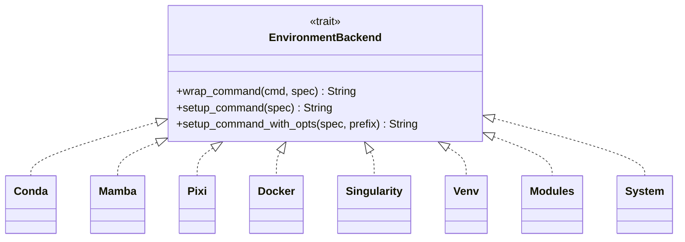
```mermaid
classDiagram
    class EnvironmentBackend {
        <<trait>>
        +wrap_command(cmd, spec) String
        +setup_command(spec) String
        +setup_command_with_opts(spec, prefix) String
    }
    class Conda
    class Mamba
    class Pixi
    class Docker
    class Singularity
    class Venv
    class Modules
    class System
    EnvironmentBackend <|.. Conda
    EnvironmentBackend <|.. Mamba
    EnvironmentBackend <|.. Pixi
    EnvironmentBackend <|.. Docker
    EnvironmentBackend <|.. Singularity
    EnvironmentBackend <|.. Venv
    EnvironmentBackend <|.. Modules
    EnvironmentBackend <|.. System
```

Resolution precedence: rule `environment` → rule `env_group` (a named
`[env_groups]` entry) → `[defaults].environment`. Setup is locked per
environment (concurrent first uses do not race the build), env names are
content-hashed for file-backed specs (edits build a fresh env instead of
silently reusing a stale one), and setup state is cached and persisted so
subsequent runs skip straight to wrapping.

---

## Web Platform

The web crate is a **domain-driven modular monolith**: nine business
domains behind one axum router, with HTTP confined to the edge of each
domain.

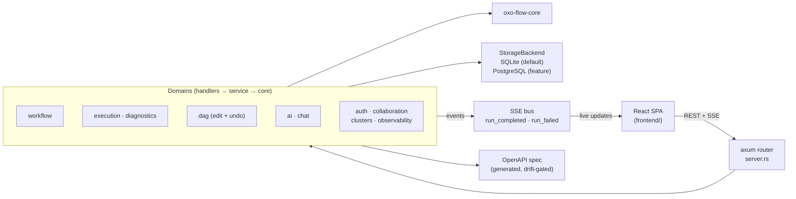
```mermaid
flowchart LR
    spa["React SPA<br/>(frontend/)"] -- "REST + SSE" --> router["axum router<br/>server.rs"]

    subgraph domains["Domains (handlers → service → core)"]
        direction TB
        wf["workflow"]
        exe["execution · diagnostics"]
        dage["dag (edit + undo)"]
        aim["ai · chat"]
        rest["auth · collaboration<br/>clusters · observability"]
    end

    router --> domains
    domains --> core["oxo-flow-core"]
    domains --> store["StorageBackend<br/>SQLite (default)<br/>PostgreSQL (feature)"]
    domains -- "events" --> sse["SSE bus<br/>run_completed · run_failed"]
    sse -- "live updates" --> spa
    domains --> openapi["OpenAPI spec<br/>(generated, drift-gated)"]
```

Key principles:

- Each domain's `service.rs` has **zero HTTP dependency** — pure Rust
  functions over core types; `handlers.rs` only parses requests and
  serializes responses.
- **Dependency direction:** `handlers.rs → service.rs → oxo_flow_core`.
  The AI domain calls other domains' services, never their handlers.
- Real-time state reaches the SPA through an SSE bus (`run_completed`,
  `run_failed`, execution events), not polling.
- The OpenAPI schema is generated from the code and gated in CI against
  drift — the published API contract cannot rot silently.

---

## AI Subsystem

`oxo-flow-ai` is a standalone library (it does not depend on the engine)
with three moving parts: providers, an agent loop, and an embedded
knowledge base. The CLI and web crates act as adapters that hand the AI
layer engine facts as data.

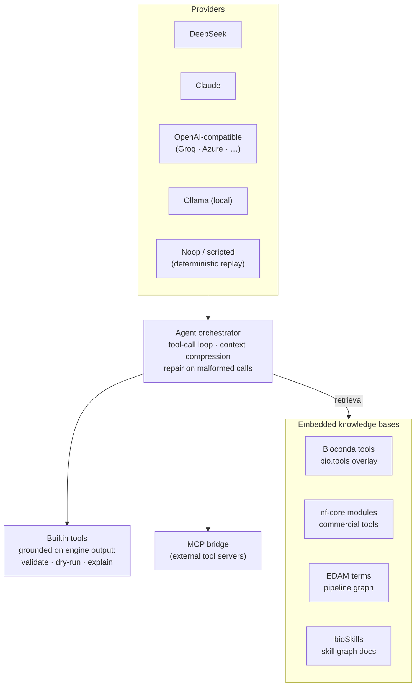
```mermaid
flowchart TB
    subgraph providers["Providers"]
        direction LR
        deepseek["DeepSeek"]
        claude["Claude"]
        oai["OpenAI-compatible<br/>(Groq · Azure · …)"]
        ollama["Ollama (local)"]
        noop["Noop / scripted<br/>(deterministic replay)"]
    end

    orchestrator["Agent orchestrator<br/>tool-call loop · context compression<br/>repair on malformed calls"]

    subgraph knowledge["Embedded knowledge bases"]
        direction LR
        bio["Bioconda tools<br/>bio.tools overlay"]
        nf["nf-core modules<br/>commercial tools"]
        edam["EDAM terms<br/>pipeline graph"]
        skills["bioSkills<br/>skill graph docs"]
    end

    tools["Builtin tools<br/>grounded on engine output:<br/>validate · dry-run · explain"]
    mcp["MCP bridge<br/>(external tool servers)"]

    providers --> orchestrator
    orchestrator --> tools
    orchestrator -- "retrieval" --> knowledge
    orchestrator --> mcp
```

Design invariants:

- **Grounded, not creative.** Every engine-facing claim (validation
  verdicts, DAG facts, dry-run previews) comes from deterministic core
  APIs; the model writes prose and proposals, the engine computes truth.
- **Deterministic replay.** Sessions record tool calls; the `scripted`
  provider replays them for tests and evals without network access.
- **Skills are explicit.** Prompt-injection bundles activate only when
  declared in `[ai]` skills — discoverable, auditable, versioned.
- **Versioned knowledge.** The embedded corpora regenerate through CI
  generators on a monthly freshness gate.

---

## Cross-Cutting Design Decisions

### DAG-first execution

All workflows compile to a DAG before execution: dependencies resolved up
front, cycles rejected before compute is wasted, parallel groups known,
execution order deterministic. Edge inference is **exact-string first**
(template outputs ↔ inputs), then strictly best-effort (globs, declared
directories, template regexes) — unresolved inputs keep the legacy
no-edge behavior, never an error.

### Plan/execute split

Everything static happens before the first job: expansion, gating,
ordering, target pruning, preflight. The run loop's only surprise is the
declared one — runtime `output_pattern` fan-out, which inserts instances
forward under completion-ordering guarantees. `dry-run` shares the same
planning code and previews the checkpoint state a real run would produce.

### Resources as constraints, not hints

Check → reserve → execute → release, with fast failure on impossible
requests and queueing (with aging) on contention. The same declaration
drives local concurrency, cluster submissions, and the web runner.

### Environment isolation

Resolve → setup (locked, content-hashed, cached) → wrap → execute. Per
rule, per run, reproducible; `oxo-flow env` inspects the resolved state.

### Checkpoint = execution truth

Status, domains, manifests, timings — persisted first, replayed on
resume, invalidated precisely. `resume` re-runs only what provably
changed; `status --json` exposes the same document for automation.

### Process hygiene

Each run executes in its own process group (`pgid`) — cancellation kills
the whole tree, orphans cannot outlive the run. Workdir locks serialize
writers; environment builds are locked globally.

### Errors: typed in the library, ergonomic at the edge

`oxo-flow-core` returns typed `OxoFlowError` variants (thiserror) that
callers can match on; the CLI presents them with suggestions and exits
non-zero. Diagnostics engines (CLI + web) map raw logs to known failure
patterns with fixes.

### Async runtime & concurrency

The executor runs each job as a tokio task; the resource pool lives
behind an async mutex. Concurrency is bounded by `-j` and by resources —
never by "however many tasks happened to spawn".

---

## Technology Stack

| Component | Technology |
|---|---|
| Language | Rust (edition 2024, `unsafe` forbidden in core) |
| Async runtime | tokio |
| CLI framework | clap (derive macros) |
| Web framework | axum + SSE |
| Persistence | SQLite (embedded) · PostgreSQL (feature-gated) |
| Serialization | serde + toml (workflows), JSON (checkpoints/reports) |
| Templating | Tera (reports) |
| Graph algorithms | petgraph |
| Logging / tracing | tracing (stderr; stdout stays machine-readable) |
| Error handling | thiserror (libraries) + anyhow (binary) |
| Frontend | React 19 + Vite SPA |

---

## See Also

- [Workflow Format](./workflow-format.md) — the declarative language itself
- [Wildcards](./wildcards.md) — pattern grammar and expansion semantics
- [DAG Engine](./dag-engine.md) — edge inference and ordering in depth
- [Environment System](./environment-system.md) — backend resolution and caching
- [Execution Backends](./execution-backends.md) — local vs cluster execution
- [Cloud Storage](./cloud-storage.md) — staging and S3/GCS
- [Workflow Versioning](./versioning.md) — git-ref-as-version semantics
- [Web System Architecture](./web-system-architecture.md) — the web platform in depth
- [AI CLI](./ai-cli.md) — using the AI layer from the terminal
- [Reporting System](./reporting-system.md) — run reports and metrics
- [Diagnostics Engine](./diagnostics-engine.md) — error pattern library
- [Glossary](./glossary.md) — shared vocabulary
