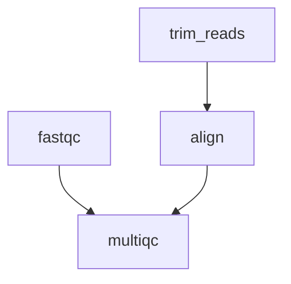
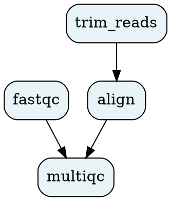

# DAG Engine

The Directed Acyclic Graph (DAG) engine is the core of oxo-flow's workflow execution model. It handles dependency resolution, validation, topological sorting, and parallel execution group identification.

---

## Overview

Every oxo-flow workflow is compiled into a DAG before execution. Each node represents a rule, and each edge represents a dependency (rule B depends on rule A's output).



---

## Implementation

The DAG engine is implemented in `crates/oxo-flow-core/src/dag.rs` using the [`petgraph`](https://docs.rs/petgraph/) library.

### Key type

```rust
pub struct WorkflowDag {
    graph: DiGraph<String, ()>,
    node_indices: HashMap<String, NodeIndex>,
}
```

- `graph` — a directed graph where nodes are rule names and edges are dependencies
- `node_indices` — maps rule names to their graph node indices for O(1) lookup

---

## Building the DAG

### `WorkflowDag::from_rules()`

Given a list of rules, the DAG is built by:

1. **Adding nodes** — one per rule, keyed by `rule.name`
2. **Inferring edges** — for each rule B, if any of B's inputs appear in another rule A's outputs, add an edge A → B
3. **Cycle detection** — verify the graph is acyclic
4. **Validation** — check for duplicate rule names and missing dependencies

```rust
let dag = WorkflowDag::from_rules(&config.rules)?;
```

If the DAG contains a cycle, an `OxoFlowError::Dag` error is returned with details about which rules are involved.

---

## Topological Sorting

### `execution_order()`

Returns rules in a valid execution order — every rule appears after all of its dependencies:

```rust
let order: Vec<String> = dag.execution_order()?;
// ["fastqc", "trim_reads", "align", "multiqc"]
```

The implementation uses Kahn's algorithm (BFS-based topological sort), which also serves as a second cycle-detection pass.

---

## Parallel Groups

### `parallel_groups()`

Returns rules grouped by execution level — rules in the same group have no dependencies on each other and can run concurrently:

```rust
let groups: Vec<Vec<String>> = dag.parallel_groups()?;
// [["fastqc", "trim_reads"], ["align"], ["multiqc"]]
```

This is used by the executor to determine which rules can be launched simultaneously within the `-j` concurrency limit.

---

## DOT Export

### `to_dot()`

Generates a Graphviz DOT representation of the DAG:

```rust
let dot: String = dag.to_dot();
```

Output:



---

## Graph Metrics

| Method | Returns | Description |
|---|---|---|
| `node_count()` | `usize` | Number of rules in the DAG |
| `edge_count()` | `usize` | Number of dependency edges |
| `execution_order()` | `Vec<String>` | Topologically sorted rule names |
| `parallel_groups()` | `Vec<Vec<String>>` | Rules grouped by execution level |
| `to_dot()` | `String` | Graphviz DOT output |

---

## Error Conditions

| Error | Cause |
|---|---|
| `Cycle detected` | Two or more rules form a circular dependency |
| `Duplicate rule name` | Two rules share the same `name` field |

---

## Design Notes

- The DAG is immutable once built — modifications require rebuilding from rules
- Wildcard patterns are matched literally during DAG construction; expansion happens at execution time
- The petgraph `DiGraph` provides efficient graph traversal with O(V + E) topological sort
- Cycle detection is performed twice: once during edge insertion (via DFS) and once during topological sort (via Kahn's algorithm) for robustness

---

## See Also

- [System Architecture](./architecture.md) — how the DAG engine fits into the system
- [`graph` command](../commands/graph.md) — CLI for DAG visualization
- [Workflow Format](./workflow-format.md) — how rules define the DAG structure
