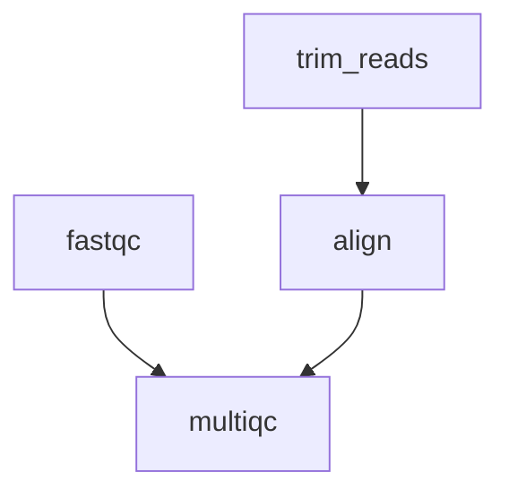
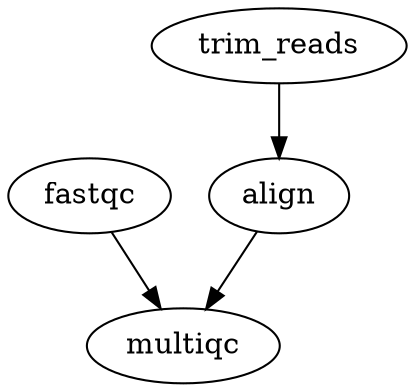

# DAG Engine

The Directed Acyclic Graph (DAG) engine is the core of oxo-flow's workflow execution model. It handles dependency resolution, validation, topological sorting, and parallel execution group identification.

---

## Overview

Every oxo-flow workflow is compiled into a DAG before execution. Each node represents a rule, and each edge represents a dependency (rule B depends on rule A's output).


```mermaid
graph TD
    A[fastqc] --> D[multiqc]
    B[trim_reads] --> C[align]
    C --> D
```

---

## Implementation

The DAG engine is implemented in `crates/oxo-flow-core/src/dag.rs` using the [`petgraph`](https://docs.rs/petgraph/) library.

### Key type

```rust
pub struct WorkflowDag {
    graph: DiGraph<DagNode, ()>,
    name_to_node: HashMap<String, NodeIndex>,
    output_to_node: HashMap<String, Vec<NodeIndex>>,
}

pub struct DagNode {
    pub name: String,
    pub rule_index: usize,
}
```

- `graph` — a directed graph where nodes are `DagNode` (rule name + index) and edges are dependencies
- `name_to_node` — maps rule names to their graph node indices for O(1) lookup
- `output_to_node` — maps output file patterns to **all** nodes producing that output (a `Vec`, since several rules may declare the same output pattern)

---

## Building the DAG

### `WorkflowDag::from_rules()` / `from_rules_with_config()`

Given a list of rules, the DAG is built by:

1. **Adding nodes** — one per rule, keyed by `rule.name`
2. **Inferring edges** — for each rule B, if any of B's inputs appear in another rule A's outputs, add an edge A → B. Before matching, `{config.x}` placeholders in input/output paths are expanded against the workflow config (`from_rules_with_config`; the CLI passes the config at every build site), so the same logical path expressed through different config keys (`{config.umap_n_neighbors}` vs `{config.leiden_n_neighbors}`) still connects. `from_rules` keeps the legacy no-config matching.
3. **Cycle detection** — verify the graph is acyclic
4. **Validation** — reject duplicate rule names; inputs with no producer are treated as source files

```rust
let dag = WorkflowDag::from_rules(&config.rules)?;
```

Inference is strictly best-effort string matching: unresolved wildcards/globs that cannot be matched keep the legacy behavior (no edge, never an error) — use explicit `depends_on` when the data flow cannot be expressed by path matching.

If the DAG contains a cycle, an `OxoFlowError::CycleDetected` error is returned with the cycle path (e.g., `A → B → A`).

---

## Topological Sorting

### `execution_order()`

Returns rules in a valid execution order — every rule appears after all of its dependencies:

```rust
let order: Vec<String> = dag.execution_order()?;
// ["fastqc", "trim_reads", "align", "multiqc"]
```

The implementation uses petgraph's `toposort` (a DFS-based topological
sort), which also serves as a second cycle-detection pass — a cycle is
reported as a petgraph `Cycle` error and surfaced as `OxoFlowError::CycleDetected`.

---

## Target-Aware Execution

### `execution_order_for_targets()`

oxo-flow supports running only a subset of the workflow — similar to `make <target>` or `just <recipe>`. When you pass `-t <target>` to `oxo-flow run` or `oxo-flow dry-run`, the DAG engine computes the **minimal set of rules** needed to produce those targets.

```rust
let order: Vec<String> = dag.execution_order_for_targets(&["align", "sort_bam"])?;
// Returns align, sort_bam, and all upstream rules they transitively depend on
```

The returned list includes the specified targets **and every upstream rule they transitively depend on**, in valid execution order. Downstream rules (those that depend on the targets) are excluded.

#### Prefix Matching

Target names support prefix matching for convenience:

```bash
# Matches all rules whose names start with "qc_"
oxo-flow run pipeline.oxoflow -t qc_

# Disambiguates: "qc_fastqc", "qc_fastp", "qc_multiqc" all match
```

If a target name doesn't match any rule exactly, the engine checks whether any rule names start with the target. If multiple rules match, all are included. If no rules match, a `RuleNotFound` error is returned with a list of available rule names.

#### Use Cases

| Scenario | Command | Effect |
|---|---|---|
| Run only QC steps | `-t multiqc` | Executes fastqc → trim → align → multiqc |
| Run up to alignment | `-t align` | Stops after alignment, skips variant calling |
| Re-run a specific branch | `-t left -t right` | Runs source → left, source → right, skips merge |
| Resume from a checkpoint | `-t final_output` | Only runs what's needed to produce `final_output` |

#### How It Works

1. **Validate** all target names (with prefix fallback)
2. **Collect** transitive upstream dependencies via reverse BFS/DFS from each target
3. **Filter** the full topological order to include only the collected nodes
4. Return the filtered order — targets and their dependencies, in correct execution sequence

---

## Parallel Groups

### `parallel_groups()`

Returns rules grouped by execution level — rules in the same group have no dependencies on each other and can run concurrently:

```rust
let groups: Vec<Vec<String>> = dag.parallel_groups()?;
// [["fastqc", "trim_reads"], ["align"], ["multiqc"]]
```

This is used by `oxo-flow dry-run` to display the execution plan grouped by level, and by `oxo-flow run` to suggest a `-j` value from the maximum group width.

---

## Critical Path Analysis

### `critical_path()`

The **critical path** is the longest chain of sequential dependencies through the DAG — the sequence of rules that determines the **minimum possible execution time** even with unlimited parallelism.

```rust
let path: Vec<String> = dag.critical_path()?;
// e.g., ["fastqc", "trim_reads", "align", "call_variants"]
```

#### Why It Matters

| Concept | Meaning |
|---|---|
| **Critical path length** | Minimum number of sequential steps — cannot be parallelized away |
| **Non-critical rules** | Can be delayed or run in parallel without affecting total runtime |
| **Bottleneck identification** | The rules on the critical path are your optimization targets |

#### Critical-Path-Prioritized Scheduling

The scheduler can prioritize rules on the critical path so they execute before non-critical rules at the same level:

```rust
let ready: Vec<String> = state.ready_rules_critical_path(&dag, &rules)?;
```

Sort order:
1. **Critical path membership** — critical rules first
2. **Explicit priority** (`priority` field, higher first)
3. **Alphabetical name** (deterministic tie-breaker)

This minimizes total workflow wall-clock time by ensuring the bottleneck chain never waits.

#### Example

In a diamond DAG (`source → left, source → right → merge`):

- Critical path: `source → left → merge` (3 steps)
- `right` is not on the critical path — it can be scheduled after `left` without affecting total time
- The `graph` command shows the critical path in ASCII output:

```
Critical path: source → left → merge
```

#### Interpreting the Output

- **Short critical path** (= shallow DAG): Good — more opportunities for parallelism
- **Long critical path** (= deep DAG): Focus optimization on the critical rules — faster tools, more threads, larger instances
- **Critical path ≈ total rules**: Your workflow is mostly sequential — look for opportunities to split rules or parallelize

---

## DOT Export

### `to_dot()`

Generates a Graphviz DOT representation of the DAG:

```rust
let dot: String = dag.to_dot();
```

Output:


```dot
digraph {
    0 [ label = "fastqc"]
    1 [ label = "trim_reads"]
    2 [ label = "align"]
    3 [ label = "multiqc"]
    1 -> 2 [ ]
    0 -> 3 [ ]
    2 -> 3 [ ]
}
```

---

## Graph Metrics

| Method | Returns | Description |
|---|---|---|
| `node_count()` | `usize` | Number of rules in the DAG |
| `edge_count()` | `usize` | Number of dependency edges |
| `execution_order()` | `Vec<String>` | Topologically sorted rule names |
| `parallel_groups()` | `Vec<Vec<String>>` | Rules grouped by execution level |
| `to_dot()` | `String` | Graphviz DOT output |
| `root_rules()` | `Vec<String>` | Entry-point rules (no upstream dependencies) |
| `leaf_rules()` | `Vec<String>` | Terminal rules (no downstream dependents) |
| `dependencies(name)` | `Vec<String>` | Direct upstream dependencies of a rule |
| `dependents(name)` | `Vec<String>` | Direct downstream dependents of a rule |
| `critical_path()` | `Vec<String>` | Longest chain of sequential dependencies |
| `metrics()` | `DagMetrics` | Structural metrics (depth, width, critical path length) |
| `detect_output_collisions(rules)` | `Vec<String>` | Warnings for overlapping output patterns |

---

## Priority Scheduling

Rules can declare a `priority` field (integer, default `0`). When multiple rules are ready to execute, the scheduler sorts them by priority (higher values first), then by name for deterministic tie-breaking:

```toml
[[rules]]
name = "critical_qc"
priority = 10   # Runs before other ready rules
```

```rust
let ready: Vec<String> = state.ready_rules_prioritized(&dag, &rules)?;
// ["critical_qc", "fastqc", "trim_reads"]  — sorted by priority desc, then name asc
```

**Important:** Priority only affects ordering *among ready rules at the same time*. A low-priority rule with all dependencies satisfied will still run before a high-priority rule waiting on a dependency. Priority does not override topological constraints.

---

## Deadlock Detection

The scheduler includes automatic deadlock detection. A deadlock occurs when pending rules exist but none can run — typically because an upstream rule failed and its dependents stay pending forever, or because of an unresolvable dependency cycle.

Note: resource waits cannot deadlock. Requests beyond the machine's detected
capacity are clamped (an over-capacity rule reserves the whole pool and runs
alone — see `run.md`), and explicit `--max-threads`/`--max-memory` budget
violations fail fast in the pre-flight check, before any rule runs.

### `check_deadlock()`

After each scheduling cycle, the engine checks:

1. Are there pending rules?
2. Are any rules currently running?
3. If no rules are running but pending rules remain (none can ever become
   ready — e.g. their dependencies failed) → **Deadlock**

```rust
state.check_deadlock(&dag)?;
```

### Deadlock Scenarios

| Scenario | Error | Resolution |
|---|---|---|
| Circular dependency | `CycleDetected` — shows the cycle path (caught at DAG build, before scheduling) | Use `oxo-flow graph` to find and break the cycle |
| Rules stuck with no clear cause | `Config` error — "N rules stuck" with stuck rule names | Check dependency declarations and upstream failures (`oxo-flow status`) |

---

## DAG Analysis Utilities

### Root & Leaf Rules

```rust
let entry_points = dag.root_rules();  // Rules with no upstream deps — start here first
let final_outputs = dag.leaf_rules(); // Rules with no downstream deps — your end products
```

Use these to understand workflow structure: root rules are your entry points (typically consuming raw data), and leaf rules produce your final deliverables.

### Orphan Rules

The `WorkflowDag` API has no orphan query. `oxo-flow validate` does flag orphan rules — rules whose inputs match no other rule's outputs and that look like wiring mistakes (misspelled paths) — as lint warnings; they still execute but may indicate configuration errors.

### Output Collision Detection

```rust
let warnings = WorkflowDag::detect_output_collisions(&rules);
```

When multiple rules produce outputs with overlapping wildcard patterns (e.g., two rules both produce `{sample}.vcf`), this function emits warnings. Output collisions can cause non-deterministic behavior or data corruption:

```
Output pattern collision: rules 'caller_a' and 'caller_b' both produce '{sample}.vcf' with overlapping wildcards
```

Resolve by giving each rule distinct output paths (e.g., `caller_a/{sample}.vcf`, `caller_b/{sample}.vcf`).

---

## Error Conditions

| Error | Cause | Resolution |
|---|---|---|
| `Cycle detected: A → B → A` | Two or more rules form a circular dependency | Use `oxo-flow graph` to visualize; break the cycle by removing an input/output connection or using `depends_on` to express the intended ordering |
| `Duplicate rule name` | Two rules share the same `name` field | Rename one rule; use `namespace` with `[[include]]` to avoid conflicts |
| `Rule not found: 'name'` | `-t` target references a non-existent rule | Check spelling; try prefix matching (`-t al` may match `align`); use `oxo-flow graph` to list all rule names (unknown `depends_on` references are caught by `oxo-flow validate`) |
| `resource budget too small for N rule(s)` | A rule's request exceeds an explicit `--max-threads`/`--max-memory` budget | Increase the budget, lower the rule's declaration, or drop the flag (auto-detected capacity is soft — over-capacity rules are clamped and run alone) |
| `resource exhausted: rule 'x' requires N of resource group 'g' (declared capacity: M)` | A rule's group requirement exceeds the declared `[resource_groups]` capacity | Raise the declared capacity or lower the rule's group requirement |

---

## Troubleshooting Common DAG Issues

### "My rules aren't running in parallel"

1. Check `oxo-flow graph` — look at **Width** in the header. If width=1, your DAG is purely sequential (no parallelism possible)
2. Verify your `-j` setting is > 1
3. Check that rules at the same depth level don't have implicit file dependencies between them
4. Resource constraints may serialize execution — check `--max-threads`/`--max-memory` aren't too restrictive

### "Rules print Running but never spawn a process"

A rule waiting for the resource pool is invisible from the outside — the
run log shows `Running:` but no child process, no verdict. The most common
cause is **shared resource-group starvation**: two rule sets claim the same
`[resource_groups]` entry while a priority or dependency pattern keeps the
high-priority side re-occupying the slots (e.g. merges at priority 20
failing on missing inputs while the dumps that produce those inputs starve
at priority 10).

Three engine mechanisms address this — together they make priority
starvation **impossible**, not merely unlikely:

1. **Fair dispatch (the backlog).** The run loop caps each round's
   submissions to the free `-j` slots and applies **priority aging** to
   the ready rules it passes over: every round a ready rule left
   unsubmitted by the cap gains +1 to its effective priority
   (`effective = declared + rounds waited`). A starved producer in the
   backlog therefore outranks fresh high-priority rules after `priority
   gap` rounds. Aging acts only on the dispatch backlog — a rule
   already handed to the executor is out of the ready list and never
   ages; its wait happens inside the resource pool, which FIFO
   acquisition (next) settles.
2. **FIFO resource acquisition (the guarantee).** Inside the resource
   pool, capacity is granted strictly in arrival order: the oldest
   waiter is served first, everyone else holds the line. The guarantee
   is inductive — free capacity only grows while waiters stand (holders
   always release), so the head eventually fits and the line drains. No
   later arrival can ever leapfrog a senior waiter, and a waiting rule
   holds nothing (reservations are atomic), so wait-for cycles cannot
   form: **a ready rule always runs, in a bounded time, no matter the
   priority pattern.**
3. **The wait is visible.** After 60 seconds of waiting, the run log
   emits, for each waiting rule:

```
waiting for resources: group 'limit_merge': need 1, have 0 held by [merge_R1_data, merge_R2_data]; top thread holders: [...]
```

For workflows that still wait: remove the shared-group claim (give each
rule set its own group), restore the missing `depends_on` edge so
downstream rules cannot start before their producers, or declare `output`
on producer rules that execute commands but declare nothing (`lint`
flags these with warning W019).

### "A rule I expect to run is being skipped"

1. Check `depends_on` — does the rule have unresolved explicit dependencies?
2. Check `when` conditions — is the condition evaluating to `false`?
3. Use `oxo-flow dry-run -t <rule_name>` to see whether the rule appears in
   the execution plan — with a checkpoint present, the per-rule markers
   show exactly why it would run or skip (`[run: input changed]`,
   `[rerun: downstream of X]`, `[skip: up to date]`); see
   [Checkpoint-Aware Rerun Preview](../commands/dry-run.md#checkpoint-aware-rerun-preview)
4. Check if the rule is an orphan (its inputs don't match any other rule's outputs)
5. Check the checkpoint — a rule marked `completed` is skipped while its
   recorded input file set is unchanged; changed inputs invalidate it
   automatically. Force execution with `--rerun` or by deleting
   `.oxo-flow/checkpoint.json` (see
   [Input changes and manifest invalidation](../commands/run.md#input-changes-and-manifest-invalidation))

**Durability & reuse guarantees** (issue #194):

- The checkpoint is written **atomically** — serialized to a sibling
  `.tmp`, fsynced, renamed over the target, then the parent directory is
  fsynced. A crash or power loss leaves either the previous state or the
  complete new one, never a truncated file.
- With `--provenance`, recorded output checksums participate in the
  freshness gate: when every output of a rule has a recorded digest,
  reuse is decided by **content identity**, not mtime — a `touch` or
  clock skew cannot fake freshness, and diverging content re-executes
  (outputs beyond the hash cap keep the mtime comparison).
- Rule timeouts and aborts terminate the rule subtree with a **SIGTERM
  grace period** (10s) before escalating to SIGKILL, so well-behaved
  tools get a chance to flush state; descendants spawned during the
  grace window are caught by a re-scan before the KILL sweep.
- Scratch outputs move back to the workdir **atomically even across
  filesystems**: the copy lands in a temp sibling, is fsynced, renamed
  into place, and the parent directory fsynced — a crash leaves either
  nothing or the complete output, never a truncated one.
- Input manifests are **re-verified after each rule completes**: if an
  external writer changed an input mid-run, the run warns loudly and the
  next run re-executes the rule instead of trusting outputs built from a
  mixed file state.
- Uploaded remote outputs are **verified against the local file** before
  the rule is recorded as complete (size always; md5 when the store
  exposes a comparable digest — S3 single-part ETag or GCS `md5Hash`).
- Rules with `cache_key` participate in **content-addressed reuse**: a
  cache entry whose key-plus-inputs-plus-command identity matches a
  previous run is restored instead of executing the shell (see
  [workflow format](workflow-format.md) for the participation limits).
- Declared sensitive values are masked in captured output in **plaintext
  and encoded forms** (base64, percent-encoding, JSON string escaping).
- Failed-rule aside files (`.oxo-failed`) age out automatically after
  7 days; the environment cache cleanup is recursive.

### "Why does my workflow have so many dependencies?"

- Each file-based input→output match creates one edge. A merge rule consuming outputs from 3 parallel branches will have 3 incoming edges
- Explicit `depends_on` entries also create edges
- The dependency count in `oxo-flow graph` header counts all edges — a high number is expected for complex workflows

### "My cycle error shows a confusing path"

The cycle path `A → B → C → A` shows you the circular chain. To break it:
1. Pick one edge in the cycle (e.g., `C → A`)
2. If it's file-based: rename one of the files so they don't match
3. If it's `depends_on`: remove the explicit dependency
4. Re-validate with `oxo-flow validate`

---

## Design Notes

- The DAG is immutable once built — modifications require rebuilding from rules
- Wildcard patterns are matched literally during DAG construction; expansion happens at execution time
- The petgraph `DiGraph` provides efficient graph traversal with O(V + E) topological sort
- Cycle detection uses petgraph's DFS-based `toposort`; the DFS walk is also used to reconstruct the cycle path for error messages

---

## See Also

- [System Architecture](./architecture.md) — how the DAG engine fits into the system
- [`graph` command](../commands/graph.md) — CLI for DAG visualization
- [Workflow Format](./workflow-format.md) — how rules define the DAG structure
- [DAG Edit API](./dag-edit-api.md) — programmatic DAG manipulation (Web UI editor)
- [Troubleshooting](../how-to/troubleshooting.md) — common DAG issues and solutions
- [Resource Tuning](../how-to/resource-tuning.md) — using DAG metrics to optimize performance
