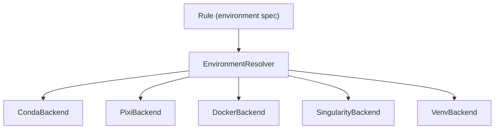

# Environment System

The environment system manages software environment resolution, activation, and deactivation for each rule in a workflow.

---

## Overview

Each rule can declare an environment specification. Before a rule's shell command runs, oxo-flow:

1. Resolves the environment spec to a concrete backend
2. Ensures the environment is ready (created, pulled, etc.)
3. Activates the environment
4. Runs the shell command
5. Deactivates the environment

---

## Architecture



### EnvironmentResolver

The central coordinator that:

- Detects available backends on the system
- Validates environment specifications
- Dispatches to the appropriate backend

```rust
let resolver = EnvironmentResolver::new();
let available = resolver.available_backends(); // ["conda", "docker", "venv"]
resolver.validate_spec(&rule.environment)?;
```

---

## Backend Implementations

### Conda

- **Detection**: Checks for `conda` on `$PATH`
- **Resolution**: Parses YAML environment file
- **Activation**: Runs `conda activate <env_name>` before the command
- **Caching**: Environments are created once and reused across rules that share the same YAML file

### Pixi

- **Detection**: Checks for `pixi` on `$PATH`
- **Resolution**: Parses `pixi.toml` project file
- **Activation**: Uses `pixi run` to execute within the environment
- **Lockfile**: Pixi's native lockfile ensures reproducible resolution

### Docker

- **Detection**: Checks for `docker` on `$PATH` and daemon availability
- **Resolution**: Parses image reference (registry/image:tag)
- **Execution**: Wraps shell command in `docker run --rm -v $(pwd):$(pwd) -w $(pwd) <image> <cmd>`
- **Pull policy**: Images are pulled on first use if not locally available

### Singularity / Apptainer

- **Detection**: Checks for `singularity` or `apptainer` on `$PATH`
- **Resolution**: Parses image reference (can be `docker://`, `.sif` file, or library URI)
- **Execution**: Wraps shell command in `singularity exec <image> <cmd>`
- **Binding**: Working directory is automatically bound into the container

### Python venv

- **Detection**: Checks for `python3` and `pip` on `$PATH`
- **Resolution**: Parses `requirements.txt` file
- **Activation**: Creates a venv (if needed) and activates it before the command
- **Caching**: Venvs are stored in a cache directory keyed by the requirements hash

---

## Environment Specification

The `EnvironmentSpec` struct supports one backend per rule:

```rust
pub struct EnvironmentSpec {
    pub conda: Option<String>,
    pub pixi: Option<String>,
    pub docker: Option<String>,
    pub singularity: Option<String>,
    pub venv: Option<String>,
}
```

In TOML:

```toml
# Only one backend per rule
environment = { conda = "envs/tools.yaml" }
environment = { docker = "biocontainers/bwa:0.7.17" }
environment = { venv = "envs/requirements.txt" }
```

If multiple backends are specified, the first one found is used in this priority order: docker, singularity, conda, pixi, venv.

---

## Default Environments

Set a default in `[defaults]`:

```toml
[defaults]
environment = { conda = "envs/base.yaml" }
```

Rules without an explicit `environment` field inherit the default. Rules with an explicit `environment` override the default completely.

---

## Validation

```bash
# Check that all backends are available
oxo-flow env list

# Validate all environments in a workflow
oxo-flow env check pipeline.oxoflow
```

The `env check` command verifies:

1. The backend type is available on the system
2. The specification file exists (for conda YAML, pixi TOML, requirements.txt)
3. The image reference is syntactically valid (for Docker/Singularity)

---

## See Also

- [Environment Management tutorial](../tutorials/environment-management.md) — getting started
- [Use Environments how-to](../how-to/use-environments.md) — practical recipes
- [`env` command](../commands/env.md) — CLI reference
