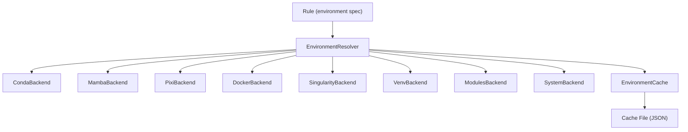

# Environment System

The environment system manages software environment resolution, activation, and deactivation for each rule in a workflow.

---

## Overview

Each rule can declare an environment specification. Before a rule's shell command runs, oxo-flow:

1. Resolves the environment spec to a concrete backend
2. Ensures the environment is ready (created, pulled, etc.)
3. Activates the environment
4. Runs the shell command
5. Deactivates the environment

---

## Architecture


```mermaid
graph TD
    Rule["Rule (environment spec)"] --> Resolver["EnvironmentResolver"]
    Resolver --> Conda["CondaBackend"]
    Resolver --> Mamba["MambaBackend"]
    Resolver --> Pixi["PixiBackend"]
    Resolver --> Docker["DockerBackend"]
    Resolver --> Singularity["SingularityBackend"]
    Resolver --> Venv["VenvBackend"]
    Resolver --> Modules["ModulesBackend"]
    Resolver --> System["SystemBackend"]
    Resolver --> Cache["EnvironmentCache"]
    Cache --> File["Cache File (JSON)"]
```

### EnvironmentResolver

The central coordinator that:

- Detects available backends on the system
- Validates environment specifications
- Dispatches to the appropriate backend
- Tracks environment setup state via EnvironmentCache

```rust
let resolver = EnvironmentResolver::new();
let available = resolver.available_backends(); // e.g. ["system", "mamba", "conda", "pixi", "docker", "singularity", "venv", "modules"] — installed backends only
resolver.validate_spec(&rule.environment)?;
```

### EnvironmentCache

Tracks which environments have been successfully set up:

- **In-memory cache**: Tracks ready environments during execution
- **Persistent cache**: Optionally saves state to a JSON file for reuse across runs

```rust
// Create resolver with persistent cache
let resolver = EnvironmentResolver::with_cache_dir(Path::new(".oxo-flow/cache"));
```

When using `--cache-dir`, oxo-flow saves environment setup state after each run. Subsequent runs skip setup for already-ready environments, reducing startup time.

---

## Environment Setup Process

Before executing a rule with an environment specification:

1. **Check cache**: If the environment is already marked as ready, skip setup
2. **Run setup command**: Execute the backend's setup command (e.g., `conda env create -f env.yaml`)
3. **Mark ready**: Cache the environment as successfully set up

### Setup Commands by Backend

| Backend | Setup Command |
|---|---|
| Conda | `conda env create -f <yaml_file>` |
| Mamba | `mamba env create -f <yaml_file>` (auto-detects mamba, micromamba, or conda) |
| Pixi | `pixi install` (if pixi.toml exists) |
| Docker | `docker pull <image>` |
| Singularity | `singularity pull <image>` |
| Venv | `python3 -m venv <path> && source <path>/bin/activate && pip install -r <requirements>` |
| Modules | None (no setup — modules are loaded at execution time) |
| System | None (no setup needed — commands run directly in the current shell) |

### Skipping Setup

Use `--skip-env-setup` when environments are pre-built:

```bash
# Environments already exist on the system
oxo-flow run pipeline.oxoflow --skip-env-setup
```

With the flag set, the engine does not create anything — a rule whose env
is missing fails inside conda. For file-backed conda specs it therefore
checks `conda env list` up front and names the expected `<name>-<hash8>`
env before running: if an env under the plain `<name>` exists, it was
likely built from the same spec before the content-hash suffix — symlink
or rename it, build the suffixed env, or drop `--skip-env-setup`.

---

## Backend Implementations

### Conda

- **Detection**: Checks for `conda` on `$PATH`
- **Resolution**: Parses YAML environment file
- **Naming**: A file-backed spec resolves to the env name `<name>-<hash8>`, where `<name>` is the YAML's `name:` field (falling back to the file stem) and `<hash8>` is the first 4 bytes of the spec's SHA-256 as 8 hex chars — two workflows shipping different YAMLs under the same name then build into distinct envs instead of silently sharing one (issue #159). Same content → same name, so identical specs deduplicate. Pre-create envs with exactly that name (`conda env create -n <name>-<hash8> -f envs/spec.yaml`); the engine prints the expected name when it detects the env is missing under `--skip-env-setup`
- **Activation**: Runs `conda run --no-capture-output -n <env_name> bash -c 'export PATH="$CONDA_PREFIX/bin:$PATH"; <command>'` — `--no-capture-output` (conda ≥ 4.13) keeps stdout/stderr live, and the `PATH` prefix makes the rule see the env's own tools first
- **Caching**: Environments are created once and reused across rules that share the same YAML file

### Mamba

- **Detection**: Checks for `mamba`, then `micromamba`, then falls back to `conda` on `$PATH`
- **Resolution**: Parses YAML environment file (same format as conda)
- **Activation**: Runs `<mamba|micromamba|conda> run -n <env_name> bash -c '<command>'` (mamba has no `--no-capture-output` flag, so it is not added)
- **Caching**: Environments are created once and reused across rules that share the same YAML file
- **Usage**: Set `environment.mamba = "envs/qc.yaml"` in the rule. Uses the same YAML format as conda but with the mamba/micromamba binary for faster solving.

### Pixi

- **Detection**: Checks for `pixi` on `$PATH`
- **Resolution**: Parses the `pixi.toml` manifest the rule names
- **Activation**: Runs `pixi run --manifest-path <pixi.toml> <command>` — the spec is a **manifest path**, not an environment name (`-e` would only search the current directory for a discoverable manifest)
- **Lockfile**: Pixi's native lockfile ensures reproducible resolution

### Docker

- **Detection**: Checks for `docker` on `$PATH` (the daemon itself is only
  contacted when a rule runs)
- **Resolution**: Parses image reference (registry/image:tag)
- **Execution**: Wraps the command in `docker run --rm --user $(id -u):$(id -g) -v <workdir>:<workdir> -w <workdir> <image> sh -c '<bash shim>' sh '<command>'`; absolute host paths referenced by the rule but living outside the workdir are added as extra **read-only** binds (`-v /data/ref:/data/ref:ro`)
- **Pull policy**: Images are pulled on first use if not locally available

### Singularity / Apptainer

- **Detection**: Prefers `apptainer` over `singularity`, whichever is found first on `$PATH`
- **Resolution**: Parses image reference (can be `docker://`, `.sif` file, or library URI)
- **Execution**: Wraps the command in `<apptainer|singularity> exec --bind <workdir>:<workdir> <image> sh -c '<bash shim>' sh '<command>'`
- **Binding**: The working directory is bound into the container with an **absolute** path (`--bind` rejects relative sources), plus read-only binds for host paths the rule references

!!! note "The container `<bash shim>`"
    Both container backends hand the rule's command to the image's shell as
    `sh -c 'if command -v bash >/dev/null 2>&1; then exec bash -c "$1"; else
    exec sh -c "$1"; fi' sh '<command>'`. The image's entrypoint shell runs
    first, and it is often a minimal `sh` that cannot execute multi-line or
    `pipefail`-using scripts — the shim re-execs bash whenever the image
    ships it, and falls back to `sh` when it does not.

### Python venv

- **Detection**: Checks for `python3` on `$PATH`
- **Resolution**: Parses `requirements.txt` file
- **Activation**: Creates a venv (if needed) and activates it before the command
- **Caching**: Venvs are stored in a cache directory keyed by the requirements hash

### HPC Modules

- **Detection**: Checks for `modulecmd` or `module` on `$PATH`
- **Resolution**: Parses the module list (comma-separated) from `environment.modules`
- **Activation**: Initializes the module system (sources `/etc/profile.d/modules.sh` or common Lmod/Modules init scripts), then runs `module load <modules>` before the command. Fails with a clear error if the `module` command is unavailable.
- **Usage**: Set `environment.modules = ["gcc/11.2", "cuda/11.7"]` in the rule. Modules are used when `environment.modules` is set and no other backend is declared (priority: mamba, conda, pixi, docker, singularity, venv, modules).

### System

- **Detection**: Always available
- **Resolution**: No environment spec required
- **Activation**: No-op — the command runs directly in the current shell environment
- **Usage**: This is the default backend for rules without an `environment` field

---

## Resolver Order

A rule resolves at most **one** backend, checked in this order:

`mamba` → `conda` → `pixi` → `docker` → `singularity` → `venv` → `modules`.

Declaring `modules` alongside any other backend is a hard error rather than a
silent drop — a container has no module system, so the `module load`s could
only ever be lost.

---

## Environment Specification

The `EnvironmentSpec` struct supports one backend per rule:

```rust
pub struct EnvironmentSpec {
    pub conda: Option<String>,
    pub mamba: Option<String>,
    pub pixi: Option<String>,
    pub docker: Option<String>,
    pub singularity: Option<String>,
    pub venv: Option<String>,
    pub modules: Vec<String>,
    pub conda_prefix: Option<String>,
    pub mamba_prefix: Option<String>,
    pub venv_requirements: Option<String>,
}
```

In TOML:

```toml
# Only one backend per rule — uncomment the one you need:
environment = { conda = "envs/tools.yaml" }
# environment = { docker = "biocontainers/bwa:0.7.17" }
# environment = { venv = "envs/requirements.txt" }
# environment = { modules = ["gcc/11.2", "cuda/11.7"] }
```

If multiple backends are specified, the first one found is used in this priority order: mamba, conda, pixi, docker, singularity, venv, modules. The `system` backend is used when a rule declares no environment spec.

---

## Default Environments

Set a default in `[defaults]`:

```toml
[defaults]
environment = { conda = "envs/base.yaml" }
```

Rules without an explicit `environment` field inherit the default. Rules with an explicit `environment` override the default completely.

---

## Validation

```bash
# Check that all backends are available
oxo-flow env list

# Validate all environments in a workflow
oxo-flow env check pipeline.oxoflow
```

The `env check` command verifies:

1. The backend type is available on the system
2. The specification file exists (for conda YAML, pixi TOML, requirements.txt)
3. The image reference is syntactically valid (for Docker/Singularity)

---

## See Also

- [Environment Management tutorial](../tutorials/environment-management.md) — getting started
- [Use Environments how-to](../how-to/use-environments.md) — practical recipes
- [`env` command](../commands/env.md) — CLI reference
- [`run` command](../commands/run.md) — `--skip-env-setup` and `--cache-dir` options

---

## See Also

- [China Network Mirrors](china-mirrors.md) — measured reachability of the
  conda/bioconda, PyPI, Rust, and Docker mirrors users on mainland-China
  networks configure for environment provisioning (includes a re-runnable
  probe script).
