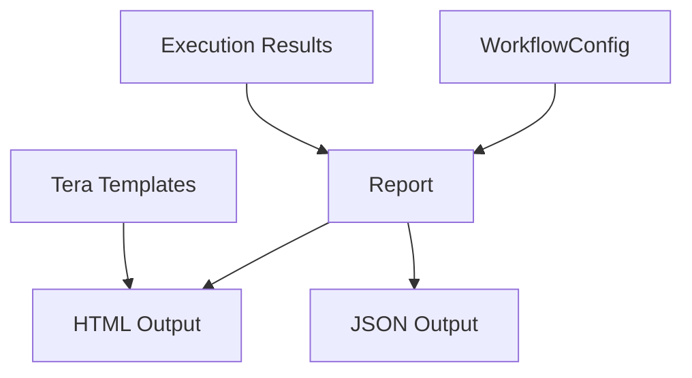

# Reporting System

oxo-flow includes a modular report generation system designed for both research and clinical use. Reports are structured documents built from composable sections.

---

## Architecture



---

## Core Types

### Report

The top-level report container:

```rust
pub struct Report {
    pub title: String,
    pub generated_at: DateTime<Utc>,
    pub workflow_name: String,
    pub workflow_version: String,
    pub sections: Vec<ReportSection>,
    pub metadata: HashMap<String, String>,
}
```

### ReportSection

A section within a report:

```rust
pub struct ReportSection {
    pub title: String,
    pub id: String,
    pub content: ReportContent,
    pub subsections: Vec<ReportSection>,
}
```

### ReportContent

The content of a section, supporting multiple formats:

```rust
pub enum ReportContent {
    Text { text: String },
    Markdown { markdown: String },
    Html { html: String },
    Table {
        headers: Vec<String>,
        rows: Vec<Vec<String>>,
    },
    KeyValue { pairs: Vec<(String, String)> },
    Json { data: serde_json::Value },
    Chart {
        title: String,
        labels: Vec<String>,
        values: Vec<f64>,
        unit: String,
    },
}
```

---

## Output Formats

### HTML

Self-contained single-file HTML with embedded CSS:

```rust
let html: String = report.to_html();
```

The HTML output includes:

- Responsive layout
- Table of contents generated from section headings
- Styled tables and key-value displays
- Print-friendly CSS

### JSON

Machine-readable structured output:

```rust
let json: String = report.to_json()?;
```

The JSON output mirrors the report structure and is suitable for:

- Downstream processing scripts
- Database ingestion
- API responses

---

## Generating Reports

### From the CLI

```bash
# HTML to stdout
oxo-flow report pipeline.oxoflow

# HTML to file
oxo-flow report pipeline.oxoflow -o report.html

# JSON to file
oxo-flow report pipeline.oxoflow -f json -o report.json
```

### Programmatically

```rust
use oxo_flow_core::report::{Report, ReportSection, ReportContent};

let mut report = Report::new("Pipeline Report", "my-pipeline", "1.0.0");

report.add_section(ReportSection {
    title: "Quality Metrics".to_string(),
    id: "quality".to_string(),
    content: ReportContent::Table {
        headers: vec!["Sample".into(), "Reads".into(), "Quality".into()],
        rows: vec![
            vec!["sample1".into(), "50M".into(), "Q35".into()],
            vec!["sample2".into(), "48M".into(), "Q36".into()],
        ],
    },
    subsections: vec![],
});

let html = report.to_html();
```

---

## Report Configuration

Configure reports in the `.oxoflow` file:

```toml
[report]
template = "clinical"
format = ["html", "json"]
sections = ["summary", "variants", "quality"]
```

### Templates

The `template` field selects a report template. Built-in templates:

| Template | Use case |
|---|---|
| `default` | General-purpose research report |
| `clinical` | Clinical-grade report with structured sections |

Templates are rendered with [Tera](https://tera.netlify.app/), a Jinja2-like template engine for Rust.

---

## Clinical Reports

The Venus pipeline uses the reporting system to generate clinical tumor variant calling reports. These include:

- Patient/sample metadata
- Variant summary tables
- Quality control metrics
- Methodology description
- Structured for regulatory compliance

See the [Venus Pipeline](./venus-pipeline.md) reference for details.

---

## See Also

- [Generate Reports how-to](../how-to/generate-reports.md) — practical guide
- [`report` command](../commands/report.md) — CLI reference
- [Venus Pipeline](./venus-pipeline.md) — clinical reporting example
