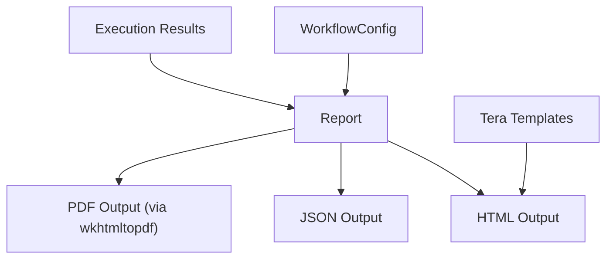

# Reporting System

oxo-flow includes a modular report generation system for research use.
Reports are structured documents built from composable sections; the
report itself is an audit-trail anchor (engine version, workflow file
sha256, checkpoint location) but generates no clinical data — the
clinical-compliance section is a static capability statement only.

---

## Architecture


```mermaid
graph TD
    Config["WorkflowConfig"] --> Report["Report"]
    Execution["Execution Results"] --> Report
    Report --> HTML["HTML Output"]
    Report --> JSON["JSON Output"]
    Report --> PDF["PDF Output (via wkhtmltopdf)"]
    Templates["Tera Templates"] --> HTML
```

---

## Core Types

### Report

The top-level report container:

```rust
pub struct Report {
    pub title: String,
    pub generated_at: DateTime<Utc>,
    pub workflow_name: String,
    pub workflow_version: String,
    pub sections: Vec<ReportSection>,
    pub metadata: HashMap<String, String>,
}
```

### ReportSection

A section within a report:

```rust
pub struct ReportSection {
    pub title: String,
    pub id: String,
    pub content: ReportContent,
    pub subsections: Vec<ReportSection>,
}
```

### ReportContent

The content of a section, supporting multiple formats:

```rust
pub enum ReportContent {
    Text { text: String },
    Markdown { markdown: String },
    Html { html: String },
    Table {
        headers: Vec<String>,
        rows: Vec<Vec<String>>,
    },
    KeyValue { pairs: Vec<(String, String)> },
    Json { data: serde_json::Value },
    Chart {
        title: String,
        labels: Vec<String>,
        values: Vec<f64>,
        unit: String,
    },
    QcStatus {
        metric: String,
        value: String,
        status: String,
        threshold: String,
    },
    QcIndicatorGroup { items: Vec<QcIndicator> },
    Hierarchy {
        name: String,
        value: f64,
        children: Vec<HierarchyNode>,
    },
    ScatterPlot {
        title: String,
        x_label: String,
        y_label: String,
        points: Vec<ScatterPoint>,
    },
}
```

---

## Output Formats

### HTML

Self-contained single-file HTML with embedded CSS:

```rust
let html: String = report.to_html();
```

The HTML output includes:

- Responsive layout
- Table of contents generated from section headings
- Styled tables and key-value displays
- Print-friendly CSS
- Accessible landmarks (skip link, `<main>`, `th scope`), WCAG-AA status colors, and HTML-escaped user content (XSS-safe)

### JSON

Machine-readable structured output:

```rust
let json: String = report.to_json()?;
```

The JSON output mirrors the report structure and is suitable for:

- Downstream processing scripts
- Database ingestion
- API responses

### PDF

PDF export is supported via `wkhtmltopdf`:

```rust
let cmd: String = report.to_pdf_command("report.pdf", vec!["--enable-local-file-access"]);
report.to_pdf(Path::new("report.pdf")).await?;
```

The implementation writes the print-optimized HTML to a temporary file and
invokes `wkhtmltopdf --encoding utf-8` on it. **Prerequisite**: `wkhtmltopdf`
must be installed separately on the system.

From the CLI:

```bash
oxo-flow report pipeline.oxoflow -f pdf -o report.pdf
```

---

## Generating Reports

### From the CLI

```bash
# HTML to stdout
oxo-flow report pipeline.oxoflow

# HTML to file
oxo-flow report pipeline.oxoflow -o report.html

# JSON to file
oxo-flow report pipeline.oxoflow -f json -o report.json
```

### Programmatically

```rust
use oxo_flow_core::report::{Report, ReportSection, ReportContent};

let mut report = Report::new("Pipeline Report", "my-pipeline", "1.0.0");

report.add_section(ReportSection {
    title: "Quality Metrics".to_string(),
    id: "quality".to_string(),
    content: ReportContent::Table {
        headers: vec!["Sample".into(), "Reads".into(), "Quality".into()],
        rows: vec![
            vec!["sample1".into(), "50M".into(), "Q35".into()],
            vec!["sample2".into(), "48M".into(), "Q36".into()],
        ],
    },
    subsections: vec![],
});

let html = report.to_html();
```

---

## Report Configuration

Configure reports in the `.oxoflow` file:

```toml
[report]
sections = ["universal", "workflow-info", "commands", "failure-diagnosis"]
```

`[report].sections` filters which sections are included, by generator
name. Available names: `universal`, `execution-status`,
`failure-diagnosis`, `clinical-compliance`, `workflow-info`, `commands`,
`file-manifest`, `environment`, `provenance`, `task-summary` — enumerable
at runtime with `oxo-flow report WF --list-sections`.

### Templates

The core library provides a [Tera](https://tera.netlify.app/)-based template engine pre-loaded with one built-in template, `report.html`; custom templates can be registered via `add_template`. The CLI `report` command renders via `Report::to_html()` / `to_json()` / `to_markdown()` / `to_pdf()` and does not apply `[report].template` yet — `[report].template` and `[report].format` are parsed but setting them makes the command warn (or fail under `--strict`).

## See Also

- [Generate Reports how-to](../how-to/generate-reports.md) — practical guide
- [`report` command](../commands/report.md) — CLI reference
