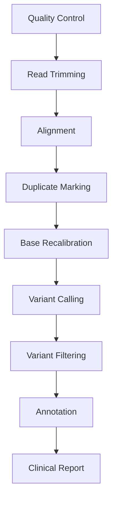

# Venus Pipeline

Venus is a clinical tumor variant calling pipeline built on oxo-flow. It is included as a workspace crate (`crates/venus/`) and ships with pre-defined workflow files, environment specs, and report templates.

---

## Overview

Venus implements a complete somatic variant detection workflow for tumor samples. It is designed for clinical genomics laboratories that need:

- Validated, reproducible analysis
- Structured clinical reports
- Audit trails for regulatory compliance
- Container-packaged execution

---

## Pipeline Steps



| Step | Tools | Description |
|---|---|---|
| Quality Control | FastQC | Raw read quality assessment |
| Read Trimming | fastp | Adapter removal and quality filtering |
| Alignment | BWA-MEM2 | Read alignment to reference genome |
| Duplicate Marking | GATK MarkDuplicates | PCR duplicate identification |
| Base Recalibration | GATK BQSR | Base quality score recalibration |
| Variant Calling | GATK Mutect2 | Somatic variant detection |
| Variant Filtering | bcftools | Quality-based variant filtering |
| Annotation | VEP / SnpEff | Functional variant annotation |
| Clinical Report | oxo-flow report | Structured report generation |

---

## Software Bill of Materials (BOM)

To ensure **Clinical-grade rigor** and exact reproducibility, Venus locks all dependencies. Below is the reference Bill of Materials used by the `envs/*.yaml` specifications:

| Component | Version | Package Manager | Environment Spec |
|-----------|---------|-----------------|-------------------|
| fastp     | 0.23.4  | bioconda        | `envs/fastp.yaml` |
| bwa-mem2  | 2.2.1   | bioconda        | `envs/bwa_mem2.yaml` |
| samtools  | 1.17    | bioconda        | `envs/bwa_mem2.yaml` |
| gatk4     | 4.4.0.0 | bioconda        | `envs/gatk.yaml`  |
| strelka   | 2.9.10  | bioconda        | `envs/strelka2.yaml` |
| cnvkit    | 0.9.10  | bioconda        | `envs/cnvkit.yaml` |
| msisensor2| 0.1     | bioconda        | `envs/msi.yaml`   |
| ensembl-vep| 110.1  | bioconda        | `envs/vep.yaml`   |
| python    | 3.10.12 | conda-forge     | `envs/report.yaml`|

*Note: For production clinical deployment, it is strongly recommended to use the generated Docker or Singularity container images which encapsulate these exact versions alongside the base OS libraries.*

---

## Project Structure

```
pipelines/venus/
├── rules/           # Individual step definitions
├── envs/            # Conda/container environment specs
├── schemas/         # Validation schemas for config
└── report/          # Report templates
```

The pipeline definitions live in `pipelines/venus/` while the Rust crate at `crates/venus/` provides programmatic access.

---

## Running Venus

### With the CLI

```bash
# Validate the pipeline
oxo-flow validate pipelines/venus/venus.oxoflow

# Dry-run
oxo-flow dry-run pipelines/venus/venus.oxoflow

# Execute
oxo-flow run pipelines/venus/venus.oxoflow -j 16
```

### Configuration

Venus expects a configuration file with sample and reference information:

```toml
[config]
reference = "/data/references/hg38/hg38.fa"
known_sites = "/data/references/hg38/known_sites.vcf.gz"
tumor_sample = "TUMOR_001"
normal_sample = "NORMAL_001"
results = "results/venus"
```

---

## Clinical Reporting

Venus generates clinical-grade reports using oxo-flow's reporting system:

```bash
oxo-flow report pipelines/venus/venus.oxoflow -f html -o patient_report.html
```

Reports include:

- **Patient/sample metadata** — sample IDs, sequencing date, reference genome
- **Quality metrics** — read counts, coverage depth, duplication rates
- **Variant summary** — total variants, filtered variants, variant types
- **Variant table** — gene, position, consequence, allele frequency
- **Methodology** — tools used, versions, parameters

---

## Container Packaging

Package Venus into a self-contained container:

```bash
# Docker
oxo-flow package pipelines/venus/venus.oxoflow -o Dockerfile
docker build -t venus:1.0.0 .

# Singularity
oxo-flow package pipelines/venus/venus.oxoflow -f singularity -o venus.def
singularity build venus.sif venus.def
```

---

## Customization

Venus is designed to be customized for specific laboratory needs:

### Add a new analysis step

1. Create a new rule in `pipelines/venus/rules/`
2. Add the environment spec to `pipelines/venus/envs/`
3. Include the rule in the main `.oxoflow` file
4. Add report sections for the new step

### Modify variant filters

Edit the filtering rule parameters in the workflow file to adjust quality thresholds, minimum depth, or allele frequency cutoffs.

### Custom report templates

Add Tera templates to `pipelines/venus/report/` for custom report sections or layouts.

---

## See Also

- [Variant Calling tutorial](../tutorials/variant-calling.md) — build a similar pipeline step by step
- [Reporting System](./reporting-system.md) — report architecture
- [System Architecture](./architecture.md) — how Venus fits into the workspace
