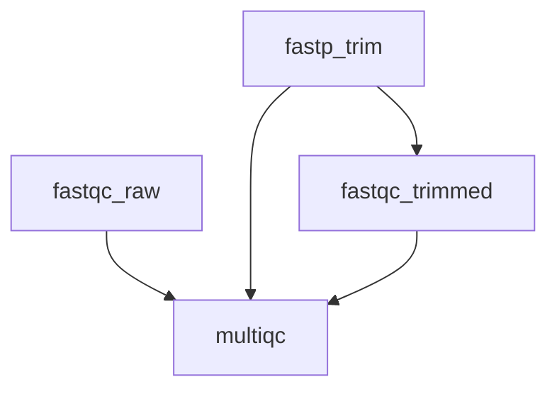

# Your First Workflow

This tutorial walks you through building a realistic bioinformatics workflow from scratch. You will create a quality-control pipeline that processes FASTQ files through FastQC and fastp, then generates a summary report.

---

## Prerequisites

- [oxo-flow installed](./installation.md)
- Paired-end FASTQ files (or the willingness to create test files)
- conda or docker available for environment management

---

## 1. Set up the project

```bash
oxo-flow init qc-pipeline
cd qc-pipeline
```

---

## 2. Create environment files

Create a conda environment file for the QC tools:

```yaml
# envs/qc.yaml
name: qc
channels:
  - bioconda
  - conda-forge
dependencies:
  - fastqc=0.12.1
  - fastp=0.23.4
  - multiqc=1.21
```

---

## 3. Write the workflow

Replace `qc-pipeline.oxoflow` with:

```toml
[workflow]
name = "qc-pipeline"
version = "1.0.0"
description = "Quality control for paired-end sequencing data"
author = "Your Name"

[config]
samples_dir = "raw_data"
results_dir = "results"

[defaults]
threads = 4
memory = "8G"

[[rules]]
name = "fastqc_raw"
input = [
    "{config.samples_dir}/{sample}_R1.fastq.gz",
    "{config.samples_dir}/{sample}_R2.fastq.gz"
]
output = [
    "{config.results_dir}/fastqc/{sample}_R1_fastqc.html",
    "{config.results_dir}/fastqc/{sample}_R1_fastqc.zip",
    "{config.results_dir}/fastqc/{sample}_R2_fastqc.html",
    "{config.results_dir}/fastqc/{sample}_R2_fastqc.zip"
]
environment = { conda = "envs/qc.yaml" }
shell = """
mkdir -p {config.results_dir}/fastqc
fastqc {input} -o {config.results_dir}/fastqc -t {threads}
"""

[[rules]]
name = "fastp_trim"
input = [
    "{config.samples_dir}/{sample}_R1.fastq.gz",
    "{config.samples_dir}/{sample}_R2.fastq.gz"
]
output = [
    "{config.results_dir}/trimmed/{sample}_R1.fastq.gz",
    "{config.results_dir}/trimmed/{sample}_R2.fastq.gz",
    "{config.results_dir}/trimmed/{sample}_fastp.html",
    "{config.results_dir}/trimmed/{sample}_fastp.json"
]
environment = { conda = "envs/qc.yaml" }
shell = """
mkdir -p {config.results_dir}/trimmed
fastp \
  --in1 {config.samples_dir}/{sample}_R1.fastq.gz \
  --in2 {config.samples_dir}/{sample}_R2.fastq.gz \
  --out1 {config.results_dir}/trimmed/{sample}_R1.fastq.gz \
  --out2 {config.results_dir}/trimmed/{sample}_R2.fastq.gz \
  --html {config.results_dir}/trimmed/{sample}_fastp.html \
  --json {config.results_dir}/trimmed/{sample}_fastp.json \
  --thread {threads}
"""

[[rules]]
name = "fastqc_trimmed"
input = [
    "{config.results_dir}/trimmed/{sample}_R1.fastq.gz",
    "{config.results_dir}/trimmed/{sample}_R2.fastq.gz"
]
output = [
    "{config.results_dir}/fastqc_trimmed/{sample}_R1_fastqc.html",
    "{config.results_dir}/fastqc_trimmed/{sample}_R1_fastqc.zip"
]
environment = { conda = "envs/qc.yaml" }
shell = """
mkdir -p {config.results_dir}/fastqc_trimmed
fastqc {input} -o {config.results_dir}/fastqc_trimmed -t {threads}
"""

[[rules]]
name = "multiqc"
input = [
    "{config.results_dir}/fastqc/",
    "{config.results_dir}/fastqc_trimmed/",
    "{config.results_dir}/trimmed/"
]
output = [
    "{config.results_dir}/multiqc/multiqc_report.html"
]
threads = 1
environment = { conda = "envs/qc.yaml" }
shell = """
mkdir -p {config.results_dir}/multiqc
multiqc {config.results_dir} -o {config.results_dir}/multiqc --force
"""
```

---

## 4. Understand the dependency graph

The workflow forms this DAG:



- `fastqc_raw` and `fastp_trim` can run in parallel (no dependency between them)
- `fastqc_trimmed` depends on `fastp_trim`'s output
- `multiqc` depends on all three upstream rules

---

## 5. Validate and preview

```bash
oxo-flow validate qc-pipeline.oxoflow
# ✓ qc-pipeline.oxoflow — 4 rules, 4 dependencies

oxo-flow dry-run qc-pipeline.oxoflow
```

---

## 6. Visualize the DAG

```bash
oxo-flow graph qc-pipeline.oxoflow
```

---

## 7. Run with parallel execution

```bash
oxo-flow run qc-pipeline.oxoflow -j 4
```

The `-j 4` flag allows up to 4 jobs to run concurrently. oxo-flow will execute `fastqc_raw` and `fastp_trim` in parallel, then `fastqc_trimmed`, then `multiqc`.

---

## Key Concepts Covered

| Concept | Where you saw it |
|---|---|
| **Workflow metadata** | `[workflow]` section with name, version, description |
| **Configuration variables** | `[config]` section referenced as `{config.samples_dir}` |
| **Defaults** | `[defaults]` section applied to all rules |
| **Per-rule overrides** | `multiqc` rule overrides `threads = 1` |
| **Environment specs** | `environment = { conda = "envs/qc.yaml" }` |
| **Wildcard patterns** | `{sample}` in file paths |
| **Multi-line shell** | Triple-quoted strings with `"""` |
| **Automatic dependencies** | Input/output matching across rules |

---

## Next Steps

- [Variant Calling Pipeline](./variant-calling.md) — build a complete NGS analysis workflow
- [Environment Management](./environment-management.md) — use docker, singularity, and more
- [Create a Workflow](../how-to/create-workflow.md) — reference guide for `.oxoflow` authoring
