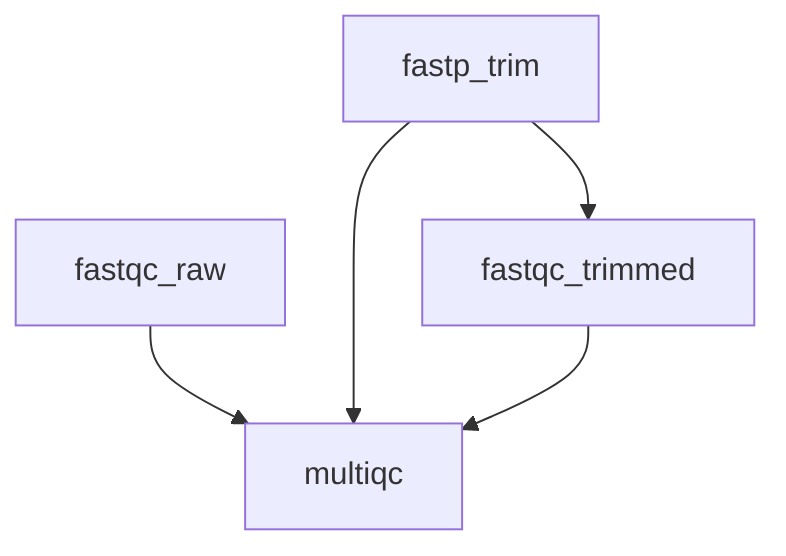

# Your First Workflow

This tutorial walks you through building a realistic bioinformatics workflow from scratch. You will create a quality-control pipeline that processes FASTQ files through FastQC and fastp, then generates a summary report.

---

## Prerequisites

- [oxo-flow installed](./installation.md)
- Paired-end FASTQ files (or the willingness to create test files)
- **conda** or **mamba** available for environment management. 
    - *If you don't have either, we recommend [Miniforge](https://github.com/conda-forge/miniforge#miniforge3) or [Mambaforge](https://github.com/conda-forge/miniforge#mambaforge).*

---

## 1. Set up the project

```bash
oxo-flow init qc-pipeline
cd qc-pipeline
```

---

## 2. Create environment files

Create a conda environment file for the QC tools:

```yaml
# envs/qc.yaml
name: qc
channels:
  - bioconda
  - conda-forge
dependencies:
  - fastqc=0.12.1
  - fastp=0.23.4
  - multiqc=1.21
```

---

## 3. Write the workflow

Replace `qc-pipeline.oxoflow` with:

!!! tip "Configuration Syntax"
    `{config.samples_dir}` refers to the `samples_dir` variable defined in the `[config]` section. This allows you to centralize paths and settings.

!!! info "Wildcard Patterns"
    The `{sample}` in the file paths below is a **wildcard**. oxo-flow will scan your `raw_data` directory for files matching the pattern `{sample}_R1.fastq.gz`, extract the sample name, and automatically generate a task for every sample it finds.

```toml
[workflow]
name = "qc-pipeline"
version = "1.0.0"
description = "Quality control for paired-end sequencing data"
author = "Your Name"

[config]
samples_dir = "raw_data"
results_dir = "results"

[defaults]
threads = 4
memory = "8G"

[[rules]]
name = "fastqc_raw"
input = [
    "{config.samples_dir}/{sample}_R1.fastq.gz",
    "{config.samples_dir}/{sample}_R2.fastq.gz"
]
output = [
    "{config.results_dir}/fastqc/{sample}_R1_fastqc.html",
    "{config.results_dir}/fastqc/{sample}_R1_fastqc.zip",
    "{config.results_dir}/fastqc/{sample}_R2_fastqc.html",
    "{config.results_dir}/fastqc/{sample}_R2_fastqc.zip"
]
environment = { conda = "envs/qc.yaml" }
shell = """
mkdir -p {config.results_dir}/fastqc
fastqc {input} -o {config.results_dir}/fastqc -t {threads}
"""

[[rules]]
name = "fastp_trim"
input = [
    "{config.samples_dir}/{sample}_R1.fastq.gz",
    "{config.samples_dir}/{sample}_R2.fastq.gz"
]
output = [
    "{config.results_dir}/trimmed/{sample}_R1.fastq.gz",
    "{config.results_dir}/trimmed/{sample}_R2.fastq.gz",
    "{config.results_dir}/trimmed/{sample}_fastp.html",
    "{config.results_dir}/trimmed/{sample}_fastp.json"
]
environment = { conda = "envs/qc.yaml" }
shell = """
mkdir -p {config.results_dir}/trimmed
fastp \
  --in1 {config.samples_dir}/{sample}_R1.fastq.gz \
  --in2 {config.samples_dir}/{sample}_R2.fastq.gz \
  --out1 {config.results_dir}/trimmed/{sample}_R1.fastq.gz \
  --out2 {config.results_dir}/trimmed/{sample}_R2.fastq.gz \
  --html {config.results_dir}/trimmed/{sample}_fastp.html \
  --json {config.results_dir}/trimmed/{sample}_fastp.json \
  --thread {threads}
"""

[[rules]]
name = "fastqc_trimmed"
input = [
    "{config.results_dir}/trimmed/{sample}_R1.fastq.gz",
    "{config.results_dir}/trimmed/{sample}_R2.fastq.gz"
]
output = [
    "{config.results_dir}/fastqc_trimmed/{sample}_R1_fastqc.html",
    "{config.results_dir}/fastqc_trimmed/{sample}_R1_fastqc.zip"
]
environment = { conda = "envs/qc.yaml" }
shell = """
mkdir -p {config.results_dir}/fastqc_trimmed
fastqc {input} -o {config.results_dir}/fastqc_trimmed -t {threads}
"""

[[rules]]
name = "multiqc"
input = [
    "{config.results_dir}/fastqc/{sample}_R1_fastqc.html",
    "{config.results_dir}/fastqc_trimmed/{sample}_R1_fastqc.html",
    "{config.results_dir}/trimmed/{sample}_R1.fastq.gz"
]
output = [
    "{config.results_dir}/multiqc/multiqc_report.html"
]
threads = 1  # override [defaults] threads = 4 — aggregation is I/O-light
environment = { conda = "envs/qc.yaml" }
shell = """
mkdir -p {config.results_dir}/multiqc
multiqc {config.results_dir} -o {config.results_dir}/multiqc --force
"""
```

---

## 4. Understand the dependency graph

The workflow forms this DAG:


```mermaid
graph TD
    A[fastqc_raw] --> D[multiqc]
    B[fastp_trim] --> C[fastqc_trimmed]
    B --> D
    C --> D
```

- `fastqc_raw` and `fastp_trim` can run in parallel (no dependency between them)
- `fastqc_trimmed` depends on `fastp_trim`'s output — inferred automatically because its `input` files match `fastp_trim`'s `output` files
- `multiqc` depends on all three upstream rules — inferred automatically because each of its three input files matches the output of a different upstream rule. No explicit declaration was needed.

!!! info "Two dependency mechanisms"
    oxo-flow supports two ways to declare dependencies:

    1. **File-based (automatic)** — if rule B's `input` matches rule A's `output`, the edge is inferred. This tutorial uses only this mechanism: `fastp_trim → fastqc_trimmed` (trimmed reads) and `fastqc_raw / fastp_trim / fastqc_trimmed → multiqc` (QC reports).
    2. **`depends_on` (explicit)** — list rule names that must finish first, even when no direct file match exists. Use this for setup rules with no outputs:

    ```toml
    [[rules]]
    name = "setup_dirs"
    output = []                  # no files to match!
    shell = "mkdir -p results"

    [[rules]]
    name = "align"
    depends_on = ["setup_dirs"]  # ← explicit ordering, no file to match
    shell = "bwa mem ..."
    ```

    Prefer file-based inference when possible — it makes the data flow self-documenting. Use `depends_on` only when the ordering can't be expressed through file matching alone.

---

## 5. Prepare Test Data

For this tutorial, create minimal test files so oxo-flow has something to process:

```bash
mkdir -p raw_data
# Create dummy compressed fastq files
echo "@test1" | gzip > raw_data/sample1_R1.fastq.gz
echo "@test1" | gzip > raw_data/sample1_R2.fastq.gz
echo "@test2" | gzip > raw_data/sample2_R1.fastq.gz
echo "@test2" | gzip > raw_data/sample2_R2.fastq.gz
```

---

## 6. Validate and preview

```bash
oxo-flow validate qc-pipeline.oxoflow
# ✓ qc-pipeline.oxoflow — 4 rules, 5 dependencies

oxo-flow dry-run qc-pipeline.oxoflow
```

```
oxo-flow 0.10.2 — Bioinformatics Pipeline Engine
DAG: (dry-run) 4 rules would execute
  1. fastp_trim
     threads=4
     env=conda
     memory=8G
     outputs: ["results/trimmed/{sample}_R1.fastq.gz", "results/trimmed/{sample}_R2.fastq.gz", ...]

  2. fastqc_raw
     threads=4
     env=conda
     memory=8G
     outputs: ["results/fastqc/{sample}_R1_fastqc.html", ...]

  3. fastqc_trimmed
     threads=4
     env=conda
     memory=8G
     outputs: ["results/fastqc_trimmed/{sample}_R1_fastqc.html", ...]

  4. multiqc
     threads=1
     env=conda
     memory=8G
     outputs: ["results/multiqc/multiqc_report.html"]
     command: mkdir -p results/multiqc
multiqc results -o results/multiqc --force
```

Summary: 4 rules, total 13 threads declared, max 4 threads/rule
         4 rule(s) with memory requirements

To execute:  oxo-flow run qc-pipeline.oxoflow -j 10
```

The dry-run expands `{config.*}` variables but leaves `{sample}` wildcards unexpanded. Unlike concrete input paths (reported as `input ✓`/`input ✗`), wildcard inputs are not checked for existence in dry-run mode.

!!! note "Listing order reflects parallel levels"
    `fastp_trim` and `fastqc_raw` are listed adjacent because they are independent and will run **in parallel** at the same DAG level. Rules within a level are sorted alphabetically; `fastqc_trimmed` waits for `fastp_trim`, and `multiqc` waits for all three.

---

## 7. Visualize the DAG

```bash
oxo-flow graph qc-pipeline.oxoflow
```

---

## 8. Run with parallel execution

```bash
oxo-flow run qc-pipeline.oxoflow -j 4
```

The `-j 4` flag allows up to 4 jobs to run concurrently. oxo-flow will execute `fastqc_raw` and `fastp_trim` in parallel, then `fastqc_trimmed`, then `multiqc`.

---

## Key Concepts Covered

| Concept | Where you saw it |
|---|---|
| **Workflow metadata** | `[workflow]` section with name, version, description |
| **Configuration variables** | `[config]` section referenced as `{config.samples_dir}` |
| **Defaults** | `[defaults]` section applied to all rules |
| **Per-rule overrides** | `multiqc` rule overrides `threads = 1`, superseding `[defaults] threads = 4` |
| **Environment specs** | `environment = { conda = "envs/qc.yaml" }` |
| **Wildcard patterns** | `{sample}` in file paths |
| **Multi-line shell** | Triple-quoted strings with `"""` |
| **Automatic dependencies** | Input/output matching across rules (all edges in this tutorial) |
| **Explicit dependencies** | `depends_on` field — shown in the info box as an alternative for output-less rules |

---

## Next Steps

- [Variant Calling Pipeline](./variant-calling.md) — build a complete NGS analysis workflow
- [Environment Management](./environment-management.md) — use docker, singularity, and more
- [Create a Workflow](../how-to/create-workflow.md) — reference guide for `.oxoflow` authoring
