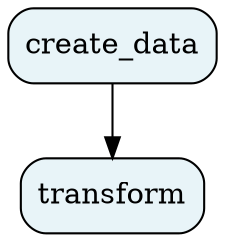

# Quick Start

Get from zero to a running pipeline in under five minutes. This tutorial assumes you have already [installed oxo-flow](./installation.md).

---

## 1. Initialize a project

```bash
oxo-flow init my-pipeline
cd my-pipeline
```

This creates:

```
my-pipeline/
├── my-pipeline.oxoflow    # Workflow definition
├── envs/                  # Environment specs
├── scripts/               # Helper scripts
└── .gitignore             # Bioinformatics-aware ignore file
```

---

## 2. Define a simple workflow

Open `my-pipeline.oxoflow` and replace its contents:

```toml
[workflow]
name = "my-pipeline"
version = "0.1.0"
description = "A simple two-step demo"

[defaults]
threads = 2

[[rules]]
name = "create_data"
input = []
output = ["data/greeting.txt"]
shell = "mkdir -p data && echo 'Hello from oxo-flow!' > data/greeting.txt"

[[rules]]
name = "transform"
input = ["data/greeting.txt"]
output = ["results/uppercase.txt"]
shell = "mkdir -p results && tr '[:lower:]' '[:upper:]' < data/greeting.txt > results/uppercase.txt"
```

This workflow has two rules:

1. **create_data** — writes a text file (no input files required)
2. **transform** — converts the file to uppercase (depends on `create_data`'s output)

oxo-flow infers the dependency automatically because `transform`'s input matches `create_data`'s output.

---

## 3. Validate

```bash
oxo-flow validate my-pipeline.oxoflow
```

```
✓ my-pipeline.oxoflow — 2 rules, 1 dependency
```

---

## 4. Dry-run

Preview the execution plan without running anything:

```bash
oxo-flow dry-run my-pipeline.oxoflow
```

```
oxo-flow 0.5.1 — Bioinformatics Pipeline Engine
Dry-run: 2 rules would execute:
  1. create_data [threads=2, env=none]
     $ mkdir -p data && echo 'Hello from oxo-flow!' > data/greeting.txt
  2. transform [threads=2, env=none]
     $ mkdir -p results && tr '[:lower:]' '[:upper:]' < data/greeting.txt > results/uppercase.txt
```

---

## 5. Execute

```bash
oxo-flow run my-pipeline.oxoflow
```

```
oxo-flow 0.5.1 — Bioinformatics Pipeline Engine
DAG: 2 rules in execution order
  1. create_data
  2. transform
  ✓ create_data
  ✓ transform

Done: 2 succeeded, 0 failed
```

---

## 6. Check the results

Ensure you are in the `my-pipeline` directory:

```bash
cd my-pipeline
cat results/uppercase.txt
# HELLO FROM OXO-FLOW!
```

---

## 7. Visualize the DAG

oxo-flow provides multiple ways to visualize your workflow's structure.

### Terminal View (Default)

The default `graph` command prints a stylized ASCII or tree representation directly to your terminal:

```bash
oxo-flow graph my-pipeline.oxoflow
```

```text
┌─────────────────────────────────────────────────────────────────────┐
│ Workflow: my-pipeline                                               │
│ Rules: 2, Dependencies: 1                                           │
└─────────────────────────────────────────────────────────────────────┘

  create_data ──► transform
```

### Graphviz (DOT) Export

For complex pipelines, you can export to Graphviz DOT format for high-resolution rendering:

```bash
oxo-flow graph my-pipeline.oxoflow --format dot
```



If you have Graphviz installed, render it (macOS: `brew install graphviz`):

```bash
oxo-flow graph my-pipeline.oxoflow -f dot | dot -Tpng -o dag.png
```

---

## What Just Happened?

1. oxo-flow parsed the `.oxoflow` TOML file into a `WorkflowConfig`
2. The DAG engine analyzed input/output dependencies and built a directed acyclic graph
3. Topological sorting determined that `create_data` must run before `transform`
4. The local executor ran each rule's shell command in order
5. Success/failure was reported for each step

---

## Next Steps

- [Your First Workflow](./first-workflow.md) — build a real bioinformatics pipeline with environments
- [Variant Calling Pipeline](./variant-calling.md) — complete NGS analysis tutorial
- [Command Reference](../commands/run.md) — explore all CLI options
