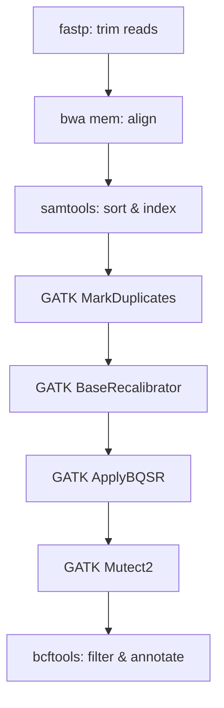

# Variant Calling Pipeline

This tutorial builds a complete somatic variant calling pipeline using oxo-flow — from raw FASTQ files to annotated VCF output. It demonstrates multi-environment workflows, resource scheduling, and real-world bioinformatics patterns.

---

## Overview

The pipeline follows a standard tumor–normal variant calling workflow:



---

## Project setup

```bash
oxo-flow init variant-calling
cd variant-calling
```

---

## Environment files

Create separate environments for different toolsets:

```yaml
# envs/alignment.yaml
name: alignment
channels:
  - bioconda
  - conda-forge
dependencies:
  - bwa=0.7.17
  - samtools=1.19
  - fastp=0.23.4
```

```yaml
# envs/gatk.yaml
name: gatk
channels:
  - bioconda
  - conda-forge
dependencies:
  - gatk4=4.5.0.0
```

```yaml
# envs/bcftools.yaml
name: bcftools
channels:
  - bioconda
  - conda-forge
dependencies:
  - bcftools=1.19
```

---

## Workflow definition

```toml
# variant-calling.oxoflow
[workflow]
name = "variant-calling"
version = "1.0.0"
description = "Somatic variant calling pipeline (tumor-normal)"
author = "Genomics Core"

[config]
reference = "/data/references/hg38/hg38.fa"
known_sites = "/data/references/hg38/known_sites.vcf.gz"
samples = "config/samples.csv"
results = "results"

[defaults]
threads = 4
memory = "8G"

[[rules]]
name = "trim_reads"
input = ["raw/{sample}_R1.fastq.gz", "raw/{sample}_R2.fastq.gz"]
output = [
    "{config.results}/trimmed/{sample}_R1.fastq.gz",
    "{config.results}/trimmed/{sample}_R2.fastq.gz"
]
threads = 4
memory = "8G"
environment = { conda = "envs/alignment.yaml" }
shell = """
mkdir -p {config.results}/trimmed
fastp \
  --in1 raw/{sample}_R1.fastq.gz \
  --in2 raw/{sample}_R2.fastq.gz \
  --out1 {config.results}/trimmed/{sample}_R1.fastq.gz \
  --out2 {config.results}/trimmed/{sample}_R2.fastq.gz \
  --thread {threads}
"""

[[rules]]
name = "align"
input = [
    "{config.results}/trimmed/{sample}_R1.fastq.gz",
    "{config.results}/trimmed/{sample}_R2.fastq.gz"
]
output = ["{config.results}/aligned/{sample}.bam"]
threads = 16
memory = "32G"
environment = { conda = "envs/alignment.yaml" }
shell = """
mkdir -p {config.results}/aligned
bwa mem -t {threads} -R '@RG\\tID:{sample}\\tSM:{sample}\\tPL:ILLUMINA' \
  {config.reference} \
  {config.results}/trimmed/{sample}_R1.fastq.gz \
  {config.results}/trimmed/{sample}_R2.fastq.gz | \
  samtools sort -@ {threads} -o {config.results}/aligned/{sample}.bam
samtools index {config.results}/aligned/{sample}.bam
"""

[[rules]]
name = "mark_duplicates"
input = ["{config.results}/aligned/{sample}.bam"]
output = [
    "{config.results}/dedup/{sample}.dedup.bam",
    "{config.results}/dedup/{sample}.metrics.txt"
]
threads = 4
memory = "16G"
environment = { conda = "envs/gatk.yaml" }
shell = """
mkdir -p {config.results}/dedup
gatk MarkDuplicates \
  -I {config.results}/aligned/{sample}.bam \
  -O {config.results}/dedup/{sample}.dedup.bam \
  -M {config.results}/dedup/{sample}.metrics.txt \
  --CREATE_INDEX true
"""

[[rules]]
name = "base_recalibration"
input = ["{config.results}/dedup/{sample}.dedup.bam"]
output = ["{config.results}/recal/{sample}.recal.table"]
threads = 4
memory = "16G"
environment = { conda = "envs/gatk.yaml" }
shell = """
mkdir -p {config.results}/recal
gatk BaseRecalibrator \
  -I {config.results}/dedup/{sample}.dedup.bam \
  -R {config.reference} \
  --known-sites {config.known_sites} \
  -O {config.results}/recal/{sample}.recal.table
"""

[[rules]]
name = "apply_bqsr"
input = [
    "{config.results}/dedup/{sample}.dedup.bam",
    "{config.results}/recal/{sample}.recal.table"
]
output = ["{config.results}/recal/{sample}.recal.bam"]
threads = 4
memory = "16G"
environment = { conda = "envs/gatk.yaml" }
shell = """
gatk ApplyBQSR \
  -I {config.results}/dedup/{sample}.dedup.bam \
  -R {config.reference} \
  --bqsr-recal-file {config.results}/recal/{sample}.recal.table \
  -O {config.results}/recal/{sample}.recal.bam
"""

[[rules]]
name = "mutect2"
input = ["{config.results}/recal/{sample}.recal.bam"]
output = ["{config.results}/variants/{sample}.vcf.gz"]
threads = 4
memory = "16G"
environment = { conda = "envs/gatk.yaml" }
shell = """
mkdir -p {config.results}/variants
gatk Mutect2 \
  -R {config.reference} \
  -I {config.results}/recal/{sample}.recal.bam \
  -O {config.results}/variants/{sample}.vcf.gz
"""

[[rules]]
name = "filter_variants"
input = ["{config.results}/variants/{sample}.vcf.gz"]
output = ["{config.results}/filtered/{sample}.filtered.vcf.gz"]
threads = 2
memory = "8G"
environment = { conda = "envs/bcftools.yaml" }
shell = """
mkdir -p {config.results}/filtered
bcftools filter \
  -i 'QUAL>=30 && DP>=10' \
  {config.results}/variants/{sample}.vcf.gz | \
  bcftools view -f PASS -Oz -o {config.results}/filtered/{sample}.filtered.vcf.gz
bcftools index -t {config.results}/filtered/{sample}.filtered.vcf.gz
"""
```

---

## Running the pipeline

### Validate

```bash
oxo-flow validate variant-calling.oxoflow
# ✓ variant-calling.oxoflow — 7 rules, 7 dependencies
```

### Preview

```bash
oxo-flow dry-run variant-calling.oxoflow
```

### Execute

```bash
# Run with 8 parallel jobs, retry failed jobs once
oxo-flow run variant-calling.oxoflow -j 8 -r 1

# Keep going even if a job fails
oxo-flow run variant-calling.oxoflow -j 8 -k
```

### Generate a report

```bash
oxo-flow report variant-calling.oxoflow -f html -o report.html
```

---

## Key Patterns Demonstrated

| Pattern | Example |
|---|---|
| **Multiple environments** | Different conda envs for alignment, GATK, and bcftools |
| **Resource scaling** | `align` gets 16 threads / 32G; `filter_variants` gets 2 threads / 8G |
| **Piped commands** | `bwa mem | samtools sort` in the `align` rule |
| **Config variables** | `{config.reference}`, `{config.results}` used across all rules |
| **Linear dependency chain** | Each rule's output is the next rule's input |
| **Retry on failure** | `-r 1` flag retries failed jobs once |

---

## Next Steps

- [Environment Management](./environment-management.md) — docker, singularity, and mixed environments
- [Run on a Cluster](../how-to/run-on-cluster.md) — submit to SLURM, PBS, or SGE
- [Venus Pipeline](../reference/venus-pipeline.md) — oxo-flow's built-in clinical variant calling pipeline
