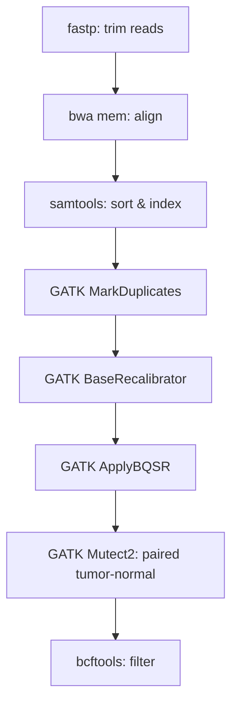

# Variant Calling Pipeline

This tutorial builds a complete **paired somatic variant calling** pipeline using oxo-flow — from raw FASTQ files to filtered VCF output. It demonstrates multi-environment workflows, tumor-normal pairing, resource scheduling, and real-world bioinformatics patterns.

---

## Overview

The pipeline follows the GATK best-practices workflow for paired tumor-normal calling:


```mermaid
graph TD
    A[fastp: trim reads] --> B[bwa mem: align]
    B --> C[samtools: sort & index]
    C --> D[GATK MarkDuplicates]
    D --> E[GATK BaseRecalibrator]
    E --> F[GATK ApplyBQSR]
    F --> G[GATK Mutect2: paired tumor-normal]
    G --> H[bcftools: filter]
```

Every rule applies to **both** the tumor and the normal sample — `[[pairs]]` drives the expansion automatically.

---

## Project setup

```bash
oxo-flow init variant-calling
cd variant-calling
```

---

## Environment files

Create separate environments for different toolsets:

```yaml
# envs/alignment.yaml
name: alignment
channels:
  - bioconda
  - conda-forge
dependencies:
  - bwa=0.7.17
  - samtools=1.19
  - fastp=0.23.4
```

```yaml
# envs/gatk.yaml
name: gatk
channels:
  - bioconda
  - conda-forge
dependencies:
  - gatk4=4.5.0.0
```

```yaml
# envs/bcftools.yaml
name: bcftools
channels:
  - bioconda
  - conda-forge
dependencies:
  - bcftools=1.19
```

---

## Workflow definition

```toml
[workflow]
name = "variant-calling"
version = "1.0.0"
description = "Paired somatic variant calling pipeline (tumor-normal)"

[config]
reference = "/data/references/hg38/hg38.fa"
known_sites = "/data/references/hg38/dbsnp_146.hg38.vcf.gz"
germline_resource = "/data/references/hg38/af-only-gnomad.hg38.vcf.gz"
results = "results"

[defaults]
threads = 4
memory = "8G"

[[pairs]]
pair_id = "P001"
experiment = "TUMOR_01"
control = "NORMAL_01"

[[pairs]]
pair_id = "P002"
experiment = "TUMOR_02"
control = "NORMAL_02"

[[rules]]
name = "trim_reads"
input = [
    "raw/{experiment}_R1.fastq.gz", "raw/{experiment}_R2.fastq.gz",
    "raw/{control}_R1.fastq.gz", "raw/{control}_R2.fastq.gz"
]
output = [
    "{config.results}/trimmed/{experiment}_R1.fastq.gz", "{config.results}/trimmed/{experiment}_R2.fastq.gz",
    "{config.results}/trimmed/{control}_R1.fastq.gz", "{config.results}/trimmed/{control}_R2.fastq.gz"
]
environment = { conda = "envs/alignment.yaml" }
shell = """
fastp --in1 raw/{experiment}_R1.fastq.gz --in2 raw/{experiment}_R2.fastq.gz --out1 {config.results}/trimmed/{experiment}_R1.fastq.gz --out2 {config.results}/trimmed/{experiment}_R2.fastq.gz --thread {threads}
fastp --in1 raw/{control}_R1.fastq.gz --in2 raw/{control}_R2.fastq.gz --out1 {config.results}/trimmed/{control}_R1.fastq.gz --out2 {config.results}/trimmed/{control}_R2.fastq.gz --thread {threads}
"""

[[rules]]
name = "align"
input = [
    "{config.results}/trimmed/{experiment}_R1.fastq.gz", "{config.results}/trimmed/{experiment}_R2.fastq.gz",
    "{config.results}/trimmed/{control}_R1.fastq.gz", "{config.results}/trimmed/{control}_R2.fastq.gz"
]
output = [
    "{config.results}/aligned/{experiment}.bam",
    "{config.results}/aligned/{control}.bam"
]
environment = { conda = "envs/alignment.yaml" }
shell = """
bwa mem -t {threads} {config.reference} {config.results}/trimmed/{experiment}_R1.fastq.gz {config.results}/trimmed/{experiment}_R2.fastq.gz | samtools sort -@ {threads} -o {config.results}/aligned/{experiment}.bam
samtools index {config.results}/aligned/{experiment}.bam
bwa mem -t {threads} {config.reference} {config.results}/trimmed/{control}_R1.fastq.gz {config.results}/trimmed/{control}_R2.fastq.gz | samtools sort -@ {threads} -o {config.results}/aligned/{control}.bam
samtools index {config.results}/aligned/{control}.bam
"""
[rules.resources]
threads = 16
memory = "32G"

[[rules]]
name = "mark_duplicates"
input = ["{config.results}/aligned/{experiment}.bam", "{config.results}/aligned/{control}.bam"]
output = [
    "{config.results}/dedup/{experiment}.dedup.bam", "{config.results}/dedup/{experiment}.metrics.txt",
    "{config.results}/dedup/{control}.dedup.bam", "{config.results}/dedup/{control}.metrics.txt"
]
environment = { conda = "envs/gatk.yaml" }
shell = """
gatk MarkDuplicates -I {config.results}/aligned/{experiment}.bam -O {config.results}/dedup/{experiment}.dedup.bam -M {config.results}/dedup/{experiment}.metrics.txt --CREATE_INDEX true
gatk MarkDuplicates -I {config.results}/aligned/{control}.bam -O {config.results}/dedup/{control}.dedup.bam -M {config.results}/dedup/{control}.metrics.txt --CREATE_INDEX true
"""

[[rules]]
name = "base_recalibration"
input = ["{config.results}/dedup/{experiment}.dedup.bam", "{config.results}/dedup/{control}.dedup.bam"]
output = ["{config.results}/recal/{experiment}.recal.table", "{config.results}/recal/{control}.recal.table"]
environment = { conda = "envs/gatk.yaml" }
shell = """
gatk BaseRecalibrator -I {config.results}/dedup/{experiment}.dedup.bam -R {config.reference} --known-sites {config.known_sites} -O {config.results}/recal/{experiment}.recal.table
gatk BaseRecalibrator -I {config.results}/dedup/{control}.dedup.bam -R {config.reference} --known-sites {config.known_sites} -O {config.results}/recal/{control}.recal.table
"""

[[rules]]
name = "apply_bqsr"
input = [
    "{config.results}/dedup/{experiment}.dedup.bam", "{config.results}/recal/{experiment}.recal.table",
    "{config.results}/dedup/{control}.dedup.bam", "{config.results}/recal/{control}.recal.table"
]
output = ["{config.results}/recal/{experiment}.recal.bam", "{config.results}/recal/{control}.recal.bam"]
environment = { conda = "envs/gatk.yaml" }
shell = """
gatk ApplyBQSR -I {config.results}/dedup/{experiment}.dedup.bam -R {config.reference} --bqsr-recal-file {config.results}/recal/{experiment}.recal.table -O {config.results}/recal/{experiment}.recal.bam
gatk ApplyBQSR -I {config.results}/dedup/{control}.dedup.bam -R {config.reference} --bqsr-recal-file {config.results}/recal/{control}.recal.table -O {config.results}/recal/{control}.recal.bam
"""

[[rules]]
name = "mutect2"
input = ["{config.results}/recal/{experiment}.recal.bam", "{config.results}/recal/{control}.recal.bam"]
output = ["{config.results}/variants/{pair_id}.vcf.gz"]
environment = { conda = "envs/gatk.yaml" }
shell = """
gatk Mutect2 \
  -R {config.reference} \
  -I {config.results}/recal/{experiment}.recal.bam \
  -I {config.results}/recal/{control}.recal.bam \
  -normal {control} \
  --germline-resource {config.germline_resource} \
  --native-pair-hmm-threads {threads} \
  -O {config.results}/variants/{pair_id}.vcf.gz
"""

[[rules]]
name = "filter_variants"
input = ["{config.results}/variants/{pair_id}.vcf.gz"]
output = ["{config.results}/filtered/{pair_id}.filtered.vcf.gz"]
environment = { conda = "envs/bcftools.yaml" }
shell = """
bcftools filter -i 'QUAL>=30 && DP>=10' {config.results}/variants/{pair_id}.vcf.gz | \
  bcftools view -f PASS -Oz -o {config.results}/filtered/{pair_id}.filtered.vcf.gz
bcftools index -t {config.results}/filtered/{pair_id}.filtered.vcf.gz
"""
```

---

## Running the pipeline

### Validate

```bash
oxo-flow validate variant-calling.oxoflow
# ✓ variant-calling.oxoflow — 7 rules, 15 dependencies
```

With 2 pairs, all 7 rules expand to 14 concrete rule instances — `trim_reads_P001`, `align_P001`, `mutect2_P001`, and so on. Each pre-processing rule handles both the tumor and the normal sample of one pair, keeping the DAG fully connected at expansion time.

### Preview

```bash
oxo-flow dry-run variant-calling.oxoflow
```

The dry-run lists all expanded rules and suggests a `-j` value based on your machine's threads divided by the workflow's heaviest rule.

### Execute

```bash
# Two pairs can run concurrently — one job stream per pair
oxo-flow run variant-calling.oxoflow -j 2 -r 1

# Keep going even if a job fails
oxo-flow run variant-calling.oxoflow -j 2 -k
```

The engine's resource pool schedules jobs so concurrent rules never oversubscribe the CPU — `align` (16 threads) will not run alongside other heavy rules on a 16-core machine.

### Generate a report

```bash
oxo-flow report variant-calling.oxoflow -f html -o report.html
```

---

## Key Patterns Demonstrated

| Pattern | Example |
|---|---|
| **Tumor-normal pairing** | `[[pairs]]` expands each rule per pair; Mutect2 runs in paired mode |
| **Multiple environments** | Different conda envs for alignment, GATK, and bcftools |
| **Resource scaling** | `align` gets 16 threads / 32G; `filter_variants` gets 2 threads / 8G |
| **Piped commands** | `bwa mem \| samtools sort` in the `align` rule |
| **Config variables** | `{config.reference}`, `{config.results}` used across all rules |
| **Linear dependency chain** | Each rule's output is the next rule's input |
| **Retry on failure** | `-r 1` flag retries failed jobs once |

---

## Next Steps

- [Environment Management](./environment-management.md) — docker, singularity, and mixed environments
- [Run on a Cluster](../how-to/run-on-cluster.md) — submit to SLURM, PBS, or SGE
