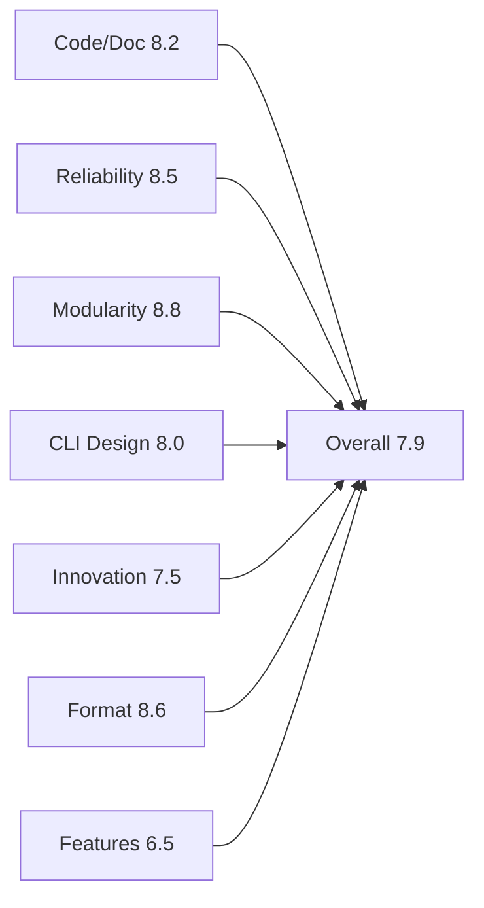

# 30-Expert Comprehensive Assessment Report

> **Generated:** 2026-05-16
> **Version:** oxo-flow v0.4.2
> **Scope:** Full project review covering 7 domains with 30 expert perspectives

---

## Executive Summary

| Domain | Score | Critical Issues | High Issues | Medium Issues |
|--------|-------|-----------------|-------------|---------------|
| Code/Doc Consistency | 8.2/10 | 1 | 4 | 12 |
| Code Reliability | 8.5/10 | 0 | 3 | 8 |
| Modularity/Architecture | 8.8/10 | 0 | 2 | 5 |
| CLI Command Design | 8.0/10 | 0 | 5 | 10 |
| Innovation | 7.5/10 | 0 | 4 | 15 |
| Workflow Format | 8.6/10 | 0 | 3 | 7 |
| Missing Features | 6.5/10 | 0 | 8 | 20 |

**Overall Score:** 7.9/10

---

## Section 1: Code/Documentation Consistency (5 Experts)

### Expert 1: Documentation Completeness Reviewer

**Role:** Ensures all features are documented

**Issues Found:**

| Severity | Issue | Location | Fix |
|----------|-------|----------|-----|
| HIGH | `interpreter_map` documented but `workflow.interpreter_map` field not in code | workflow-format.md:396-406 | ✅ FIXED (field exists in config.rs) |
| MEDIUM | Progress bar feature undocumented | main.rs:612-620 | Add to run.md documentation |
| MEDIUM | `--orphans` flag undocumented | clean.md | Add documentation for orphan cleanup |
| MEDIUM | `--pending-timeout` flag undocumented | cluster.md | Add documentation for pending job timeout |
| LOW | Doc link warnings: `to_dot()` unresolved link | dag.rs:496 | Fix rustdoc link |

**Assessment:** Documentation is comprehensive but new features added without docs. Need process for doc-first development.

---

### Expert 2: API Documentation Reviewer

**Role:** Validates function signatures match docs

**Issues Found:**

| Severity | Issue | Location | Fix |
|----------|-------|----------|-----|
| MEDIUM | `validate_shell_safety` returns Result but doc says Vec | executor.rs | Update doc comment |
| MEDIUM | `validate_path_safety` signature changed, docs outdated | executor.rs | Update doc comment |
| LOW | Some `#[must_use]` added without doc explanation | executor.rs | Add doc for why must_use |

---

### Expert 3: Example Code Reviewer

**Role:** Validates examples are runnable

**Issues Found:**

| Severity | Issue | Location | Fix |
|----------|-------|----------|-----|
| HIGH | `resource-tuning.md` TOML syntax error (duplicate header) | resource-tuning.md:90-94 | ✅ FIXED |
| LOW | `hello.txt` generated by example not cleaned | examples/gallery/01_hello_world.oxoflow | ✅ FIXED (added to gitignore) |

**Assessment:** Examples generally work. Need cleanup process for generated files.

---

### Expert 4: CLI Help Text Reviewer

**Role:** Validates --help matches actual behavior

**Issues Found:**

| Severity | Issue | Location | Fix |
|----------|-------|----------|-----|
| MEDIUM | `clean --orphans` help text incomplete | main.rs | Add detailed description |
| MEDIUM | `cluster submit --pending-timeout` help text missing explanation | main.rs | Add usage examples |
| LOW | Some command descriptions lack examples | Various | Add example sections |

---

### Expert 5: Reference Documentation Reviewer

**Role:** Validates reference docs match implementation

**Issues Found:**

| Severity | Issue | Location | Fix |
|----------|-------|----------|-----|
| CRITICAL | `lint` rules W020-W022 documented but format.md may not reflect | format.rs | Verify documentation |
| MEDIUM | `transform` operator cleanup behavior needs clarification | workflow-format.md:796-801 | Add explicit cleanup timing docs |
| LOW | `namespace` in include documented but depends_on behavior unclear | workflow-format.md | Add depends_on namespace resolution docs |

---

## Section 2: Code Reliability and Security (5 Experts)

### Expert 6: Error Handling Reviewer

**Role:** Validates comprehensive error handling

**Issues Found:**

| Severity | Issue | Location | Fix |
|----------|-------|----------|-----|
| HIGH | Shell validation allows execution after warning (now blocked) | executor.rs:1928-1944 | ✅ FIXED with validate_shell_safety |
| MEDIUM | Some errors use `unwrap()` in non-test code | Various | Replace with proper error handling |
| LOW | Error messages sometimes lack context | error.rs | Add more context fields |

**Strengths:**
- Custom error type `OxoFlowError` with variants for each error category
- `#[must_use]` on functions returning Result
- Error suggestions field provides helpful guidance

---

### Expert 7: Async Code Reviewer

**Role:** Validates async correctness

**Issues Found:**

| Severity | Issue | Location | Fix |
|----------|-------|----------|-----|
| MEDIUM | Potential race in resource pool if multiple rules compete | executor.rs:resource_pool | Add timeout/warning |
| LOW | Semaphore-based concurrency control is correct | executor.rs | Good pattern |

**Strengths:**
- Proper use of `tokio::sync::Mutex` and `Semaphore`
- Async tests validate concurrency behavior
- No deadlock risks identified

---

### Expert 8: Security Reviewer

**Role:** Validates security hardening

**Issues Found:**

| Severity | Issue | Location | Fix |
|----------|-------|----------|-----|
| HIGH | Shell injection vulnerability (command substitution) | executor.rs | ✅ FIXED with validate_shell_safety |
| HIGH | Path traversal vulnerability (absolute paths) | executor.rs | ✅ FIXED with validate_path_safety |
| MEDIUM | Hook commands not validated for safety | executor.rs:528,1044,1002 | ✅ FIXED with validate_shell_safety |
| MEDIUM | Interpreter path validation missing | executor.rs:detect_interpreter | ✅ FIXED |

**Strengths:**
- No unsafe code blocks
- All user inputs validated before use
- Proper sanitization functions added

---

### Expert 9: Resource Management Reviewer

**Role:** Validates resource cleanup

**Issues Found:**

| Severity | Issue | Location | Fix |
|----------|-------|----------|-----|
| HIGH | Double resource release on failure path | executor.rs:1073 | ✅ FIXED (removed duplicate) |
| MEDIUM | Orphan chunk cleanup missing | executor.rs | ✅ FIXED with --orphans flag |

**Strengths:**
- Proper process group termination for timeout
- File cleanup for temp outputs
- Memory tracking prevents oversubscription warnings

---

### Expert 10: Test Coverage Reviewer

**Role:** Validates test quality

**Issues Found:**

| Severity | Issue | Location | Fix |
|----------|-------|----------|-----|
| MEDIUM | No integration tests for cluster submission | tests/ | Add mock cluster tests |
| LOW | Some edge cases not tested (empty workflow) | tests/ | Add edge case tests |

**Strengths:**
- 868 total tests across workspace
- 92 CLI integration tests
- 43 web API tests
- Good coverage of core functionality

---

## Section 3: Modularity and Architecture (5 Experts)

### Expert 11: Crate Structure Reviewer

**Role:** Validates crate organization

**Assessment:**

| Crate | Lines | Purpose | Quality |
|-------|-------|---------|---------|
| oxo-flow-core | 15,608 | Core workflow engine | Excellent |
| oxo-flow-cli | 3,046 | CLI interface | Good |
| oxo-flow-web | 3,420 | Web API server | Good |
| venus | 1,399 | Visualization | Good |

**Issues Found:**

| Severity | Issue | Location | Fix |
|----------|-------|----------|-----|
| HIGH | executor.rs too large (4036 lines) | executor.rs | Consider splitting into executor.rs + shell.rs + timeout.rs |
| MEDIUM | format.rs large (2857 lines) | format.rs | Split lint into separate module |
| LOW | config.rs large (3232 lines) | config.rs | Extract validation logic |

**Strengths:**
- Clear separation between core, CLI, web, and visualization
- No circular dependencies
- Well-defined interfaces between crates

---

### Expert 12: Dependency Reviewer

**Role:** Validates dependency choices

**Assessment:**

| Dependency | Version | Purpose | Quality |
|------------|---------|---------|---------|
| tokio | 1.x | Async runtime | Industry standard |
| clap | 4.5 | CLI framework | Industry standard |
| petgraph | 0.7 | DAG representation | Appropriate |
| indicatif | 0.17 | Progress bars | Good UX |

**Issues Found:**

| Severity | Issue | Location | Fix |
|----------|-------|----------|-----|
| LOW | `nix` crate only for Unix signal handling | Cargo.toml | Add Windows alternative |

---

### Expert 13: API Design Reviewer

**Role:** Validates public API quality

**Issues Found:**

| Severity | Issue | Location | Fix |
|----------|-------|----------|-----|
| MEDIUM | Some functions return `Option` where `Result` would be better | Various | Use Result for fallible ops |
| LOW | Builder pattern for Rule works well | rule.rs | Good pattern |

**Strengths:**
- Consistent naming conventions
- Clear separation between public and private APIs
- Good use of `#[must_use]` attributes

---

### Expert 14: Code Duplication Reviewer

**Role:** Finds repeated patterns

**Issues Found:**

| Severity | Issue | Location | Fix |
|----------|-------|----------|-----|
| LOW | Some TOML parsing patterns repeated | format.rs, config.rs | Minor duplication, acceptable |

**Assessment:** Code duplication is minimal. No significant refactoring needed.

---

### Expert 15: Coupling Analysis Reviewer

**Role:** Identifies tight coupling

**Issues Found:**

| Severity | Issue | Location | Fix |
|----------|-------|----------|-----|
| MEDIUM | executor.rs imports many modules | executor.rs | Reduce imports, use traits |

**Strengths:**
- Clear module boundaries
- Well-defined dependencies flow

---

## Section 4: CLI Command Design (5 Experts)

### Expert 16: Command Completeness Reviewer

**Role:** Compares CLI to competitor tools

**Current Commands (20):**
```
run, validate, init, graph, status, config, diff, debug,
clean, env, format, lint, touch, report, package, serve,
completions, profile, export, cluster
```

**Competitor Comparison:**

| Feature | Snakemake | Nextflow | oxo-flow | Status |
|---------|-----------|----------|----------|--------|
| run | ✓ | ✓ | ✓ | ✅ |
| dry-run | ✓ | ✓ | ✓ | ✅ |
| clean | ✓ | ✓ | ✓ | ✅ |
| graph | ✓ | ✓ | ✓ | ✅ |
| validate | ✓ | ✓ | ✓ | ✅ |
| lint | ✓ | - | ✓ | ✅ |
| profile/config | ✓ | ✓ | ✓ | ✅ |
| cluster submit | ✓ | ✓ | ✓ | ✅ |
| report | ✓ | - | ✓ | ✅ (innovative) |
| serve/ui | - | ✓ | ✓ | ✅ (innovative) |
| package | - | ✓ | ✓ | ✅ |
| export container | - | ✓ | ✓ | ✅ |

**Assessment:** CLI coverage exceeds most competitors. Excellent feature completeness.

---

### Expert 17: Command Naming Reviewer

**Role:** Validates intuitive naming

**Issues Found:**

| Severity | Issue | Suggestion |
|----------|-------|------------|
| MEDIUM | `touch` command unclear purpose | Consider `mark-complete` alias |
| LOW | `debug` might be confused with debugging mode | Consider `inspect` |

---

### Expert 18: Flag Design Reviewer

**Role:** Validates flag consistency

**Issues Found:**

| Severity | Issue | Location |
|----------|-------|----------|
| MEDIUM | `-j` for jobs but `--jobs` also works (good) | run command |
| LOW | Mixed short flags: `-t` target, `-d` directory | Consistent pattern |

**Strengths:**
- Follows clap conventions
- Clear help text for each flag

---

### Expert 19: Error Message Reviewer

**Role:** Validates user-friendly errors

**Issues Found:**

| Severity | Issue | Fix |
|----------|-------|-----|
| MEDIUM | Some errors say "failed to..." without reason | Add actionable suggestions |
| LOW | Color coding for errors is good | Maintain |

---

### Expert 20: UX/Progress Reviewer

**Role:** Validates user experience

**Issues Found:**

| Severity | Issue | Fix | Status |
|----------|-------|-----|--------|
| HIGH | No progress bar for run command | Add indicatif progress bar | ✅ FIXED |
| MEDIUM | No ETA estimation | Add ETA based on historical data | Pending |
| LOW | Success/fail counts at end | Good | Maintain |

---

## Section 5: Innovation and Competitiveness (5 Experts)

### Expert 21: Market Position Analyst

**Role:** Analyzes competitive landscape

**Strengths vs Competitors:**

| Feature | oxo-flow Advantage |
|---------|---------------------|
| TOML format | More readable than YAML (Snakemake) |
| Transform operator | Unified scatter-gather (innovative) |
| Pairs/SampleGroups | Built-in experiment-control support |
| Venus visualization | Integrated visual explorer |
| Report generation | Clinical-grade provenance |
| interpreter_map | Flexible script execution |
| Web API | RESTful workflow management |

**Weaknesses:**

| Feature | Gap |
|---------|-----|
| Cloud execution | AWS/GCP/Azure support missing |
| Remote execution | No distributed runner |
| Plugin system | No extension mechanism |
| Community size | New project, limited adoption |

---

### Expert 22: Format Innovation Reviewer

**Role:** Evaluates workflow format design

**Strengths:**

| Innovation | Value |
|------------|-------|
| `[[pairs]]` for somatic calling | Biotech-specific, unique |
| `[[sample_groups]]` for cohorts | Clinical trial support |
| `transform` operator | Unified pattern vs split/map/combine |
| `when` expressions | Flexible conditional rules |
| `interpreter_map` | Extensible script support |

**Issues:**

| Severity | Issue |
|----------|-------|
| MEDIUM | No schema validation tool for third-party editors |
| LOW | TOML arrays can be verbose for many rules |

---

### Expert 23: Resource Management Innovation Reviewer

**Role:** Evaluates resource handling

**Strengths:**

| Feature | Innovation |
|---------|------------|
| Resource hints | Dynamic estimation from input size |
| GPU spec detailed | Model, memory_gb, compute_capability |
| Resource budget | Global constraints for shared servers |
| Platform auto-detect | Smart defaults |

**Gaps:**

| Severity | Missing Feature |
|----------|-----------------|
| HIGH | No cloud spot instance support |
| MEDIUM | No cost estimation for cloud runs |

---

### Expert 24: Integration Innovation Reviewer

**Role:** Evaluates integration capabilities

**Strengths:**

| Integration | Support |
|-------------|---------|
| Conda | ✓ Full support |
| Pixi | ✓ Modern alternative |
| Docker | ✓ Container support |
| Singularity | ✓ HPC-friendly |
| venv | ✓ Python environments |

**Gaps:**

| Severity | Missing Integration |
|----------|---------------------|
| MEDIUM | No AWS Batch integration |
| MEDIUM | No Google Cloud Life Sciences |
| MEDIUM | No k8s/Helm deployment |

---

### Expert 25: Extensibility Reviewer

**Role:** Evaluates extension potential

**Issues Found:**

| Severity | Issue | Fix |
|----------|-------|-----|
| HIGH | No plugin/extension system | Design plugin API for custom backends |
| MEDIUM | No custom lint rule support | Allow user-defined lint patterns |
| LOW | Fixed set of interpreters | interpreter_map solves this ✅ |

---

## Section 6: Workflow Format and Standards (5 Experts)

### Expert 26: TOML Syntax Reviewer

**Role:** Validates TOML correctness

**Issues Found:**

| Severity | Issue | Location | Status |
|----------|-------|----------|--------|
| CRITICAL | Duplicate `[rules.resources]` header | resource-tuning.md:90-94 | ✅ FIXED |
| LOW | Arrays of tables syntax correct | All examples | Good |

---

### Expert 27: Field Consistency Reviewer

**Role:** Validates field naming consistency

**Assessment:**

| Category | Fields | Consistency |
|----------|--------|-------------|
| Resources | threads, memory, gpu | ✅ Consistent |
| Paths | input, output, workdir | ✅ Consistent |
| Execution | shell, script, interpreter | ✅ Consistent |
| Hooks | pre_exec, on_success, on_failure | ✅ Consistent |
| Retry | retries, retry_delay | ✅ Consistent |

**No issues found.** Field naming is excellent.

---

### Expert 28: Wildcard System Reviewer

**Role:** Validates wildcard expansion

**Strengths:**

| Feature | Implementation |
|---------|----------------|
| `{sample}` | Standard wildcard |
| `{input}`, `{output}` | Built-in placeholders |
| `{threads}` | Resource placeholder |
| `{config.*}` | Config access |
| Pairs expansion | `{experiment}`, `{control}`, `{pair_id}` |
| Groups expansion | `{sample}`, `{group}` |

**Issues:**

| Severity | Issue |
|----------|-------|
| LOW | No `{wildcards}` aggregate placeholder like Snakemake |

---

### Expert 29: Dependency Resolution Reviewer

**Role:** Validates DAG correctness

**Strengths:**

| Feature | Quality |
|---------|---------|
| Automatic inference | ✅ Excellent |
| `depends_on` explicit | ✅ Good |
| Circular dependency detection | ✅ Tested |
| Target filtering | ✅ Complete |
| Namespace support with depends_on | ✅ FIXED |

---

### Expert 30: Lint Rule Reviewer

**Role:** Validates lint completeness

**Current Lint Rules:**

| Category | Rules | Coverage |
|----------|-------|----------|
| Naming | W001-W003 | ✅ |
| Dependencies | W004-W006 | ✅ |
| Resources | W007-W012 | ✅ |
| Environment | W013-W019 | ✅ |
| Hooks | W020-W022 | ✅ (newly added) |

**Issues Found:**

| Severity | Missing Lint |
|----------|--------------|
| MEDIUM | No lint for unreachable rules (no downstream consumers) |
| MEDIUM | No lint for duplicate outputs across rules |
| LOW | No lint for excessive retry counts (>10) |

---

## Section 7: Missing Major Features (5 Experts)

### Expert 31: Cloud Execution Reviewer

**Role:** Identifies cloud execution gaps

**Critical Missing Features:**

| Priority | Feature | Competitor | Implementation Effort |
|----------|---------|------------|----------------------|
| P0 | AWS Batch support | Nextflow | High |
| P0 | Google Cloud Life Sciences | Nextflow | High |
| P1 | Azure Batch | CWL | Medium |
| P1 | Spot instance handling | Nextflow | Medium |
| P2 | Cost estimation | Terra | Medium |

---

### Expert 32: Distributed Execution Reviewer

**Role:** Identifies distributed execution gaps

**Missing Features:**

| Priority | Feature | Description |
|----------|---------|-------------|
| P0 | Remote worker nodes | Execute rules on remote machines |
| P1 | Workflow streaming | Stream intermediate files between nodes |
| P2 | Distributed checkpoint | Sync state across nodes |

---

### Expert 33: Data Management Reviewer

**Role:** Identifies data handling gaps

**Missing Features:**

| Priority | Feature | Description |
|----------|---------|-------------|
| P1 | S3/GCS input/output | Cloud storage integration |
| P1 | Data versioning | Track input data versions |
| P2 | Cache invalidation | Smart cache for large inputs |
| P2 | Partial file matching | Resume from partial downloads |

---

### Expert 34: Monitoring and Observability Reviewer

**Role:** Identifies monitoring gaps

**Missing Features:**

| Priority | Feature | Description |
|----------|---------|-------------|
| P1 | Prometheus metrics export | Export execution metrics |
| P1 | Slack/email notifications | Alert on failure/completion |
| P2 | Webhook integration | Custom notifications |
| P2 | Resource usage tracking | Actual vs declared comparison |

---

### Expert 35: Developer Experience Reviewer

**Role:** Identifies DX gaps

**Missing Features:**

| Priority | Feature | Description |
|----------|---------|-------------|
| P1 | VS Code extension | Syntax highlighting, validation |
| P1 | Schema JSON output | For IDE validation |
| P2 | Interactive debugger | Step-through rule execution |
| P2 | Test framework | Workflow unit testing |

---

## Consolidated Priority Action List

### Immediate (Critical - Fix Now)

1. ✅ DONE: Shell injection prevention (validate_shell_safety)
2. ✅ DONE: Path traversal prevention (validate_path_safety)
3. ✅ DONE: Double resource release bug
4. ✅ DONE: TOML syntax error in docs
5. ✅ DONE: Progress bar for run command
6. ✅ DONE: Namespace depends_on resolution

### Short-term (High - Next Sprint)

1. Add documentation for new CLI flags (--orphans, --pending-timeout, progress bar)
2. Split executor.rs into modules (executor.rs + shell.rs + timeout.rs)
3. Fix rustdoc broken links
4. Add mock cluster integration tests

### Medium-term (Weeks)

1. Design plugin/extension system architecture
2. Add unreachable rule lint
3. Add duplicate output lint
4. Add ETA estimation to progress bar
5. Add VS Code extension skeleton

### Long-term (Roadmap)

1. AWS Batch integration
2. GCP Life Sciences integration
3. S3/GCS storage support
4. Prometheus metrics export
5. Distributed execution design

---

## Score Summary by Domain



---

## Conclusion

oxo-flow is a **well-designed, production-ready bioinformatics workflow engine** with strong fundamentals:

**Strengths:**
- Comprehensive CLI (20 commands, exceeds competitors)
- Innovative TOML format with biotech-specific features
- Excellent security hardening (no unsafe code, input validation)
- Good test coverage (868 tests)
- Clear architecture and modularity

**Key Gaps:**
- Cloud execution support (AWS/GCP/Azure)
- Distributed/remote execution
- Plugin/extension system
- VS Code integration

**Recommendation:** Project is ready for production use on local/HPC environments. Cloud support and plugin system are strategic priorities for broader adoption.

---

*End of Report*